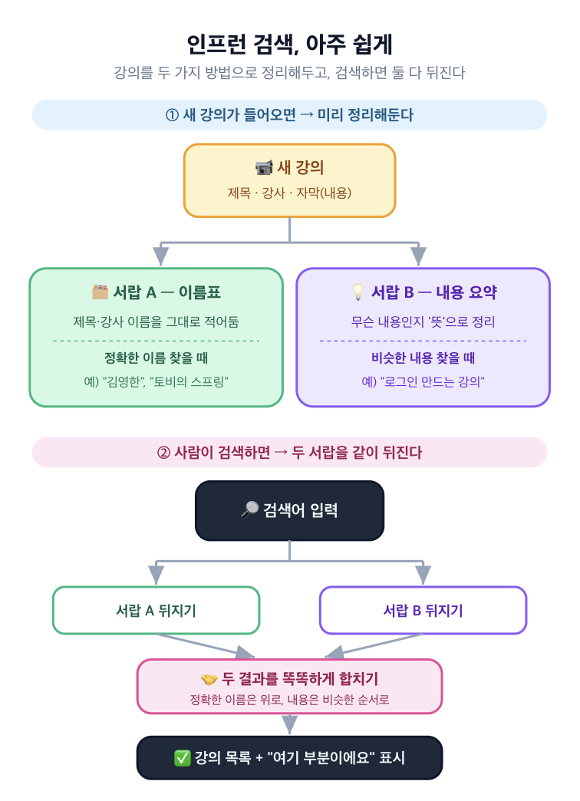
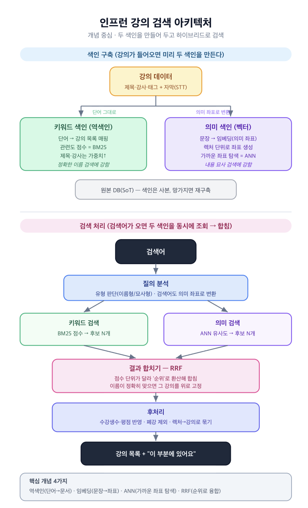
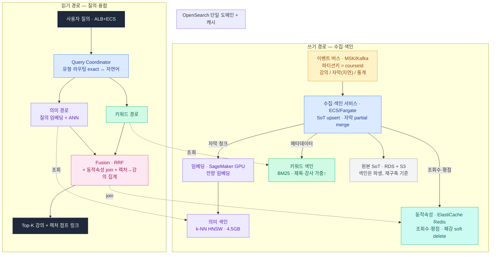
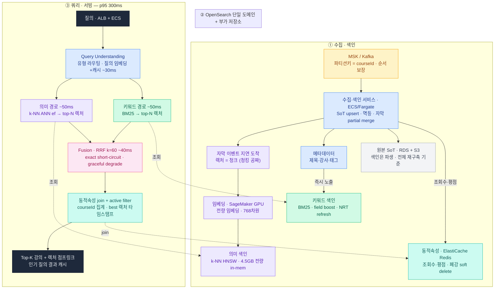

# Week7 과제: 동영상 플랫폼 검색 시스템 설계 (수집 → 색인 → 하이브리드 검색)

> 동영상 플랫폼에 업로드되는 영상의 메타데이터와 자막을 수집·색인하고, 키워드 검색(exact match)과
> 시맨틱 검색을 결합한 하이브리드 검색으로 사용자 질의에 응답하는 검색 시스템을 설계한다.

## 1. 문제 이해 및 설계 범위 확정

### 시나리오

유튜브에는 분당 수백 시간 분량의 영상이 업로드되고, 매초 수만 건의 검색 질의가 들어온다.
수십억 영상 중 관련 영상을 수백 ms 안에 찾아 반환해야 한다.

**서로 다른 두 종류의 질의를 모두 처리해야 한다**

- 정확히 일치해야 하는 질의: "침착맨", "뉴진스 Hype Boy" — 채널명·노래 제목은 한 글자도 틀리면 안 됨
- 내용을 묘사하는 질의: "고양이가 박스에 뛰어드는 영상" → 정답 영상 제목은 "우리집 냥이 일상 브이로그".
  질의의 어떤 단어도 제목에 없음
- 영상은 본문이 없는 매체. 검색에 쓸 데이터를 영상에서 뽑아내는 것부터가 설계의 일부다.
- 한 가지 매칭 방식으로는 두 질의 유형을 모두 만족시킬 수 없다 — 어떤 검색 구조가 필요한가?

**색인은 계속 갱신되어야 한다**

- 업로드된 영상은 수 분 내 검색에 노출되어야 함
- 조회수·좋아요는 색인된 뒤에도 계속 변함
- 삭제·비공개 영상은 결과에서 빠르게 사라져야 함
- 즉 색인은 한 번 만들고 끝이 아니라 계속 갱신되는 살아있는 자료구조여야 한다

### 왜 인프런으로 정했나

원래 과제는 유튜브였다. 근데 유튜브는 영상 50억 개에 자막 청크가 1,000억 개,
검색도 초당 20만 건씩 들어온다. 이 규모에서는 "검색을 어떻게 하나"보다
"이 많은 걸 어디에 나눠 담고(샤딩), 뭘 포기하고(부분 임베딩), 어떻게 압축하나(양자화)"
같은 **운영 규모 문제**가 설계의 절반을 잡아먹는다.

내가 이번에 이해하고 싶었던 건 하이브리드 검색 도메인의 큰 흐름과 아키텍처였다.
그래서 대학생 때 자주 쓰는 **인프런**의 수집 → 색인 → 하이브리드 검색 시스템 설계로 목표를 잡았다.

1. 영상처럼 글이 없는 매체에서 어떻게 검색용 텍스트를 뽑나
2. "스프링 강의"(정확히 일치)와 "JWT 로그인 구현하는 강의"(내용 묘사)를 **어떻게 둘 다** 잡나
3. 그 두 검색 결과를 어떻게 하나로 합치나
4. "그 개념 나오는 그 강의의 그 부분"으로 어떻게 점프시키나

인프런에는 강의가 수만 개 있고, 강의 하나는 다시 렉처(영상) 수십~수백 개로 되어 있다.
사람들은 강의를 **두 가지 방식**으로 찾는다. 이게 이 문제의 전부다.

> **강의(course)** — "스프링 부트 입문" 하나
> - **섹션(section)** — "1. 환경 설정", "2. 회원 관리 기능" 같은 묶음
>   - **렉처(lecture)** — 그 안의 개별 영상. "1-1. 프로젝트 생성"(8분), "2-3. 회원 가입 구현"(12분)…

- **정확히 일치하는 검색**: "스프링 부트 강의", "김영한", "토비의 스프링"
  → 제목·강사명은 한 글자도 틀리면 안 된다.
- **내용을 묘사하는 검색**: "JWT로 로그인 구현하는 강의", "트랜잭션 격리수준 설명해주는 강의"
  → 내가 친 단어가 제목엔 없을 수 있다. 강의가 **무슨 내용인지**를 봐야 잡힌다.

문제는, 강의 영상엔 검색할 글자가 없다는 거다. 그래서 검색에 쓸 텍스트를 직접 뽑아야 한다.
나는 두 종류를 쓰기로 했다.

- **메타데이터**: 제목, 소개글, 태그, 강사명, 커리큘럼(섹션·렉처 제목)
- **렉처 자막**: STT(음성을 글자로 받아쓰는 기술)로 만든 렉처별 텍스트
  → 강의 *내용* 검색은 결국 이 자막이 있어야 된다.

그리고 색인(검색용 데이터)은 한 번 만들고 끝이 아니다. 새 강의는 곧 검색돼야 하고,
수강생 수·평점은 계속 바뀌고, 폐강된 강의는 결과에서 빠져야 한다. "살아있는 데이터"다.

### 설계 범위

| 한다 (In Scope) | 안 한다 (Out Scope) |
| --- | --- |
| 강의에서 뭘 뽑아 색인할지 (메타 + 렉처 자막) | STT·자막 만드는 모델 자체 (이미 있다고 가정) |
| 등록/수정/폐강 + 늦게 오는 자막 수집 | 영상 업로드/인코딩 파이프라인 |
| 색인 단위 정하기 (강의 vs 렉처) | 임베딩 모델 학습 |
| 키워드 색인 + 의미 색인 만들기 | 정밀 재랭킹(딥러닝 줄세우기) |
| 두 검색 결과 합치기 (하이브리드) | 검색 품질 점수 측정 |
| 새 강의 노출 / 폐강 제외 | 개인화·추천 |
| 수강생수·평점 반영 | 자동완성·오타 교정 |
| "그 렉처로 점프" | 결제·수강·광고 |
| 검색 응답 서빙, 장애 대응 | |

> 영상에서 어떤 데이터를 추출해 색인할지는 전적으로 설계 재량이다. 추출 모델(STT, 프레임 캡셔닝,
> 챕터 요약 등)은 이미 존재한다고 가정하고 가져다 쓰면 된다. 다만 무엇을 뽑느냐에 따라 색인 규모,
> 도착 지연, 비용이 달라지므로 그 선택의 결과는 설계에서 책임져야 한다.

### 시스템 구성 전제

- 영상 업로드/트랜스코딩 파이프라인은 이미 존재하며, 업로드·메타데이터 변경·삭제 이벤트가 Kafka로 발행된다.
- 영상에서 텍스트를 추출하는 시스템(STT 자막 등)은 이미 존재하며, 추출 결과는 업로드 후
  수 분~수십 분 지연되어 이벤트로 도착한다.
- 원본 메타데이터/자막의 source of truth는 별도 DB와 Object Storage에 있고, 검색 색인은 파생 데이터다.
- 역색인 엔진은 Lucene 계열(Elasticsearch, OpenSearch)을 사용할 수 있다.
- 벡터 색인은 HNSW, IVF 등 ANN 엔진(Faiss, Vespa, Milvus, Lucene KNN 등)을 사용할 수 있다.
- 임베딩 모델은 자체 서빙(GPU)하며, 처리량 한계와 호출 비용이 존재한다.
- 조회수·좋아요 등 통계 값은 별도 집계 시스템이 산출하며, 검색 시스템은 이를 구독해 반영한다.
- 본 시스템은 후보 검색(retrieval)과 단순 fusion까지를 다루며, 이후 정밀 랭킹은 다루지 않는다.

### 기능 요구사항 및 고려할 점

**[수집]** 영상 업로드·변경·삭제·자막 생성 이벤트를 수신해 색인할 수 있어야 한다.
- 문제: 한 강의 데이터가 한꺼번에 안 온다. 메타는 등록 즉시, 자막은 수십 분 뒤.
  자막을 기다리면 검색 노출이 늦고, 따로 색인하면 같은 강의를 두 번 손대야 한다.

**[색인]** 키워드 매칭용 색인과 의미 검색용 색인을 함께 유지해야 한다.
- 문제: 색인이 두 개다. 키워드 등록은 빠른데 임베딩은 GPU에 묶여 느려서, 둘 상태가 어긋난다.
- 문제: 검색 단위가 애매하다. 강의 전체를 의미 좌표 하나로 뭉치면 여러 주제가 섞여 흐려진다.

**[융합]** 키워드 후보와 의미 후보를 하나의 결과로 융합해야 한다.
- 문제: 두 점수는 단위가 달라(키워드 0~30점대, 의미 0~1) 그냥 못 더한다.
- 문제: "토비의 스프링" 같은 정확한 검색에서 의미 검색이 데려온 비슷한 강의가 정답을 밀어내면 안 된다.

**[신선도]** 등록 후 수 분 내 노출, 폐강 후 1분 내 제외.

**[동적 속성]** 수강생수·평점이 바뀌어도 재색인 없이 반영돼야 한다.
- 문제: 글자는 거의 안 변하는데 숫자(수강생수)는 자주 변한다. 변할 때마다 재색인하면 색인이 그것만 하다 끝난다.

**[서빙]** 상위 K개 강의를 매칭된 렉처 위치(타임스탬프)와 함께 빠르게 준다.
- 문제: 렉처 단위로 검색하면 같은 강의의 렉처 여러 개가 후보로 온다. 근데 보여줄 건 강의 목록이다.

### 비기능 요구사항

| 항목 | 목표 |
| --- | --- |
| 검색 응답 | p95 300ms (100번 중 95번은 0.3초 안) |
| 후보 검색 | 키워드/의미 각각 p95 50ms |
| 등록 → 노출 | 수 분 이내 |
| 폐강 → 제외 | 1분 이내 |
| 수강생수·평점 반영 | 수 분 이내 |
| 가용성 | 색인 갱신·재구축 중에도 검색 끊김 없음 |
| 정합성 | 색인은 사본이라 원본 기준 통째로 재구축 가능 |

### 대략적 규모 추정

| 항목 | 인프런 | 유튜브였다면 |
| --- | --- | --- |
| 강의(문서) 수 | 약 3만 | 50억 |
| 렉처(청크) 수 | 약 150만 | 1,000억 |
| 자막 텍스트 | 약 22GB | 75TB |
| 의미 좌표(벡터) 저장량 | 약 4.5GB | 300TB |
| 새로 올라오는 양 | 하루 수십~수백 강의 | 분당 수백 시간 |
| 검색량 | 평균 ~500, 피크 ~3,000 QPS | 피크 20만 |

벡터 4.5GB + 텍스트 22GB는 서버 한두 대에 다 들어간다.
그래서 유튜브 과제의 3대 난제 — 샤딩(나눠 담기), 부분 임베딩(일부만 의미색인), 양자화(압축) —
가 **전부 필요 없어진다.**

---

## 2. 개략적 설계안 제시 및 동의 구하기

### 핵심 흐름

**write (수집·색인)**
1. Kafka가 강의/자막/통계 이벤트를 흘려보낸다.
2. 수집 파이프라인이 받아서 원본에 저장하고, 색인에 반영한다.
3. 메타데이터는 **즉시** 키워드 색인에 올려서 바로 검색되게 한다.
   자막은 늦게 오니까, 도착하면 같은 강의에 끼워 넣고(merge) 렉처별 의미 좌표를 만들어 벡터 색인에 올린다.
4. 수강생수·평점은 텍스트 색인과 **따로** 저장한다 (자주 바뀌니까).

**read (검색)**
1. 검색어가 오면, 먼저 종류를 본다 — 정확한 이름형인가, 내용 묘사형인가.
2. 키워드 검색과 의미 검색을 **동시에** 돌려서 각각 후보를 받는다.
3. 둘을 **RRF**(Reciprocal Rank Fusion, 역순위 융합)로 합친다 (점수 단위가 다르니 등수로 환산해 합침).
4. 수강생수·평점을 붙여 순위에 반영하고, 폐강 강의는 걸러낸다.
5. 렉처 후보들을 **강의 단위로 묶고**, 제일 잘 맞은 렉처의 위치를 "여기로 점프" 링크로 붙여 보여준다.

### 개략적 아키텍처 다이어그램

---

## 3. 상세 설계

### 상세 아키텍처 다이어그램

### 3-1. 수집 — 늦게 오는 자막을 어떻게 합치나

가장 먼저 부딪힌 문제. 메타는 등록 즉시 오는데 자막은 수십 분 뒤에 온다.

- **그래서**: 강의를 하나의 문서로 보고, 자막이 도착하면 같은 강의 문서에 **끼워 넣는다**(partial upsert).
  메타만으로 먼저 검색 노출시키고, 자막은 따라붙는다. 새로 만드는 게 아니라 일부만 덮어쓰는 것.
- **순서 꼬임 방지**: Kafka에서 같은 강의 이벤트는 한 줄로 처리되게 묶었다(파티션 키 = courseId).
  안 그러면 "폐강 처리 후 수정"이 거꾸로 적용되는 사고가 난다.
- 인프런은 강의가 쏟아지지 않아서, 자막 없이 메타만으로도 수 분 내 노출은 쉽게 지킨다.

> 유튜브였으면: 분당 수백 시간이 들어와서 수집 서버를 잔뜩 늘리고, 임베딩이 밀리면 속도를 줄이는(백프레셔) 장치가 필요하다.

### 3-2. 색인 단위 — 강의로 보나, 렉처로 보나 (★ 중요)

검색의 '문서 한 칸'을 뭘로 잡느냐가 결과 품질을 좌우한다.

- **나는 섞어서 쓰기로 했다.**
  - 메타데이터(제목/강사/태그) → **강의 단위**로 색인
  - 자막 → **렉처 단위**로 색인 (강의ID + 렉처ID + 시간 정보 포함)
- **왜 렉처 단위인가**: 강의 전체 자막을 의미 좌표 하나로 뭉치면, 한 강의 안의 여러 주제가
  뒤섞여 평균돼서 "JWT 설명하는 부분"을 콕 집어 못 잡는다. 렉처별로 쪼개야 잡힌다.
- **여기서 인프런의 이점**: 유튜브는 10분 자막을 어디서 끊을지가 큰 고민인데(문장? 화제 전환?),
  인프런은 **강의가 이미 렉처로 나뉘어 있다.** 렉처 하나 = 검색 단위 하나. 자를 필요가 없다.
- **렉처 → 강의로 다시 묶기**: 검색은 렉처로 하지만 결과는 강의 목록이어야 하니, 같은 강의ID끼리 묶는다.
  강의 점수는 그 안에서 제일 잘 맞은 렉처 점수로 본다. 그 렉처의 시간이 곧 "여기로 점프" 링크가 된다.
- **가중치**: 제목·강사명에서 맞은 건 자막에서 맞은 것보다 더 쳐준다. 정확한 검색을 지키는 핵심.

### 3-3. 색인 저장·분산 — 인프런은 안 나눠도 된다

- **샤딩(나눠 담기) 불필요**: 텍스트 22GB + 벡터 4.5GB는 서버 한두 대에 다 들어간다.
  복제본만 둬서 안 끊기게 한다. "수십 조각에 흩어 조회 → 제일 느린 조각이 발목" 같은 문제가 아예 없다.
- **벡터 검색은 HNSW**: 전부 메모리에 올릴 수 있으니, '친구의 친구' 그래프로 가까운 좌표를 찾는 HNSW가
  단순하고 정확하다. (코퍼스가 작으면 군집으로 나누는 IVF보다 이게 깔끔)
- **전부 의미 색인에 넣는다**: 150만 렉처 다 임베딩해도 4.5GB라서, 인기 없는 강의까지 빠짐없이 넣는다.

> 유튜브였으면: 여기가 제일 크게 터진다. 1,000억 청크·300TB → 강의ID로 수십 조각 나누고,
> 인기·신규만 골라 임베딩하고, 좌표를 압축(양자화)해야 한다.

### 3-4. 두 검색 합치기 — RRF와 정확한 검색 보호 (★ 중요)

- **왜 그냥 못 더하나**: 키워드 점수(BM25)는 0~30점대, 의미 점수(코사인 유사도)는 0~1.
  단위가 다르니 더하면 한쪽이 깔아뭉갠다.
- **그래서 RRF**: 점수를 버리고 **순위만** 쓴다. 1등이면 큰 값, 뒤로 갈수록 작은 값(`1/(60+순위)`).
  양쪽 검색에서 다 상위에 있으면 최종 상위. *서로 다른 시험 점수를 등수로 환산해 합치는 셈.*
- **정확한 검색 보호(short-circuit)**: "토비의 스프링"처럼 제목·강사명이 딱 맞으면, 융합을 거치지 않고
  그 강의를 결과 맨 위에 **고정**한다. 의미 검색이 데려온 '비슷한 스프링 강의'가 정답을 밀어내는 걸 막는다.
- **종류별 가중치(라우팅)**: 정확한 이름형이면 키워드에 무게, 자연어 묘사형이면 의미에 무게를 더 준다.
- **한쪽 고장 나면**: 의미 검색(GPU)이 죽어도 키워드 결과만으로 계속 응답한다. 검색이 멈추진 않는다.

### 3-5. 새 강의 바로 노출 — 인프런은 기본 기능으로 충분

- 인프런은 강의가 쏟아지지 않으니, 검색엔진 기본 갱신(거의 실시간, 보통 1초 주기)만으로
  수 분 내 노출이 지켜진다. 유튜브처럼 "실시간용 작은 색인 / 본 색인"을 따로 나눌 필요가 없다.
- 단, 키워드는 즉시 노출, 의미 검색은 임베딩이 만들어진 뒤 노출. 그 사이 잠깐은 키워드로만 잡힌다 (허용).

> 유튜브였으면: 분당 수백 시간 → 실시간용 작은 색인과 본 색인을 나누고 백그라운드로 합쳐야 한다.

### 3-6. 자주 바뀌는 값과 폐강 처리

- **수강생수·평점은 따로 저장**: 텍스트 색인에 안 박고 별도 저장소(KV)에 둔다. 바뀔 때마다 재색인 안 한다.
- **언제 합치나**: 순위·필터에 쓸 가벼운 숫자는 색인에 가볍게 두고, 화면 표시값은 결과 낼 때 조인한다.
- **폐강 = 플래그만**: 폐강되면 즉시 안 지우고 '비활성' 표시만 한 뒤, 검색할 때 걸러서 1분 내 제외한다.
  실제 정리는 나중에 몰아서 (soft delete).

### 3-7. 빠르게 응답하기 (0.3초 예산 쪼개기)

- 질의 임베딩(GPU, 자주 쓰는 검색어는 캐시해서 0에 가깝게) ≈ 30ms
- 키워드 + 의미 검색 동시에 ≈ 50ms
- 합치고 + 숫자 붙이고 + 강의로 묶기 ≈ 40ms
- 네트워크·여유 ≈ 나머지
- 인기 검색어("스프링", "리액트")는 임베딩도, 결과도 캐시해서 더 빠르게.
- 서버가 한두 대라 "여러 곳에 뿌리고 모으기(scatter-gather)"가 좁은 범위에서 끝나, 지연이 안 튄다.

> 유튜브였으면: 수십 조각에 흩어 조회 → 느린 조각에 복제 요청을 한 번 더 던져(hedged request) 꼬리 지연을 잘라야 한다.

### 3-8. 비용 vs 신선도 vs 범위 — 인프런은 고민이 거의 없다

- **전부 임베딩**: 4.5GB라 다 넣는다. (유튜브였으면 300TB라 일부만)
- **압축(양자화)**: 메모리 여유라 안 한다. (유튜브였으면 필수)
- **탐색 범위 다이얼(ef)**: 코퍼스가 작아 넉넉히 줘도 빠르다. 놓치는 후보 거의 없음.
- **인기 없는 강의(롱테일)**: 수가 적어 전부 의미 색인에 포함. 검색 사각지대가 없다.

### 3-9. 클라우드 구성 (AWS 기준)

추상적인 박스를 실제 매니지드 서비스로 매핑한다. 단, 인프런 규모(강의 3만·벡터 4.5GB)는
서비스 몇 개로 끝나는 규모라, "분산 풀세트"를 넣으면 오히려 오버엔지니어링이다. 그래서
**인프런에 맞는 현실적 구성**과 **유튜브 스케일이면 무엇으로 바꾸는지**를 같이 적는다.

| 컴포넌트 | 인프런 (현실적) | 유튜브 스케일이면 |
| --- | --- | --- |
| 이벤트 버스 | MSK(Managed Kafka). 소규모면 SQS/SNS도 가능 | MSK 대규모 파티션 |
| 수집·색인 서비스 | ECS/Fargate 컨슈머 (또는 Lambda) | EKS + 오토스케일 컨슈머 |
| 원본 SoT | RDS(메타) + S3(원본 자막) | Aurora + S3 |
| 키워드 색인 | OpenSearch Service (단일 도메인, 복제본만) | OpenSearch 다중 샤드 |
| 의미 색인(벡터) | **OpenSearch k-NN에 통합** (별도 엔진 불필요) | 전용 벡터 DB(Vespa 등) 분리 |
| 임베딩 생성 | SageMaker 엔드포인트 또는 ECS+GPU | SageMaker 대규모 배치 |
| 질의 임베딩/결과 캐시 | ElastiCache(Redis) 또는 CloudFront | Redis 클러스터, 다계층 캐시 |
| 동적속성 Store | ElastiCache(Redis) | Redis 클러스터 + 샤딩 |
| 검색 API | ALB + ECS/Fargate | API Gateway + EKS |

**핵심 결정**: 인프런 규모에선 키워드 색인과 의미 색인을 **OpenSearch 하나로 통합**한다.
OpenSearch가 BM25(키워드)와 k-NN(벡터, HNSW)을 모두 지원하므로, 별도 벡터 DB(Faiss/Vespa)
운영이 통째로 빠진다. 4.5GB는 단일 도메인에 다 올라가므로 샤딩도 불필요하다.
→ "두 색인을 한 엔진에서, 단일 도메인에 다 담는다"가 이 규모의 가장 큰 단순화다.

> 유튜브 스케일이면: 벡터가 300TB라 OpenSearch 한 엔진에 못 담는다. 전용 벡터 DB를 분리하고
> 키워드/벡터 각각 수십 샤드로 나눠야 하며, 운영 복잡도가 급증한다.

---

## 4. 설계 장점

- **두 검색을 다 잡는다** — 정확한 이름(제목·강사)도, 내용 묘사(자막)도 모두 응답한다.
- **렉처로 검색, 강의로 보여주기** — "그 개념 나오는 12강 4:33으로 점프"가 된다.
- **작아서 단순하다** — 샤딩·부분 임베딩·실시간 색인 분리·압축이 전부 필요 없다. 운영이 쉽고 고장날 곳이 적다.
- **색인을 둘로 나누고 비동기로 처리** — 메타로 먼저 노출, 임베딩은 따라붙어서 등록이 빨리 보인다.
- **자주 바뀌는 값을 분리** — 통계가 변해도 색인이 흔들리지 않는다.
- **색인은 사본** — 원본 기준으로 끊김 없이 다시 만들 수 있다.

## 5. 설계 단점

- **대규모 난제를 직접 경험하진 못한다** — 그래서 단계마다 "유튜브였으면 여기서 터진다"를 같이 적었다.
- **두 색인이 잠깐 어긋난다** — 등록 직후 잠시 키워드로만 검색되는 구간이 있다.
- **RRF는 점수 정보를 버린다** — 등수만 쓰니 "근소한 1·2위"와 "압도적 1위"를 구분 못 한다. 정밀 랭킹(범위 밖)이 보완.
- **검색어 종류 판단이 틀릴 수 있다** — 이름형/묘사형 분류가 어긋나면 가중치가 잘못 실린다.
- **자막 품질에 의존** — STT 자막이 부정확하면 내용 검색이 약해진다 (STT는 범위 밖 가정).

---

## 용어 사전

### 데이터 추출
- **STT (Speech-To-Text)** — 음성을 글자로 받아쓰는 기술. → "음성→자막. 내용 검색의 원천 텍스트."

### 키워드 검색
- **역색인** — 책 뒤 '찾아보기'. 단어 → 그 단어 든 강의 목록. → "단어를 키로 잡은 인덱스."
- **BM25** — 키워드 관련도 점수 공식. 흔한 단어는 깎음. → "키워드 관련도 점수표."
- **field boost** — 어느 칸에서 맞았는지로 가중치 차등. → "제목에서 맞으면 더 쳐준다."

### 의미 검색
- **임베딩** — 문장을 '의미 좌표'로 바꾸는 것. 뜻이 비슷하면 좌표가 가깝다. → "문장을 의미 좌표로. 비슷하면 가깝다."
- **코사인 유사도** — 두 좌표가 같은 방향이면 1, 직각이면 0. → "두 의미 좌표가 얼마나 같은 방향인지."
- **벡터 색인 / ANN** — 가까운 의미 좌표를 빨리 찾는 구조(근사). → "가까운 의미 좌표를 빨리 찾는 인덱스."
- **HNSW** — '친구의 친구' 그래프로 점프하며 가까운 좌표 찾기. 작은 코퍼스에 유리. → "친구의 친구로 점프."
- **ef / nprobe** — '얼마나 넓게 뒤질지' 다이얼. 키우면 정확↑ 느림↑. → "탐색 범위 다이얼."
- **양자화** — 좌표를 압축해 저장 절약(정확도 조금 손해). 인프런은 불필요. → "벡터 압축. 유튜브면 필수."

### 융합
- **하이브리드 검색** — 키워드 + 의미 둘 다 돌려 합치기. → "둘 다 써서 합친다."
- **RRF** — 점수 대신 순위로 합치기(`1/(60+순위)`). → "단위 다른 점수를 등수로 환산해 합치기."
- **exact 보호 / short-circuit** — 제목·강사 딱 맞으면 융합 생략하고 맨 위 고정. → "정답 명백하면 바로 1등."
- **유형 라우팅** — 검색어 종류 보고 어느 검색에 무게 둘지 결정. → "질의 종류 보고 무게 배분."

### 서빙·운영
- **retrieval(후보 검색)** — 정밀 줄세우기 전 후보 빠르게 추리기. → "후보 빠르게 추리기."
- **p95** — 100번 중 95번은 이 시간 안. → "느린 쪽까지 거의 포함한 약속."
- **scatter-gather** — 여러 곳에 뿌리고 모아서 합치기. → "뿌리고 모으기."
- **tail latency / hedged request** — 제일 느린 조각이 발목 → 복제 요청으로 잘라냄. → "느린 조각 보완."
- **soft delete** — 삭제 플래그만 세우고 실제 정리는 나중. → "딱지만 붙이고 나중에 청소."
- **partial upsert** — 늦은 자막을 같은 강의에 끼워 넣기. → "일부만 덮어쓰기."
- **query-time join** — 자주 변하는 값은 따로 두고 결과 낼 때 조인. → "결과 낼 때 붙이기."
- **graceful degrade** — 한쪽 고장나도 되는 쪽으로 계속 응답. → "고장나도 멈추지 않기."
- **백프레셔** — 뒤가 밀리면 앞에서 속도 줄이기. → "밀리면 입구 조이기."
- **SoT(원본)** — 색인은 사본, 망가지면 원본 보고 재구축. → "진짜 원본."
- **NRT refresh** — 새 문서를 거의 실시간(1초 주기)으로 검색되게. → "새 강의 바로 검색되게."