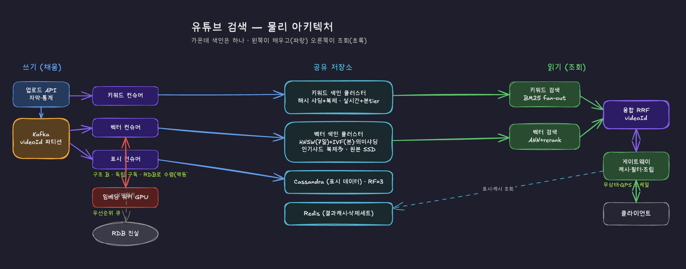

# 동영상 플랫폼 검색 시스템 설계

## 1. 문제 정의

### 두 종류의 질의를 모두 처리해야 한다

검색 시스템이 풀어야 하는 질의가 성격이 정반대인 두 부류로 나뉜다.

- **정확히 일치해야 하는 질의**: "침착맨", "뉴진스 Hype Boy" — 채널명·노래 제목은 한 글자도 틀리면 안 됨
- **내용을 묘사하는 질의**: "고양이가 박스에 뛰어드는 영상" → 정답 영상의 제목은 "우리집 냥이 일상 브이로그". 질의의 어떤 단어도 제목에 없음

전자는 키워드 매칭(역색인 + BM25), 후자는 의미 검색(임베딩 + 벡터 검색)이 필요하다. 한 방식으로는 둘 다 만족시킬 수 없어서 **두 경로를 병렬로 돌리고 결과를 융합**하는 하이브리드 구조가 강제된다.

### 색인은 살아있는 자료구조다

- 업로드된 영상은 수 분 내 검색에 노출되어야 함
- 삭제·비공개 영상은 결과에서 빠르게 사라져야 함

즉 색인은 한 번 만들고 끝이 아니라 끊임없이 갱신되는 구조여야 한다. 이게 단순 검색 엔진과 다른 핵심 난이도다.

### 규모

| 항목 | 수치 |
| --- | --- |
| 색인 대상 영상 | 50억 건 |
| 신규 업로드 | 일 400만 건 ≈ 초당 ~46건 |
| 검색 QPS | 평균 5만 / 피크 20만 |
| 통계(조회수) 갱신 | 초당 수십만 건 |
| 검색 응답 목표 | p95 300ms |
| 업로드 → 노출 | 5분 이내 |
| 삭제 → 결과 제외 | 1분 이내 |

추출 모델(STT 자막, 프레임 캡셔닝 등)은 이미 존재한다고 가정하고 가져다 쓴다. 무엇을 뽑을지는 설계 재량이되, 그 선택이 색인 규모·비용으로 되돌아온다.

---

## 2. 전체 조감도

시스템은 크게 **쓰기 경로**(데이터가 저장소로 들어감)와 **읽기 경로**(질의가 결과로 나옴)로 나뉜다. 그리고 그 사이에 **4개의 저장소**가 있다.




핵심은 저장소가 4개로 나뉜 이유다 — **갱신 속도가 다른 데이터를 한 저장소에 두면 가장 빨리 변하는 것이 전체를 망가뜨린다.** 그래서 변경 속도별로 쪼갰다:

| 저장소 | 담는 것 | 변경 속도 | 기술 |
| --- | --- | --- | --- |
| 키워드 색인 | 텍스트(제목·자막) | 거의 불변 | Lucene 계열 (2티어) |
| 벡터 색인 | 의미 임베딩 | GPU 따라 지연 | HNSW + IVF (2티어) |
| 표시 스토어 | 썸네일·조회수·채널명 | 빈번 | Cassandra |
| 삭제 세트 | 삭제된 videoId | 즉시 | 인메모리 |

이 4개를 어떻게 채우고(쓰기), 어떻게 합쳐 읽는지(읽기)가 이 문서의 나머지다.

---

## 3. 색인 단위 — 영상 1개 = 벡터 1개

**결정: 청크 단위를 버리고 영상 단위 벡터로 간다.**

검색 결과로 사용자에게 보여주는 것은 영상 목록이지 자막 구간이 아니다. 그렇다면 "영상 안의 특정 구간"이 검색의 의미 단위일 때만 청크가 정당화되는데 — YouTube 검색의 대부분은 "이 영상이 무엇에 관한 영상이냐"(주제 검색)지 "영상의 3분 지점 그 내용"(구간 검색)이 아니다.

| | 영상 단위 (선택) | 청크 단위 (기각) |
| --- | --- | --- |
| 규모 | 50억 벡터 (15TB) | 1,000억 청크 (300TB) |
| 중복/독식 | 없음 | 한 영상이 후보 슬롯 독식 → group-by 필요 |
| 구간 검색 | 불가 (키워드 자막으로 보완) | 가능 |
| 의미 검색 핵심 가치 | **유지** (자막 전체 임베딩) | 유지 |


**예외 — 긴 영상은 업로더가 분할.** 2시간 영상을 벡터 하나로 뭉치면 주제가 너무 섞여 뭉개진다. 시스템이 자동 분할하면 "어디서 자를까"라는 ML 문제가 생기므로, 업로더가 챕터를 끊게 한다(YouTube 챕터). 사람이 의미 단위로 잘라주니 공짜로 깔끔한 분할이 나온다. docId는 `videoId` 또는 `videoId#chapterId`. 다만 현재의 아키텍쳐에선 다루지 않겠다.

---

## 4. 엔진 분리 — 키워드와 벡터를 따로

**결정: 키워드 엔진(Lucene 계열)과 벡터 엔진(Vespa/Milvus 등)을 물리적으로 분리한다.**

두 색인의 특성이 정반대라 한 엔진에 묶으면 서로 발목을 잡는다.

| | 키워드 색인 | 벡터 색인 |
| --- | --- | --- |
| 갱신 속도 | ms (즉시) | GPU 큐 대기 (느림) |
| merge 비용 | 쌈 (posting list 병합) | 비쌈 (HNSW 그래프 재구축) |
| 샤딩 기준 | videoId 해시 | 의미 클러스터 |

샤딩 기준조차 다르므로(아래) 두 시스템을 한 엔진에 묶는 것은 부자연스럽다. 분리가 필연이다.

**분리의 대가 — 정합성은 직접 책임.** 통합 엔진이면 "이 영상이 두 색인에 다 있나"가 엔진 보장인데, 분리하면 키워드엔 있고 벡터엔 없는 상태를 파이프라인이 관리해야 한다. 이건 수집(§7)에서 "과도기 불일치 수용 + 영구 불일치 방어"로 푼다.

두 엔진이 공유하는 유일한 것은 **videoId라는 공통 키**다. 색인 구조도, 샤딩도, 갱신 주기도 다 따로이고, 융합 단계가 이 둘을 잇는 유일한 다리다.

---

## 5. 벡터 색인 — 2티어 + SSD rerank

### 2티어: 갱신 특성이 정반대인 두 알고리즘을 역할 분담

| | 업데이트 tier | 본 tier |
| --- | --- | --- |
| 알고리즘 | HNSW | IVF + PQ |
| 담는 것 | 최근 7일 (~2,800만, ~84GB) | 전체 (~50억, 압축 ~500GB) |
| 갱신 | 한 건씩 insert 쌈 | 배치 빌드, 한 건 insert 약함 |
| 샤딩 | 작아서 불필요 (단일 + 복제본) | 의미 클러스터 샤딩 |

HNSW는 incremental insert가 싸지만 그래프가 메모리에 통째로 있어야 해서 50억엔 안 맞는다. IVF+PQ는 배치 빌드로 대규모를 싸게 감당하지만 분포가 변하면 centroid가 낡는다. 그래서 **신규(자주 변함)는 HNSW, 안정 데이터는 IVF**로 나눈다.

**2티어의 숨은 보너스 — 재클러스터링 부담 감소.** 업데이트 tier가 신규를 다 받아주니 IVF엔 며칠 지난 안정 데이터만 들어온다. centroid 드리프트가 느려져서 재클러스터링을 분기 1회급으로 미룰 수 있다. 매일 배치로 8일째 영상을 HNSW → IVF로 졸업시킨다.

### 본 tier 핫스팟 — 의미 샤딩의 대가

의미 클러스터 샤딩은 fan-out을 줄이지만, "비슷한 걸 모은다"가 "인기 있는 걸 한 군데 모은다"가 된다. 게임/K-pop 샤드에 데이터도 질의도 몰린다.

- **B — 밀도 기반 균등 분할**: 인기 클러스터는 잘게(서브클러스터로), 비인기는 뭉쳐서 샤드당 데이터량을 맞춤 → 저장 핫스팟 해결
- **C — 인기 샤드 정적 복제**: 상시 인기 카테고리(게임·음악·뉴스)는 복제본을 많이. 읽기 부하 분산. 뜨거운 10%만 복제하면 메모리 +7~23%
- **D — 결과 캐시**: 인기 질의는 같은 게 반복 → 캐시가 1차로 흡수. 돌발 주제도 "같은 질의 폭발"이라 캐시 친화적

돌발 주제는 캐시가 흡수하므로 **동적 복제는 안 한다**(정적만). 오토스케일러·로딩 지연을 떠안지 않는다.

### SSD rerank — 압축본은 메모리, 원본은 SSD

IVF+PQ는 압축 코드로 근사 거리만 계산해 부정확하다. 표준 해법은 **rerank** — PQ로 후보를 추리고, 추려진 수백 개만 원본 벡터로 정확한 거리를 다시 계산한다.

- 메모리: PQ 압축본 ~500GB (라우팅 + 1차 거리)
- NVMe SSD: 원본 15TB (rerank 때 후보 것만 읽기, RAM 대비 ~2-3ms 페널티)

**부수 효과**: rerank가 두 tier(HNSW 정확 거리 / IVF 근사 거리)의 점수도 같은 기준으로 통일해준다. tier 합칠 때의 점수 불일치 문제가 동시에 해결된다.

> 근거: Databricks "Decoupled by Design" — 압축본 메모리 + 원본 오브젝트 스토리지 rerank로 10억 규모 ~500ms (SSD면 더 빠름). DiskANN — PQ RAM 라우팅 + SSD 원본 rerank가 표준.

---

## 6. 키워드 색인 — 2티어 + 해시 샤딩

### 2티어 (벡터와 동일 패턴, 더 쉬움)

- 실시간 tier: 최근 N일, Lucene NRT(메모리 버퍼 → 1초 refresh)로 즉시 검색
- 본 색인: 50억, 최적화된 segment

벡터와 결정적 차이 — **키워드 merge는 싸다**(posting list 병합 = merge sort). 그래서 실시간 → 본 색인 편입을 부담 없이 자주 돌릴 수 있다.

### 샤딩: document-partitioned (videoId 해시)

| | document-partitioned (선택) | term-partitioned (기각) |
| --- | --- | --- |
| 분할 기준 | videoId 해시 | 단어 |
| 질의 | 전 샤드 fan-out | 일부 샤드만 |
| 색인 | 단순 | 영상이 단어 수만큼 흩어짐 |
| 다중 단어 질의 | 문제없음 | 샤드 간 posting list 교환 폭발 |

**왜 벡터는 fan-out을 줄였는데(의미 샤딩) 키워드는 전 샤드 fan-out을 받아들이나?** fan-out을 줄이는 비용이 정반대이기 때문이다. 벡터는 "질의 1벡터 → 가까운 클러스터 소수"라 클러스터링이 거의 공짜로 fan-out을 줄인다. 키워드는 "단어 여러 개 → 여러 샤드에 흩어짐"이라 fan-out을 줄이려다 샤드 간 통신이 폭발한다. **같은 목표(fan-out 감소)인데 한쪽은 싸고 한쪽은 비싸서 결정이 갈린다.**

키워드는 해시 분할이라 데이터가 균등해 저장 핫스팟이 없고, 질의 핫스팟은 결과 캐시가 막는다. 벡터에서 한 B+C 같은 게 필요 없다.


---

## 7. 수집 파이프라인

### 방식 2 — 이벤트는 참조, 상태는 RDB에서

| | 방식 1 (이벤트가 데이터를 실음) | 방식 2 (선택) |
| --- | --- | --- |
| 이벤트 내용 | {videoId, 제목, 설명, ...} | {videoId, "변경됨"} |
| 색인 시 | 이벤트 그대로 색인 | RDB에서 최신 읽어 색인 |
| 순서 역전 | 취약 (옛 이벤트가 최신 덮어씀) | **무관 (멱등)** |
| 재처리/복구 | 어려움 | 쉬움 (RDB가 진실) |

색인을 파생 데이터(source of truth = RDB)로 설계했으므로 방식 2가 철학과 일관된다. 이벤트가 어떤 순서로 오든 마지막 색인은 RDB의 현재 상태로 수렴한다.

**예외 — 통계는 방식 1.** 조회수는 초당 수십만 건이라 매번 RDB를 읽으면 폭발한다. 통계만 값을 직접 싣고 감쇄(아래)한다. *같은 "RDB 읽기"라도 수집 경로(쓰기 빈도, 낮음)에선 안전하고 검색 경로(질의 빈도, 높음)에선 위험하다 — 그래서 검색 시 RDB 검증은 안 하고 수집 시엔 한다.*

### 구조 B — 저장소별 독립 컨슈머

하나의 "영상 변경됨" 이벤트를 키워드/벡터/Cassandra 컨슈머가 **각자 독립적으로** 구독한다.

- 키워드 컨슈머는 즉시 색인, 벡터 컨슈머는 GPU 큐에서 천천히 — 서로 안 막음
- 각자 RDB에서 최신을 읽으니 진행 속도가 달라도 결국 같은 곳으로 수렴
- 한 컨슈머가 죽어도 나머지 색인은 진행

**과도기 불일치는 수용한다.** 키워드엔 색인됐는데 벡터엔 아직 없는 몇 분 — 이건 버그가 아니다. 그 영상은 키워드 검색으로 이미 찾아지니 노출 SLA를 충족하고(오히려 막으면 SLA를 깬다), 벡터는 곧 따라붙는다.

**영구 불일치만 방어한다.** 임베딩이 영영 실패하면(워커 다운) 재시도 → DLQ → 알람. RDB가 진실이라 해당 videoId만 재색인하면 복구된다.

**자막 병합도 공짜가 된다.** 방식 2라서 자막 도착은 "이 영상 다시 봐" 트리거일 뿐. 컨슈머가 RDB에서 (자막까지 채워진) 최신을 통째 재색인한다. "메타만 있던 문서에 자막을 부분 추가"하는 복잡한 머지가 없다.

### 벡터 임베딩 — 우선순위 큐 + 배칭

유입은 병목이 아니다(초당 ~100건, GPU 몇 장이면 여유). 진짜 문제는 버스트와 백필이다.

- **우선순위 분리**: 신규 업로드(High, SLA 대상) / 백필·재임베딩(Low, 여유분만). 버스트 땐 백필을 멈추고 신규에 GPU 몰아줌
- **dynamic batching**: "N개 차거나 T초 지나면 flush". 5분 SLA가 넉넉해 약간의 배치 지연을 허용하고 GPU 효율을 챙김
- **모델 교체**(50억 재임베딩)는 상시 파이프라인 밖 — 필요시 대규모 배치 클러스터로 며칠 만에

---

## 8. 동적 속성과 삭제/비공개

### 표시 데이터 — Cassandra

조회수·좋아요·썸네일·채널명을 색인 밖 별도 스토어에 둔다. 텍스트는 거의 안 변하는데 통계는 초당 수십만 건 변하므로, 한 저장소에 두면 통계 갱신이 색인을 망가뜨린다.

- 읽기: videoId → 메타데이터 묶음 (point lookup) — Cassandra가 제일 잘하는 것
- 쓰기: 갱신을 감쇄(임계 변화량 + 시간 윈도우 배치)해서 초당 수십만 → 수천으로
- 결합: 검색 최종 K개에만 조회 (필터 통과 후)

### 삭제 ≠ 비공개 (서로 다른 문제)

| | 삭제 | 비공개 |
| --- | --- | --- |
| 영상 존재 | 사라짐 | 계속 존재 |
| 처리 | 인메모리 세트 (자연 소멸) | 색인 visibility 필드 |
| 세트 크기 | 작게 유지 (merge로 제거되면 세트에서도 빠짐) | — (세트로 하면 영구 누적) |

**삭제**: 색인에서 즉시 물리 삭제는 segment 구조상 불가능하고 느리다. "삭제된 videoId 세트"를 서빙 노드가 들고 결과 반환 직전에 필터한다 — 색인은 더럽게 두고 결과만 깨끗하게. 세트는 "merge가 아직 못 따라간 최근 삭제"만 담아 작게 유지된다.

**비공개**: 영상이 계속 존재하므로 삭제 세트로 하면 10년치가 영구 누적된다. 대신 색인의 visibility 필드(동적 필드/DocValues)로 두고 검색 시 `AND public` 필터. 비공개가 쌓여도 색인 안 플래그일 뿐이라 메모리 문제가 없다. **재공개도 플래그 false→true라 대칭으로 공짜.**

---

## 9. 융합과 서빙

### RRF — 점수 대신 순위로 합친다

BM25 점수(0~수십)와 벡터 거리(0~1)는 스케일이 달라 weighted sum이 위험하다(한쪽이 압도). RRF는 각 목록의 **순위만** 사용한다.

```
최종점수(video) = 1/(k + 키워드순위) + 1/(k + 벡터순위)    (k=60)
```

- 점수 스케일 문제 원천 소멸, 튜닝할 건 k 하나
- 두 목록 다 상위인 영상이 자연히 위로, 한쪽에만 있어도 포함
- Elasticsearch/OpenSearch 하이브리드 검색 기본값


### 지연 예산 — 평균은 되고, 꼬리가 진짜 싸움

직렬 경로 합산이 평균 ~130-150ms로 p50은 300ms 안에 여유롭게 들어온다. 핵심은 병렬 구조 — 키워드 검색은 질의 임베딩이 불필요해 즉시 시작하고, 벡터 경로(임베딩 30ms → 검색 50ms = 80ms)와 병렬로 돌려 느린 쪽만 기다린다.


**p95 300ms의 진짜 적은 평균이 아니라 꼬리다.** fan-out에서 가장 느린 샤드 하나(GC 멈춤 수백 ms)가 전체를 결정하고, 샤드 수십 개라 그중 하나가 느릴 확률이 높다(fan-out은 max라 꼬리 증폭). ES 운영에서 P99 급등의 1위 원인이 GC다.

| 대응 | 상태 | 효과 |
| --- | --- | --- |
| 결과 캐시 + 질의임베딩 캐시 | 확정 | 인기 질의는 fan-out 자체를 안 함 |
| 부분 결과 (느린 샤드 포기) | 확정 | hedging의 부하 없는 대안 |
| GC 튜닝 | 확정 | 꼬리 근원 축소 |
| hedged request | TODO | 위 셋으로 부족하면 측정 후 (복제라 부하·복잡도 비용) |

> 근거: 웹규모 BM25 실측(짧은 질의, 샤딩 시 더 빠름) + 샤딩이 fan-out 지연을 거의 안 늘림(top-1000이라 위험구간 밖). 단 GC × fan-out 꼬리는 ES 프로덕션 실증.

---

## 10. 규모 계산 — 왜 이 구조여야 감당되는가

각 설계 결정은 "안 그러면 터진다"로 정당화된다. 숫자로 증명한다.

### 10-1. 벡터 메모리 — 분리하지 않으면 불가능

원본 벡터를 그대로 메모리에 올리는 경우:

```
50억 벡터 × 768차원 × 4바이트(float32) = 15TB
```

15TB를 전부 RAM에 올리는 건 비현실적이다(고용량 서버 수십 대를 벡터 저장에만). 그래서 **PQ 압축 + 원본 SSD 분리**가 선택이 아니라 필수다.

```
PQ 압축: 768차원 float → 약 64~100바이트 코드
50억 × 100바이트 = 500GB  (메모리에 올라감)
원본 15TB는 SSD에 (rerank 때 후보 수백 개만 읽음)
```

- 메모리 요구: **15TB → 500GB (1/30)**
- 압축으로 잃은 정확도는 rerank(원본 SSD 재계산)로 복구
- 결론: **압축본 메모리 + 원본 SSD 분리가 15TB를 한 자릿수 노드에 담는 유일한 길**

### 10-2. HNSW 2티어 — 7일로 자르지 않으면 불가능

HNSW는 그래프 전체가 메모리에 상주해야 한다(그래프 hop이 어디로든 점프하므로). 50억 전체를 HNSW로 하면:

```
50억 벡터 + 그래프 링크 → 15TB+ 메모리 상주 → 불가능
```

그래서 HNSW는 **최근 7일만** 담는다:

```
일 400만 업로드 × 7일 = 2,800만 벡터
2,800만 × 3KB = 약 84GB
```

- **84GB는 고용량 서버 한 대 메모리에 들어간다** → 샤딩조차 불필요(단일 + 복제본)
- 나머지 50억은 디스크 친화적인 IVF로 (배치 빌드, 압축본 500GB)
- 결론: **"insert 싼 HNSW는 작게, 대규모는 IVF로"가 두 알고리즘의 한계를 서로 메운다**

### 10-3. 임베딩 처리량 — 유입은 병목이 아니다

```
일 400만 업로드 ÷ 86,400초 = 초당 약 46건
변경 이벤트 포함 넉넉히 잡아 초당 ~100건
```

텍스트 임베딩 모델은 GPU 1장에서 배치 처리 시 초당 수백~수천 문장을 낸다.

```
필요: 초당 ~100건
GPU 1장 처리량: 초당 수백~수천 → GPU 몇 장이면 여유
```

- 평균 유입은 전혀 병목이 아니다(일 400만이 커 보여도 초당 46건)
- 진짜 문제는 **버스트**(피크 시 수백~수천/초)와 **백필**(50억 재임베딩) → 우선순위 큐로 분리
- 결론: **상시 임베딩은 작은 GPU 풀로 충분, 대규모 재처리만 별도 배치**

### 10-4. 통계 감쇄 — 색인에 넣으면 마비, 분리하면 평범

조회수 갱신을 색인에 직접 반영하는 경우:

```
초당 수십만 건 갱신 × 각각 문서 재색인(삭제 마킹 + 재추가)
→ 색인이 통계 갱신만 하다 끝남 (segment 무한 증식, merge 못 따라감)
```

텍스트 색인에서 떼어내 Cassandra로 분리하고 감쇄하면:

```
감쇄 1 (임계 변화량): 마지막 반영값 대비 5~10% 변할 때만 → 대부분 스킵
감쇄 2 (시간 윈도우): 영상별 1~5분 묶어 마지막 값만 (coalescing)
초당 수십만 → 초당 수천 (수십~수백 분의 1)
```

- Cassandra는 쓰기에 강한데(LSM), 거기에 감쇄까지 더하면 평범한 부하
- 결론: **변경 속도가 다른 데이터(불변 텍스트 vs 초당 수십만 통계)를 분리하는 것이 색인 마비를 막는다**

### 10-5. 핫스팟 복제 메모리 — 전체 복제 대비 +7~23%

본 tier(IVF 압축본 500GB)의 질의 부하는 멱법칙이다(상위 10% 샤드가 질의 80%).

```
전체 일괄 3벌 복제: 500GB × 3 = 1,500GB (베이스라인)

선택적 복제 (뜨거운 데만):
  차가운 90% (450GB) × 3벌 = 1,350GB
  뜨거운 10% (50GB)  × 10벌 = 500GB
  합계 = 1,850GB  → 베이스 대비 +23%

+ 결과 캐시(D)로 뜨거운 샤드 도달 부하 80%→24% 감소 시:
  뜨거운 10% × 5벌이면 충분 → 250GB
  합계 = 1,600GB  → 베이스 대비 +7%
```

- 뜨거운 샤드 부하는 3벌→10벌로 **3배 이상 분산**되는데 메모리는 +7~23%만
- "전체를 10벌 복제"라면 5TB지만, 뜨거운 10%만이라 0.1~0.35TB 추가로 끝
- 결론: **선택적 복제 + 캐시 조합이 부하 분산을 싸게 산다**

### 10-6. 저장 용량 총계

| 저장소 | 계산 | 용량 | 위치 |
| --- | --- | --- | --- |
| 키워드 색인 | 50억 × 텍스트, posting list 압축 | 수십 TB | 디스크 |
| 벡터 압축본 | 50억 × 100B (PQ) | ~500GB | 메모리 |
| 벡터 원본 | 50억 × 3KB | 15TB | SSD |
| HNSW tier | 2,800만 × 3KB | ~84GB | 메모리 |
| Cassandra | 50억 × 수백 B | 수 TB | 디스크 |
| 삭제 세트 | merge 차분만 | 수십만 건 | 메모리 |

핵심은 **메모리에 올리는 건 압축본·HNSW·삭제세트뿐**(합쳐 ~600GB대)이고, 대용량(원본 15TB, 키워드 수십 TB, Cassandra 수 TB)은 전부 SSD/디스크라는 것. 메모리는 "빠르게 접근해야 하는 것"만, 나머지는 싼 저장소로 — 이 분리가 50억 규모를 현실적 비용에 담는다.

---

## 11. 전체 결정 요약

| 컴포넌트 | 결정 | 핵심 이유 |
| --- | --- | --- |
| 색인 단위 | 영상 1벡터 (청크 X) | 결과가 영상 목록, 구간 검색은 비핵심 |
| 긴 영상 | 업로더 챕터 분할 | 자동 분할의 ML 문제 회피 |
| 엔진 | 키워드/벡터 분리 | 갱신·merge·샤딩 특성이 정반대 |
| 벡터 티어 | HNSW(7일) + IVF(본) | insert 싼 쪽 / 대규모 싼 쪽 분담 |
| 벡터 rerank | 압축본 메모리 + 원본 SSD | recall 회복 + 두 tier 점수 통일 |
| 벡터 핫스팟 | 밀도분할 + 정적복제 + 캐시 | 의미 샤딩의 대가, 동적 복제는 회피 |
| 키워드 샤딩 | videoId 해시 fan-out | term 분할은 다중단어 질의에 폭발 |
| 수집 | 방식2 (RDB 참조) + 구조B | 멱등, 저장소별 독립 속도 |
| 불일치 | 과도기 수용 / 영구만 방어 | 키워드 먼저 노출이 SLA에 유리 |
| 표시 데이터 | Cassandra | 통계 갱신을 색인에서 분리 |
| 삭제/비공개 | 세트 / visibility 필드 | 누적 특성이 달라 처리도 다름 |
| 융합 | RRF | 이종 점수 스케일 회피 |
| 서빙 꼬리 | 캐시+부분결과+GC튜닝 | fan-out max 꼬리, hedging은 보류 |

### 미해결 (TODO)

- **조회수 기반 랭킹**: 현재 랭킹은 텍스트+벡터 관련성만. 누적 인기(일 단위 OK)와 velocity/트렌딩(실시간 필요)을 분리해 다뤄야 — 누적은 색인 일배치, velocity는 별도 실시간 카운터(최근 델타만)
- **exact 질의 보호**: RRF는 "압도적 1등"을 모름. weighted RRF / 제목 완전일치 보너스 / 질의 라우팅
- **hedged request**: 부분 결과로 cache miss 롱테일 꼬리가 안 잡히면 추가
- **모델 교체 재임베딩**: 50억 재임베딩 시 신구 모델 벡터 공존 전략