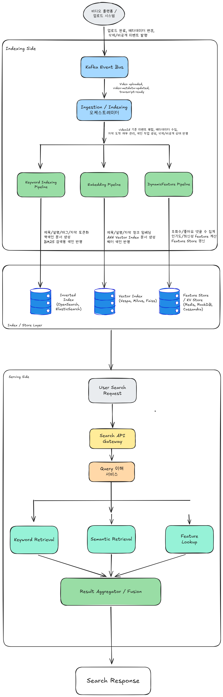

# Week7 과제: 동영상 플랫폼 검색 시스템 설계 (수집 → 색인 → 하이브리드 검색)

- 동영상 플랫폼(유튜브)에 업로드되는 영상의 메타데이터와 자막을 수집·색인하고, 키워드 검색(exact match)과 시맨틱 검색을 결합한 하이브리드 검색으로 사용자 질의에 응답하는 검색 시스템을 설계합니다

## 1. 문제 이해 및 설계 범위 확정

### 시나리오

유튜브에는 분당 수백 시간 분량의 영상이 업로드되고, 매초 수만 건의 검색 질의가 들어온다. 수십억 영상 중 관련 영상을 수백 ms 안에 찾아 반환해야 한다.

**서로 다른 두 종류의 질의를 모두 처리해야 한다**

- 정확히 일치해야 하는 질의: "침착맨", "뉴진스 Hype Boy" — 채널명·노래 제목은 한 글자도 틀리면 안 됨
- 내용을 묘사하는 질의: "고양이가 박스에 뛰어드는 영상" → 정답 영상 제목은 "우리집 냥이 일상 브이로그". 질의의 어떤 단어도 제목에 없음
- 영상은 본문이 없는 매체. 검색에 쓸 데이터를 영상에서 뽑아내는 것부터가 설계의 일부다 (제목·설명·태그는 기본, 자막·음성·프레임 등 무엇을 더 뽑을지는 자유)
- 한 가지 매칭 방식으로는 두 질의 유형을 모두 만족시킬 수 없다 — 어떤 검색 구조가 필요한가?

**색인은 계속 갱신되어야 한다**

- 업로드된 영상은 수 분 내 검색에 노출되어야 함 ("방금 올린 영상이 검색 안 돼요" = 최악의 CS)
- 조회수·좋아요는 색인된 뒤에도 계속 변함
- 삭제·비공개 영상은 결과에서 빠르게 사라져야 함
- 즉 색인은 한 번 만들고 끝이 아니라 계속 갱신되는 살아있는 자료구조여야 한다

**이 과제의 초점**

- 랭킹 모델 고도화·품질 측정이 아니라 검색 인프라: 안정적 수집·색인 / 낮은 지연의 후보 검색(retrieval) / 색인 최신 상태 유지

다만, 유튜브가 아닌 다른 대상으로 구체화해도 좋다. (수집-색인-하이브리드 검색 구조라면)

```
- 틱톡/릴스 숏폼 검색
- 팟캐스트 에피소드 검색 (음성 → 자막 기반)
- 인프런/유데미 강의 검색 ("그 개념 설명하는 강의 찾기")
- 사내 회의 녹화/녹취록 검색
- OTT 콘텐츠 검색 (넷플릭스류)
```

---

## 설계 범위

| 포함 (In Scope) | 제외 (Out scope) |
| --- | --- |
| 영상에서 검색용 데이터를 무엇으로 뽑을지 설계 (자막, 음성, 프레임 캡션 등 자유) | 추출 모델(STT, 캡셔닝 등) 자체의 구현·학습 |
| 영상 메타데이터/추출 데이터 수집 파이프라인 | 영상 업로드/트랜스코딩 파이프라인 자체 |
| 색인 단위 설계 (영상 단위 vs 청크 단위) | 임베딩 모델 학습 자체 |
| 키워드 매칭용 색인 구축 및 샤딩 | 정밀 재랭킹 모델 (LTR, cross-encoder) |
| 임베딩 생성 및 의미 검색용 색인 | 검색 품질 평가 (nDCG, 평가셋 구축) |
| 두 검색 경로 결과의 융합 (하이브리드 검색) | 개인화 검색 / 추천 시스템 |
| 업로드 즉시 검색 노출 (실시간 색인) | 검색어 자동완성, 오타 교정 |
| 조회수 등 동적 속성 갱신 반영 | 어뷰징/저작권/제한 콘텐츠 필터링 정책 |
| 삭제/비공개 전환 색인 반영 | 광고 시스템 |
| 쿼리 서빙 (분산 조회, 결과 병합) |  |
| 장애 복구 및 색인 재구축 |  |

> 영상에서 어떤 데이터를 추출해 색인할지는 전적으로 설계 재량이다. 추출 모델(STT, 프레임 캡셔닝, 챕터 요약 등)은 이미 존재한다고 가정하고 가져다 쓰면 되며, ML 모델을 만들라는 뜻이 아니다. 다만 무엇을 뽑느냐에 따라 색인 규모, 도착 지연, 비용이 달라지므로 그 선택의 결과는 설계에서 책임져야 한다.
>

---

## 시스템 구성 전제

- 영상 업로드/트랜스코딩 파이프라인은 이미 존재하며, 업로드 완료·메타데이터 변경·삭제 이벤트가 Kafka로 발행된다고 가정한다.
- 영상에서 텍스트를 추출하는 시스템(STT 자막, 프레임 캡셔닝 등)은 이미 존재한다고 가정한다. 어떤 데이터를 추출해 색인에 쓸지는 설계 재량이며, 추출 결과는 업로드 후 수 분~수십 분 지연되어 이벤트로 도착한다.
- 원본 메타데이터/자막의 source of truth는 별도 DB와 Object Storage에 있고, 검색 색인은 파생 데이터라고 가정한다.
- 역색인 엔진은 직접 설계하거나 Lucene 계열(Elasticsearch, OpenSearch)을 사용할 수 있다.
- 벡터 색인은 HNSW, IVF 등 ANN 알고리즘 기반 엔진(Faiss, Vespa, Milvus, Lucene KNN 등)을 사용할 수 있다.
- 임베딩 모델은 자체 서빙(GPU)하며, 처리량 한계와 호출 비용이 존재한다고 가정한다.
- 조회수·좋아요 등 통계 값은 별도 집계 시스템이 산출하며, 검색 시스템은 이를 구독해 반영한다고 가정한다.
- 본 시스템은 후보 검색(retrieval)과 단순 fusion까지를 다루며, 그 이후의 정밀 랭킹은 다루지 않는다.

---

## 기능 요구사항 및 고려할 점

요구사항은 한 줄씩만 적고, 각 요구사항에서 무엇이 문제가 되는지를 함께 정리한다. 설계는 이 문제들에 답하는 과정이다.

### [수집] 영상 업로드·변경·삭제·자막 생성 이벤트를 수신해 색인할 수 있어야 한다

- 문제: 한 영상의 데이터가 한 번에 오지 않는다. 메타데이터는 업로드 즉시, 자막은 STT를 거쳐 수십 분 뒤에 도착한다. 자막을 기다렸다 색인하면 노출 SLA가 깨지고, 따로 색인하면 같은 영상을 두 번 갱신해야 한다.

### [색인] 키워드 매칭용 색인과 의미 검색용 색인을 함께 유지해야 한다

- 문제: 색인이 두 개다. 텍스트 색인 등록은 ms 단위인데 임베딩 생성은 GPU 처리량에 묶여 있어, 두 색인의 상태가 항상 어긋나 있는 게 기본값이 된다. 이 불일치를 허용할 것인가, 막을 것인가.
- 문제: 문서 단위가 자명하지 않다. 10분 분량 자막을 벡터 하나로 뭉치면 여러 주제가 평균되어 내용 묘사 질의에 잡히지 않는다. 그렇다고 잘게 쪼개면 색인 규모가 20배(1,000억 건)로 뛴다. 검색의 문서 단위를 무엇으로 잡을 것인가 — 두 색인에서 같은 단위를 써야 하는가?

### [융합] 키워드 매칭 후보와 의미 기반 후보를 하나의 결과로 융합해야 한다

- 문제: 두 경로의 점수는 스케일이 달라 그냥 더할 수 없다. 융합 방식에 따라 한쪽 경로가 다른 쪽을 압도한다.
- 문제: 의미 검색 경로는 태생적으로 느리다. 수십억 벡터의 정확한 최근접 탐색은 불가능해서 근사 탐색을 쓰는데, 탐색 범위를 넓히면 지연이 늘고, 여기에 질의 임베딩 생성(GPU 호출) 지연까지 얹힌다. 의미 검색 경로가 전체 지연 예산의 병목이 되는 구조다.

### [신선도] 업로드 후 수 분 내 검색 노출, 삭제 후 1분 내 결과 제외가 되어야 한다

- 문제: 검색이 빠른 색인일수록 갱신에는 불리하다. 색인은 검색 속도를 위해 압축하고 정리해서 꽉 눌러 담은 구조라, 중간에 한 건 끼워 넣는 것보다 통째로 다시 쓰는 게 자연스러운 자료구조다. "방금 올라온 영상을 바로 노출하라"는 요구와 "50억 건을 빠르게 검색하라"는 요구가 정면으로 충돌한다.
- 문제: 이런 색인에서 삭제는 보통 그 자리에서 지우지 않고 "삭제됨" 표시만 해뒀다가 나중에 한꺼번에 정리한다. 정리 전까지 비공개 영상이 검색에 남아 있을 수 있는데, 이 시간을 어떻게 1분 안으로 줄이는가.

### [동적 속성] 조회수·좋아요 변경이 재색인 없이 검색에 반영되어야 한다

- 문제: 텍스트는 거의 안 변하는데 통계 값은 초당 수십만 건씩 변한다. 변할 때마다 문서를 다시 색인하면 색인 시스템이 통계 갱신만 하다 끝난다. 그렇다고 안 반영하면 검색 결과의 조회수가 며칠 전 값이다. 어떻게 할 것인가.
- 추가 문제: 결과에 표시만 할 때는 다 고른 뒤에 값을 붙이면 됐다. 그런데 순위에 반영하려면 후보를 고르는 그 시점에 값이 필요하다

### [서빙] 상위 K개 영상 목록(매칭 구간 타임스탬프 포함)을 p95 300ms 내 반환해야 한다

- 문제: 색인이 수십 개 조각(샤드)에 나뉘어 있어, 한 질의가 두 경로 × 수십 샤드로 흩어져 조회된 뒤 다시 모인다. 가장 느린 샤드 하나가 전체 응답 시간을 결정한다.
- 문제: 청크 단위로 검색하면 같은 영상의 청크 여러 개가 후보로 돌아온다. 사용자에게 보여줄 것은 영상 목록인데, 이 간극을 어디서 어떻게 메울 것인가.

---

## 비기능 요구사항

| 항목 | 목표 |
| --- | --- |
| 검색 응답 지연 | p95 300ms 이내 (end-to-end) |
| 후보 검색(retrieval) 지연 | 키워드/의미 경로 각각 p95 50ms 이내 |
| 업로드 → 검색 노출 지연 | 메타데이터 기준 5분 이내 |
| 삭제/비공개 → 결과 제외 지연 | 1분 이내 |
| 동적 속성(조회수) 반영 지연 | 수 분 이내 (정확한 실시간성 불요) |
| 색인 가용성 | 색인 갱신/재구축 중 무중단 서빙 |
| 확장성 | 영상 수 증가에 따라 색인 샤드 수평 확장 가능 |
| 데이터 정합성 | 색인은 파생 데이터, source of truth 기준 전체 재구축 가능 |
| 임베딩 처리량 | 신규 유입 영상의 임베딩 생성이 유입 속도를 따라갈 것 |

---

## 대략적 규모 추정

| 항목 | 수치 |
| --- | --- |
| 색인 대상 영상 수 | 50억 건 |
| 신규 업로드 | 분당 500시간 분량 ≈ 일 400만 건 |
| 메타데이터 크기 (제목+설명+태그) | 영상당 평균 2KB |
| 자막 크기 | 영상당 평균 15KB (10분 영상 기준) |
| 전체 자막 텍스트 | 약 75TB |
| 자막 청크 수 | 영상당 20개 → 전체 1,000억 청크 |
| 영상 단위 임베딩 | 50억 × 768차원 float32(3KB) ≈ 15TB |
| 청크 단위 임베딩 (전부 할 경우) | 1,000억 × 3KB ≈ 300TB ← 전부 임베딩할 것인가? |
| 신규 임베딩 생성 처리량 | 일 400만 영상 → 초당 약 50건 (청크 단위면 ×20) |
| 검색 QPS | 평균 50,000 / 피크 200,000 |
| 질의당 후보 수 | 경로별 top 1,000 (키워드 / 의미) |
| 동적 속성 갱신 | 조회수 변경 이벤트 초당 수십만 건 (전부 색인에 반영?) |

# 2. 개략적 설계안 제시 및 동의 구하기

## 핵심 흐름

본 시스템의 핵심 흐름은 `영상 데이터 수집 → 검색용 데이터 추출 → 색인 생성 → 하이브리드 검색 → 결과 병합 및 반환`으로 구성된다.

```text
영상 업로드 / 변경 / 삭제 이벤트
→ Metadata & Transcript 수집 파이프라인
→ Text Indexing Pipeline / Embedding Pipeline
→ Keyword Index + Vector Index
→ Query Service
→ Hybrid Retrieval
→ Score Fusion
→ Top-K 영상 결과 반환
```

검색 대상 데이터는 크게 두 종류로 나눈다.

첫 번째는 제목, 설명, 태그, 채널명, 자막과 같은 **텍스트 기반 데이터**이다.
이 데이터는 키워드 검색을 위한 역색인에 들어간다.

두 번째는 영상 내용이나 자막 청크를 임베딩한 **벡터 데이터**이다.
이 데이터는 사용자의 자연어 설명형 질의를 처리하기 위한 벡터 색인에 들어간다.

검색 시점에는 키워드 검색 경로와 의미 검색 경로를 병렬로 실행한 뒤, 두 결과를 하나로 합치는 Hybrid Search 구조를 사용한다.

---

## 개략적 아키텍처 다이어그램
<p align="center">
  
</p>


---

## 컴포넌트별 역할

### 1. Kafka Event Bus

영상 업로드, 메타데이터 변경, 자막 생성 완료, 삭제/비공개 전환, 조회수 변경 이벤트를 수신하는 이벤트 버스이다.

색인 시스템은 원본 DB를 직접 주기적으로 스캔하지 않고, 이벤트를 기반으로 색인 갱신 작업을 수행한다.

Kafka를 사용하는 이유는 업로드·자막·삭제·통계 갱신 이벤트가 비동기로 발생하고, 각 이벤트를 안정적으로 처리해야 하기 때문이다.

---

### 2. Ingestion / Indexing Orchestrator

한 영상의 데이터는 한 번에 도착하지 않는다.

메타데이터는 업로드 직후 도착하지만, 자막은 STT 처리 이후 수 분~수십 분 뒤에 도착할 수 있다. 따라서 Orchestrator는 `videoId` 기준으로 이벤트를 병합하고, 현재 색인 상태를 관리한다.

예를 들어 메타데이터만 먼저 도착하면 제목·설명·태그만으로 임시 색인을 생성한다. 이후 자막이 도착하면 해당 videoId의 문서를 다시 갱신한다.

```text
video-uploaded
→ 메타데이터 기반 1차 색인

transcript-ready
→ 자막 청크 기반 2차 색인

video-deleted
→ 삭제 tombstone 반영
```

---

### 3. Keyword Indexing Pipeline

키워드 검색을 위한 역색인을 생성한다.

제목, 설명, 태그, 채널명, 자막 텍스트를 토큰화하고, Lucene/OpenSearch/Elasticsearch 계열의 역색인에 등록한다.

정확한 질의, 예를 들어 채널명이나 노래 제목 검색에서는 키워드 매칭이 매우 중요하다.

```text
"침착맨"
"뉴진스 Hype Boy"
"아이유 밤편지"
```

이런 질의에서는 의미적으로 비슷한 후보보다 정확히 일치하는 문서가 우선되어야 한다.

---

### 4. Embedding Pipeline

시맨틱 검색을 위한 임베딩을 생성한다.

제목, 설명, 자막 청크, 필요하다면 프레임 캡션을 임베딩 모델에 입력하고, 결과 벡터를 Vector Index에 저장한다.

자연어 설명형 질의는 제목에 단어가 직접 포함되지 않아도 의미적으로 관련 있는 영상을 찾아야 한다.

예를 들어:

```text
"고양이가 박스에 뛰어드는 영상"
```

이라는 질의는 제목에 “고양이”, “박스”, “뛰어드는”이 없더라도, 자막이나 프레임 캡션 의미가 유사한 영상을 찾아야 한다.

---

### 5. Inverted Index

키워드 검색을 위한 색인이다.

일반적으로 Lucene 계열 엔진인 OpenSearch, Elasticsearch 등을 사용할 수 있다.

역색인은 단어에서 문서 목록으로 가는 구조를 가진다.

```text
"뉴진스" → video1, video7, video100
"Hype" → video7, video20
"Boy" → video7, video30
```

이 구조를 사용하면 수십억 영상 중에서도 특정 키워드를 포함한 후보를 빠르게 찾을 수 있다.

---

### 6. Vector Index

의미 검색을 위한 색인이다.

영상 또는 자막 청크를 벡터로 변환하고, ANN 기반으로 근사 최근접 검색을 수행한다.

후보 기술로는 Vespa, Milvus, Faiss, Lucene KNN 등을 사용할 수 있다.

정확한 전체 벡터 탐색은 비용이 너무 크기 때문에, HNSW나 IVF 같은 ANN 알고리즘을 사용해 지연 시간과 검색 품질 사이의 균형을 맞춘다.

---

### 7. Feature Store / KV Store

조회수, 좋아요, 댓글 수, 최신성, 삭제/비공개 상태 같은 동적 속성을 저장한다.

이 값들은 매우 자주 변하기 때문에 검색 색인 문서를 매번 재색인하지 않는다.

대신 별도 Feature Store나 KV Store에 저장하고, 검색 결과 후보가 나온 뒤 해당 videoId들의 동적 속성을 조회해 결과 표시나 점수 계산에 사용한다.

---

### 8. Query Understanding Service

사용자 질의를 분석하는 계층이다.

질의가 exact match에 가까운지, 자연어 설명형 질의인지 판단하고, 키워드 검색과 시맨틱 검색의 가중치를 조정한다.

예를 들어 `"뉴진스 Hype Boy"`는 exact 성격이 강하므로 키워드 검색 가중치를 높인다.

반대로 `"운동할 때 들으면 신나는 노래"` 같은 질의는 시맨틱 검색 가중치를 높일 수 있다.

---

### 9. Keyword Retrieval

BM25 기반으로 키워드 후보를 조회한다.

제목, 채널명, 태그, 자막 필드마다 가중치를 다르게 둘 수 있다.

예를 들어 제목과 채널명 매칭은 자막 본문 매칭보다 더 높은 가중치를 줄 수 있다.

```text
title match > channel match > tag match > transcript match
```

---

### 10. Semantic Retrieval

질의를 임베딩한 뒤 Vector Index에서 유사한 영상 또는 자막 청크를 검색한다.

자막 청크 단위로 검색하면 특정 장면이나 구간을 잘 찾을 수 있지만, 같은 영상의 여러 청크가 후보로 중복 반환될 수 있다.

따라서 이후 Aggregator에서 청크 후보를 영상 단위로 묶어야 한다.

---

### 11. Result Aggregator / Fusion

키워드 검색 결과와 시맨틱 검색 결과를 하나로 합치는 계층이다.

두 경로의 점수는 스케일이 다르기 때문에 단순히 더하면 안 된다. 따라서 score normalization, RRF, weighted fusion 같은 방법을 사용할 수 있다.

또 삭제/비공개 상태를 확인해 결과에서 제외하고, 청크 단위 후보는 videoId 기준으로 aggregation한다.

최종적으로 top-K 영상 목록과 매칭 구간 timestamp를 반환한다.

---

## 개략적 설계의 핵심 선택

### 1. 검색 경로를 두 개로 분리한다

키워드 검색과 시맨틱 검색은 서로 잘하는 질의 유형이 다르다.

* 키워드 검색: 정확한 제목, 채널명, 고유명사 검색에 강함
* 시맨틱 검색: 내용을 묘사하는 자연어 질의에 강함

따라서 두 경로를 병렬로 실행하고 결과를 융합하는 Hybrid Search 구조를 사용한다.

---

### 2. 색인과 동적 속성 저장소를 분리한다

조회수, 좋아요, 댓글 수 같은 값은 계속 변한다.

이를 색인에 직접 반영하려고 하면 재색인 비용이 과도하게 커진다. 따라서 텍스트/벡터 색인은 정적인 검색 필드를 중심으로 관리하고, 동적 속성은 Feature Store 또는 KV Store에서 별도로 관리한다.

검색 시에는 후보 videoId를 먼저 찾고, 이후 동적 속성을 조회해 점수 계산과 결과 표시 단계에 반영한다.

---

### 3. 업로드 즉시 노출과 완전한 색인을 분리한다

업로드 후 5분 내 검색 노출을 위해, 메타데이터 기반 1차 색인을 먼저 수행한다.

자막이나 프레임 캡션, 임베딩은 늦게 도착할 수 있으므로, 도착하는 시점에 2차 색인으로 보강한다.

```text
업로드 직후
→ 제목/설명/태그 기반 검색 노출

자막 생성 후
→ 자막 청크 색인 추가

임베딩 생성 후
→ 시맨틱 검색 노출 강화
```

이 구조는 신선도를 우선하면서도, 시간이 지나면 검색 품질을 점진적으로 높일 수 있다.

---

### 4. 색인은 Source of Truth가 아니라 파생 데이터로 본다

원본 메타데이터와 자막은 별도 DB와 Object Storage에 저장되어 있고, 검색 색인은 이를 기반으로 만든 파생 데이터이다.

따라서 색인이 손상되거나 불일치가 발생해도 source of truth를 기준으로 재구축할 수 있어야 한다.

이 전제 덕분에 색인 갱신 실패나 재구축 전략을 설계할 수 있다.


---
# 3. 상세 설계

## 상세 설계 주제 선정

이번 상세 설계에서는 동영상 검색 시스템의 핵심인 `수집 → 색인 → 하이브리드 검색 → 신선도 유지 → 서빙` 흐름을 중심으로 다룬다.

특히 본 시스템은 키워드 검색과 시맨틱 검색을 모두 지원해야 하므로, 단일 검색 색인만으로는 요구사항을 만족하기 어렵다. 따라서 다음 네 가지를 중점적으로 설계한다.

* 3-1. 수집 파이프라인 설계
* 3-2. 색인 단위 설계: 영상 단위 vs 자막 청크 단위
* 3-4. 하이브리드 검색과 Score Fusion
* 3-5. 업로드 즉시 노출: 실시간 색인 구조
* 3-6. 동적 속성 갱신과 삭제 처리
* 3-7. 쿼리 서빙 구조
* 3-8. 저장 비용, 신선도, 검색 범위 Trade-off

본 설계에서 선택한 주요 기술 스택은 다음과 같다.

| 영역        | 선택 기술              | 선택 이유                                    |
| --------- | ------------------ | ---------------------------------------- |
| 이벤트 수집    | Apache Kafka       | 업로드·자막·삭제·통계 갱신 이벤트를 안정적으로 수집하고 재처리 가능   |
| 수집/병합 처리  | Kafka Streams      | `videoId` 기준 이벤트 순서 보장과 상태 저장에 적합        |
| 키워드 검색 색인 | OpenSearch         | Lucene 기반 BM25 검색, 샤딩, 실시간 색인, 운영 도구 제공  |
| 벡터 검색 색인  | Milvus             | 대규모 벡터 검색, IVF_PQ 기반 압축 색인, 수평 확장 지원     |
| 동적 속성 저장소 | Redis Cluster      | 조회수·좋아요·삭제 상태 등 후보 결과의 빠른 feature lookup |
| 원본 텍스트 저장 | Object Storage     | 자막 원본, 추출 결과, 재색인용 데이터 장기 보관             |
| Query API | Search API Service | 두 검색 경로 호출, fusion, 필터링, 최종 응답 생성        |

---

## 3-1. 수집 파이프라인 설계

### 1. 설계 목표

영상 검색 색인은 한 번에 완성되지 않는다.

영상 업로드 직후에는 제목, 설명, 태그, 채널명 같은 메타데이터만 먼저 도착한다. 반면 자막, 음성 인식 결과, 프레임 캡션, 임베딩 결과는 수 분에서 수십 분 뒤에 도착할 수 있다.

따라서 본 설계에서는 `videoId`를 기준으로 여러 이벤트를 병합하고, 가능한 데이터부터 단계적으로 색인하는 구조를 선택한다.

```text
video-uploaded
→ 메타데이터 기반 1차 색인

transcript-ready
→ 자막 청크 기반 2차 색인

embedding-ready
→ 벡터 색인 반영

video-deleted / private
→ 검색 결과에서 빠르게 제외
```

---

### 2. Kafka Topic 설계

Kafka Topic은 이벤트 성격별로 분리한다.

| Topic                  | 설명                            |
| ---------------------- | ----------------------------- |
| video-uploaded         | 영상 업로드 완료 이벤트                 |
| video-metadata-updated | 제목, 설명, 태그, 썸네일 등 변경 이벤트      |
| transcript-ready       | STT 자막 생성 완료 이벤트              |
| caption-ready          | 프레임 캡션 생성 완료 이벤트              |
| embedding-ready        | 임베딩 생성 완료 이벤트                 |
| video-deleted          | 삭제·비공개 전환 이벤트                 |
| engagement-updated     | 조회수, 좋아요, 댓글 수 등 동적 속성 갱신 이벤트 |

Partition Key는 모든 Topic에서 `videoId`로 둔다.

```text
partition key = videoId
```

이렇게 하면 같은 영상에 대한 업로드, 자막 도착, 임베딩 완료, 삭제 이벤트가 같은 Partition으로 들어가므로 이벤트 순서를 관리하기 쉽다.

### Trade-off

`videoId` 기준 Partitioning은 같은 영상 단위 순서 보장에는 유리하다. 하지만 인기 영상의 조회수 이벤트까지 같은 키로 넣으면 특정 `videoId`에 트래픽이 몰릴 수 있다.

따라서 `engagement-updated`는 검색 색인 파이프라인과 분리하고, 동적 속성 저장소인 Redis Cluster에 별도로 반영한다.

---

### 3. Kafka Streams 기반 Indexing Orchestrator

수집 파이프라인에서는 Kafka Streams를 사용한다.

Kafka Streams를 선택한 이유는 다음과 같다.

* Kafka Topic을 읽어 상태 기반 처리를 하기 쉽다.
* `videoId` 기준으로 이벤트를 묶기 좋다.
* 로컬 State Store를 통해 영상별 색인 상태를 관리할 수 있다.
* 별도 대형 Stream Processing Cluster 없이 색인 파이프라인을 구성할 수 있다.

Indexing Orchestrator는 각 영상의 색인 상태를 관리한다.

```text
videoId = V123

metadataIndexed = true
transcriptIndexed = false
embeddingIndexed = false
visibility = PUBLIC
```

메타데이터가 먼저 도착하면 OpenSearch에 1차 색인을 수행한다. 이후 자막이 도착하면 자막 청크 문서를 추가하고, 임베딩이 생성되면 Milvus에 벡터를 등록한다.

---

### 4. 업로드 노출 SLA 처리

업로드 후 5분 내 검색 노출을 위해 자막이나 임베딩을 기다리지 않는다.

```text
업로드 직후
→ 제목 / 설명 / 태그 / 채널명 기반 OpenSearch 색인

자막 도착 후
→ 자막 청크 색인 추가

임베딩 생성 후
→ Milvus 벡터 색인 추가
```

이 구조는 완성도보다 신선도를 우선한다. 즉, 처음에는 키워드 검색에만 노출되고, 이후 자막과 임베딩이 도착하면 시맨틱 검색 품질이 점진적으로 좋아진다.

### Trade-off

장점은 업로드 직후 검색 노출 SLA를 지킬 수 있다는 점이다. 단점은 업로드 직후에는 자막 기반 검색과 의미 검색 품질이 낮을 수 있다는 점이다.

---

## 3-2. 색인 단위 설계: 영상 단위 vs 자막 청크 단위

### 1. 색인 단위 선택

본 설계에서는 키워드 색인과 벡터 색인의 단위를 다르게 가져간다.

| 색인     | 단위               | 이유                                             |
| ------ | ---------------- | ---------------------------------------------- |
| 키워드 색인 | 영상 문서 + 자막 청크 문서 | 제목/설명/태그 exact match와 자막 구간 검색 모두 필요           |
| 벡터 색인  | 자막 청크 단위         | 긴 영상 전체를 하나의 벡터로 만들면 여러 주제가 평균되어 의미 검색 품질이 떨어짐 |

---

### 2. 영상 단위 문서

영상 단위 문서는 제목, 설명, 태그, 채널명 같은 메타데이터 중심으로 구성한다.

```json
{
  "docType": "VIDEO",
  "videoId": "V123",
  "title": "우리집 냥이 일상 브이로그",
  "description": "고양이와 함께한 하루",
  "tags": ["고양이", "브이로그"],
  "channelName": "냥이집사",
  "createdAt": "2026-06-01T10:00:00",
  "visibility": "PUBLIC"
}
```

이 문서는 `"침착맨"`, `"뉴진스 Hype Boy"`, `"아이유 밤편지"`처럼 정확한 제목, 채널명, 고유명사 검색에 중요하다.

---

### 3. 자막 청크 문서

자막 청크 문서는 영상 내 특정 구간을 검색하기 위한 단위다.

```json
{
  "docType": "CHUNK",
  "videoId": "V123",
  "chunkId": "V123_0002",
  "startTime": 30,
  "endTime": 60,
  "chunkText": "고양이가 갑자기 택배 박스 안으로 뛰어들었어요.",
  "visibility": "PUBLIC"
}
```

청크는 기본적으로 30초 단위로 자르고, 앞뒤 5초 정도 overlap을 둔다.

```text
chunk size = 30초
overlap = 5초
```

Overlap을 두는 이유는 중요한 문장이 청크 경계에서 잘리는 문제를 줄이기 위해서다.

### Trade-off

청크를 작게 자르면 특정 장면을 더 정확히 찾을 수 있고 timestamp 제공도 쉬워진다. 하지만 색인 문서 수와 벡터 수가 크게 증가한다.

반대로 청크를 크게 자르면 저장 비용은 줄지만 여러 주제가 하나의 청크에 섞여 의미 검색 품질이 떨어진다.

본 설계에서는 검색 품질과 비용의 균형을 위해 30초 단위 청크를 기본으로 선택한다.

---

### 4. 청크 결과의 영상 단위 집계

사용자에게 보여줄 결과는 청크 목록이 아니라 영상 목록이다.

따라서 검색 결과에서 같은 `videoId`의 여러 청크가 반환되면 하나의 영상으로 묶는다.

```text
chunk V123_0002 score 0.91
chunk V123_0003 score 0.87
chunk V123_0005 score 0.72

→ video V123 score = max(chunk score)
→ best timestamp = V123_0002.startTime
```

본 설계에서는 영상 점수를 해당 영상의 최고 청크 점수로 계산한다.

```text
videoScore = max(chunkScore)
```

이렇게 하면 영상 내 특정 구간이 강하게 매칭될 때 해당 영상이 상위에 노출될 수 있다.

---

## 3-3. 역색인과 벡터 색인의 구축 및 샤딩

### 1. 키워드 색인: OpenSearch

키워드 검색에는 OpenSearch를 사용한다.

OpenSearch를 선택한 이유는 다음과 같다.

* Lucene 기반 역색인 제공
* BM25 기반 키워드 검색 지원
* 색인 샤딩과 Replica 운영 가능
* Near Real-Time 색인 갱신 지원
* 운영/모니터링 도구가 풍부함

OpenSearch 문서는 `videoId` 해시를 기준으로 Shard에 분산한다.

```text
shard key = hash(videoId)
```

이렇게 하면 영상 단위로 균등하게 분산할 수 있다.

### Trade-off

`videoId` 해시 샤딩은 데이터 분산에는 유리하지만, 최신 영상만 모아 검색하거나 인기 영상 tier를 분리하는 데는 불리하다. 따라서 신선도 요구는 별도 Real-time Index Tier로 보완한다.

---

### 2. 벡터 색인: Milvus

벡터 검색에는 Milvus를 사용한다.

Milvus를 선택한 이유는 다음과 같다.

* 대규모 벡터 검색에 특화되어 있음
* IVF_PQ 기반 압축 색인을 사용할 수 있음
* Collection/Partition 단위로 데이터 관리 가능
* ANN 기반 검색으로 대규모 벡터를 빠르게 탐색 가능

본 설계에서는 모든 영상을 하나의 벡터로 만들지 않고, 자막 청크 단위로 벡터를 만든다.

```text
embedding unit = subtitle chunk
```

색인 알고리즘은 IVF_PQ를 선택한다.

IVF_PQ를 선택한 이유는 전체 청크 수가 매우 크기 때문이다. HNSW는 검색 품질과 속도가 좋지만 메모리 사용량이 크다. 반면 IVF_PQ는 벡터를 압축해 저장할 수 있어 대규모 청크 벡터 저장에 유리하다.

### Trade-off

IVF_PQ는 저장 비용을 크게 줄일 수 있지만, 압축 과정에서 검색 정확도가 일부 떨어질 수 있다. 따라서 모든 후보를 IVF_PQ 결과만으로 최종 결정하지 않고, 상위 후보에 대해 원본 벡터 또는 텍스트 점수와 함께 fusion 단계에서 보완한다.

---

## 3-4. 하이브리드 검색과 Score Fusion

### 1. 설계 목표

검색 질의는 크게 두 종류로 나뉜다.

```text
정확 매칭형:
"침착맨", "뉴진스 Hype Boy"

의미 설명형:
"고양이가 박스에 뛰어드는 영상"
"잠 안 올 때 듣는 잔잔한 노래"
```

정확 매칭형 질의는 키워드 검색이 강하고, 의미 설명형 질의는 벡터 검색이 강하다.

따라서 본 설계에서는 OpenSearch 기반 키워드 검색과 Milvus 기반 의미 검색을 병렬 실행하고, 결과를 하나로 융합한다.

---

### 2. Query Understanding

Search API는 질의를 받으면 먼저 질의 유형을 간단히 판단한다.

| 질의 유형    | 예시                | 검색 가중치       |
| -------- | ----------------- | ------------ |
| Exact 질의 | 침착맨, 뉴진스 Hype Boy | 키워드 가중치 높음   |
| 자연어 설명형  | 고양이가 박스에 뛰어드는 영상  | 시맨틱 가중치 높음   |
| 혼합형      | 아이유가 라이브에서 부른 밤편지 | 키워드 + 시맨틱 균형 |

초기 설계에서는 복잡한 ML 분류기를 두지 않고, 규칙 기반으로 판단한다.

```text
짧고 고유명사/채널명 패턴 → 키워드 가중치 증가
긴 문장형 질의 → 시맨틱 가중치 증가
```

---

### 3. Score Fusion 방식

BM25 점수와 벡터 유사도 점수는 스케일이 다르다. 따라서 단순히 더하지 않는다.

본 설계에서는 RRF, 즉 Reciprocal Rank Fusion을 사용한다.

```text
RRF score = 1 / (k + keywordRank) + 1 / (k + semanticRank)
```

RRF는 점수 자체가 아니라 각 검색 경로에서의 순위를 기반으로 결과를 합친다. 따라서 BM25와 벡터 유사도 점수의 스케일 차이를 직접 맞추지 않아도 된다.

질의 유형에 따라 가중 RRF를 적용한다.

```text
exact 질의:
keyword weight = 0.8
semantic weight = 0.2

description 질의:
keyword weight = 0.4
semantic weight = 0.6
```

### Trade-off

RRF는 구현이 단순하고 점수 스케일 문제를 피할 수 있다. 반면 정교한 학습 기반 랭킹보다 검색 품질 최적화에는 한계가 있다.

본 과제는 정밀 랭킹이 아니라 retrieval과 단순 fusion이 범위이므로, RRF를 선택한다.

---

### 4. Exact 질의 보호

`"뉴진스 Hype Boy"` 같은 질의에서 시맨틱 검색 후보가 정답을 밀어내면 안 된다.

따라서 다음 규칙을 둔다.

```text
title exact match
channel exact match
official title match
```

위 조건에 해당하는 후보는 fusion 단계에서 boost를 부여한다.

```text
exact title match boost = +strong
```

이렇게 하면 의미적으로 비슷한 영상이 정확한 제목 매칭 영상을 밀어내는 문제를 줄일 수 있다.

---

## 3-5. 업로드 즉시 노출: 실시간 색인 구조

### 1. 설계 목표

업로드된 영상은 5분 내 검색에 노출되어야 한다. 하지만 전체 색인은 대규모 검색 성능을 위해 segment merge, 압축, 최적화가 필요하다.

따라서 본 설계에서는 색인을 두 계층으로 나눈다.

```text
Real-time Index Tier
→ 최근 업로드 영상, 빠른 갱신

Main Index Tier
→ 전체 영상, 검색 성능 최적화
```

---

### 2. Real-time Index Tier

Real-time Index Tier는 OpenSearch의 별도 Index로 구성한다.

최근 24시간 또는 48시간 내 업로드된 영상이 들어간다.

```text
video-rt-index
```

이 계층은 빠른 색인 갱신을 우선한다. 업로드 직후 메타데이터만으로도 문서를 생성해 검색 노출 SLA를 지킨다.

---

### 3. Main Index Tier

Main Index Tier는 전체 영상을 대상으로 하는 최적화된 색인이다.

```text
video-main-index
```

Real-time Index에 있던 영상은 자막, 임베딩, 통계 정보가 어느 정도 준비되면 Main Index로 병합된다.

검색 시점에는 두 색인을 함께 조회한다.

```text
Search Query
→ Real-time Index 조회
→ Main Index 조회
→ 결과 병합
→ 중복 videoId 제거
```

### Trade-off

Real-time Tier를 두면 업로드 직후 노출이 가능하지만, 검색 시 두 색인을 함께 조회해야 하므로 Query Fan-out이 증가한다.

반면 하나의 Main Index만 사용하면 구조는 단순하지만, 새 영상 노출 지연이 커질 수 있다.

본 설계에서는 업로드 신선도를 우선해 Real-time Tier와 Main Tier를 분리한다.

---

### 4. 임베딩 지연 처리

임베딩 생성은 GPU 처리량에 영향을 받기 때문에 메타데이터 색인보다 늦게 완료될 수 있다.

따라서 업로드 직후에는 키워드 검색에만 노출하고, 임베딩이 준비되면 Milvus에 벡터를 등록한다.

```text
T+1분:
OpenSearch 메타데이터 색인 완료

T+10분:
자막 청크 색인 완료

T+20분:
Milvus 벡터 색인 완료
```

즉, 검색 가능 상태와 의미 검색 가능 상태를 분리한다.

---

## 3-6. 동적 속성 갱신과 삭제 처리

### 1. 조회수·좋아요 갱신

조회수, 좋아요, 댓글 수는 매우 자주 변한다. 이 값이 바뀔 때마다 OpenSearch 문서를 재색인하면 색인 시스템에 과도한 부하가 발생한다.

따라서 본 설계에서는 정적 검색 필드와 동적 속성을 분리한다.

```text
정적 검색 필드:
title, description, tags, transcript

동적 속성:
viewCount, likeCount, commentCount, popularityScore, visibility
```

정적 필드는 OpenSearch와 Milvus에 저장하고, 동적 속성은 Redis Cluster에 저장한다.

검색 시에는 먼저 OpenSearch/Milvus에서 후보 videoId를 가져온 뒤, Redis에서 해당 후보의 동적 속성을 batch lookup한다.

---

### 2. 동적 속성 반영 위치

동적 속성은 다음 두 단계에서 사용한다.

```text
1. 결과 표시 단계
- 조회수, 좋아요 수 표시

2. Fusion 이후 간단 점수 보정 단계
- popularityScore
- freshnessScore
```

후보 검색 자체는 색인에서 수행하고, 동적 속성은 후보 집합에 대해서만 조회한다.

이렇게 하면 모든 문서를 대상으로 DB 조회를 하지 않고, 후보 수천 개에 대해서만 빠르게 feature를 가져올 수 있다.

---

### 3. 삭제/비공개 처리

삭제 또는 비공개 전환은 1분 내 결과에서 제외되어야 한다.

OpenSearch나 Milvus에서 물리 삭제가 즉시 반영되지 않을 수 있으므로, 삭제 이벤트가 도착하면 Redis에 visibility 상태를 먼저 반영한다.

```text
video-deleted
→ Redis visibility = DELETED
→ Search API에서 결과 필터링
→ 이후 백그라운드에서 OpenSearch/Milvus 물리 삭제
```

검색 결과 후보가 나오면 Search API는 Redis에서 visibility를 확인하고, 삭제 또는 비공개 상태인 영상은 즉시 제외한다.

### Trade-off

이 방식은 삭제/비공개 SLA를 빠르게 만족할 수 있다. 하지만 색인 안에는 일정 시간 동안 삭제된 문서가 남아 있을 수 있다. 따라서 주기적인 compaction 또는 백그라운드 삭제 작업이 필요하다.

---

## 3-7. 쿼리 서빙 구조

### 1. 설계 목표

검색 API는 p95 300ms 이내에 상위 K개 영상을 반환해야 한다.

질의 처리 흐름은 다음과 같다.

```text
User Query
→ Search API
→ Query Understanding
→ Keyword Retrieval(OpenSearch)
→ Semantic Retrieval(Milvus)
→ Redis Feature Lookup
→ Fusion
→ Top-K Response
```

---

### 2. 병렬 검색

키워드 검색과 시맨틱 검색은 병렬로 실행한다.

```text
Search API
├─ OpenSearch keyword top 1000 요청
└─ Milvus semantic top 1000 요청
```

두 검색 경로를 순차 실행하면 지연이 누적되기 때문에 병렬 실행한다.

질의 임베딩 생성이 필요한 경우에도 Semantic Retrieval 경로 안에서 수행하되, 전체 지연 예산을 넘지 않도록 timeout을 둔다.

```text
semantic path timeout = 80ms
keyword path timeout = 50ms
```

시맨틱 경로가 timeout되면 키워드 결과만으로 응답한다.

---

### 3. Top-K 병합

각 경로에서 top 1000 후보를 가져온 뒤 videoId 기준으로 병합한다.

자막 청크 검색 결과는 같은 videoId로 묶는다.

```text
chunk V123_0002
chunk V123_0005
→ video V123
→ bestTimestamp = score가 가장 높은 chunk의 startTime
```

최종 응답은 영상 단위로 반환한다.

```json
{
  "videoId": "V123",
  "title": "우리집 냥이 일상 브이로그",
  "matchedTimestamp": 30,
  "viewCount": 120000,
  "score": 0.92
}
```

---

### 4. 인기 질의 캐시

피크 QPS를 낮추기 위해 인기 질의 결과는 짧은 TTL로 캐시한다.

```text
query result cache TTL = 30초
```

예를 들어 컴백 직후 특정 아티스트 이름이나 사건 관련 질의가 폭증할 수 있다. 이때 동일 질의 결과를 캐시하면 OpenSearch와 Milvus 부하를 줄일 수 있다.

### Trade-off

캐시를 사용하면 지연과 부하는 줄어든다. 하지만 업로드 직후 신선도나 삭제 반영이 늦어질 수 있다. 따라서 삭제/비공개 상태는 캐시 응답 직전 Redis에서 다시 확인한다.

---

## 3-8. 저장 비용, 신선도, 검색 범위 Trade-off

### 1. 청크 전체 임베딩 vs 일부 임베딩

모든 자막 청크를 임베딩하면 시맨틱 검색 커버리지는 좋아진다. 하지만 전체 1,000억 청크를 모두 768차원 float32로 저장하면 약 300TB 규모가 된다.

따라서 본 설계에서는 모든 청크를 동일하게 임베딩하지 않는다.

우선순위는 다음과 같이 둔다.

```text
1순위: 신규 업로드 영상
2순위: 조회수 상위 영상
3순위: 검색 유입이 많은 영상
4순위: 긴 자막이 있는 교육/정보성 영상
```

롱테일 영상은 메타데이터와 자막 키워드 색인만 먼저 제공하고, 임베딩은 비동기적으로 생성하거나 수요가 생길 때 생성한다.

### Trade-off

일부만 임베딩하면 저장 비용과 GPU 비용은 줄어든다. 하지만 롱테일 영상의 시맨틱 검색 커버리지가 낮아질 수 있다.

---

### 2. IVF_PQ 압축 선택

Milvus 벡터 색인은 IVF_PQ를 사용한다.

IVF_PQ는 벡터를 압축해 저장하므로 대규모 벡터 저장 비용을 줄일 수 있다.

하지만 압축으로 인해 검색 정확도가 일부 떨어질 수 있다.

따라서 본 설계에서는 시맨틱 검색을 최종 랭킹으로 사용하지 않고, 후보 검색 단계로만 사용한다. 이후 키워드 결과, 동적 feature, exact match boost와 함께 fusion 단계에서 보정한다.

---

### 3. 신선도 vs 검색 품질

업로드 직후에는 자막이나 임베딩이 준비되지 않았을 수 있다.

이때 완전한 색인을 기다리면 업로드 후 5분 내 노출 SLA를 지킬 수 없다.

따라서 본 설계는 다음 전략을 선택한다.

```text
메타데이터만 있어도 먼저 검색 노출
자막 도착 후 키워드 색인 보강
임베딩 완료 후 시맨틱 검색 보강
```

이 구조는 신선도를 우선하되, 시간이 지날수록 검색 품질이 개선되는 방식이다.

---

### 4. 삭제 즉시 반영 vs 물리 삭제 비용

OpenSearch와 Milvus에서 문서를 즉시 물리 삭제하는 것은 비용이 클 수 있다.

따라서 삭제 이벤트가 오면 Redis에 visibility 상태를 먼저 반영하고, 검색 응답 직전에 필터링한다.

물리 삭제는 백그라운드에서 수행한다.

```text
빠른 삭제 반영:
Redis visibility filter

최종 정리:
OpenSearch / Milvus background delete
```

### Trade-off

삭제 SLA는 빠르게 만족할 수 있지만, 색인에는 일정 시간 동안 삭제 문서가 남아 있을 수 있다. 따라서 검색 응답 전 visibility 필터가 반드시 필요하다.

---

## 상세 설계 요약

| 설계 항목      | 선택                                                   |
| ---------- | ---------------------------------------------------- |
| 이벤트 수집     | Kafka                                                |
| 이벤트 병합     | Kafka Streams                                        |
| 키워드 색인     | OpenSearch                                           |
| 벡터 색인      | Milvus                                               |
| 벡터 색인 알고리즘 | IVF_PQ                                               |
| 색인 단위      | 영상 문서 + 자막 청크                                        |
| 동적 속성 저장   | Redis Cluster                                        |
| Fusion 방식  | Weighted RRF                                         |
| 실시간 노출     | Real-time Index Tier + Main Index Tier               |
| 삭제 처리      | Redis visibility filter + background physical delete |
| 원본 저장      | Object Storage                                       |

---
