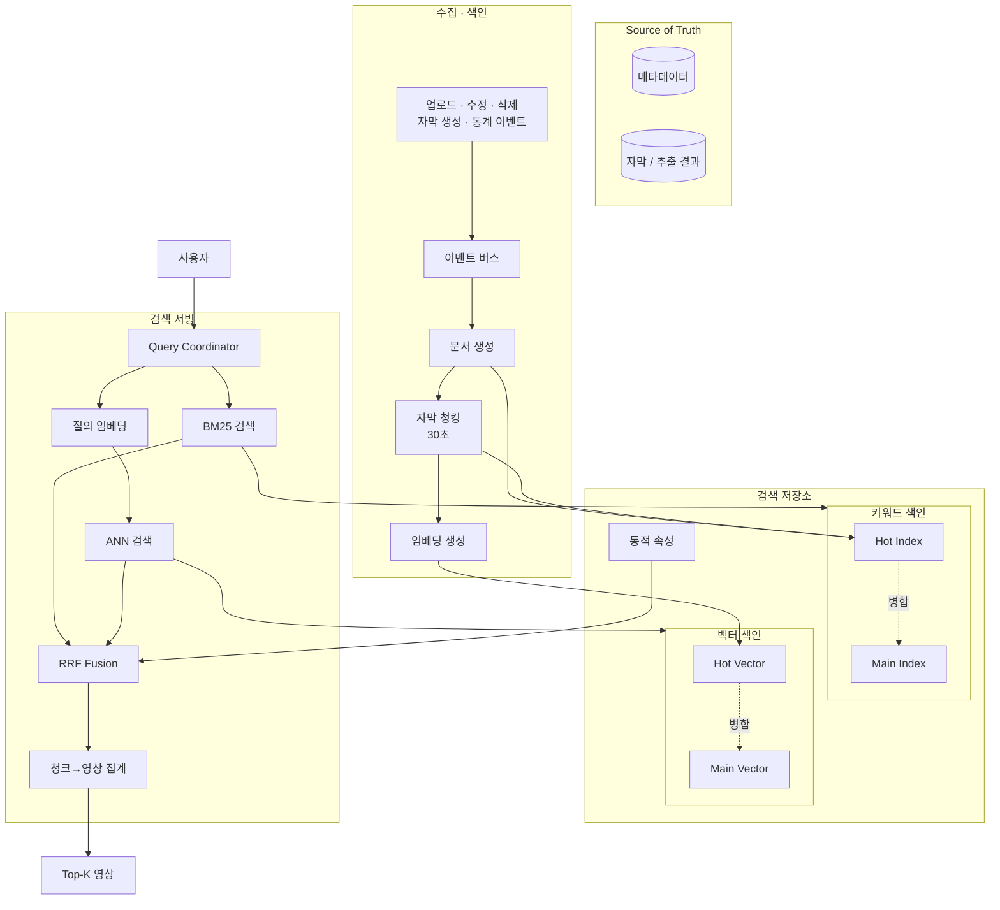
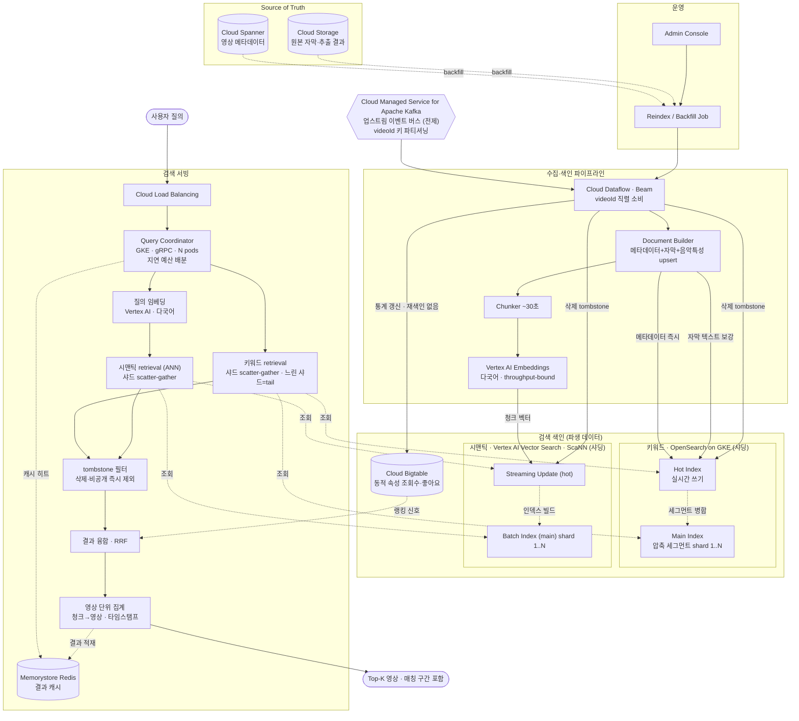

# Week7 과제: 동영상 플랫폼 검색 시스템 설계 (수집 → 색인 → 하이브리드 검색)

- 유튜브에는 분당 수백 시간 분량의 영상이 업로드되고, 매초 수만 건의 검색 질의가 들어온다. 수십억 영상 중 관련 영상을 수백 ms 안에 찾아 반환한다.
- 유튜브에 업로드되는 영상의 메타데이터와 자막을 수집·색인하고, 키워드 검색(exact match)과 시맨틱 검색을 결합한 하이브리드 검색으로 사용자 질의에 응답하는 검색 시스템을 제공한다. 
- 이번 과제에서는 특히 음악(공연·커버·플리) 관련 영상을 수집·색인하여, 분위기·악기·언어를 넘나드는 하이브리드 검색으로 제공하는 **글로벌 음악 레퍼런스 검색 시스템**을 설계해보았다.
- 타겟은 유튜브의 음악 도메인 영상 전체 — MV, 라이브, 밴드·악기별 커버, 연주·강의 영상, 플레이리스트 영상 등으로, 수억 건 규모이다. 전 세계 크리에이터가 매분 새로운 커버를 올리고, 한 곡에 대한 공연 영상은 보컬 성별·언어·악기 편성·악보 여부가 제각각이다. 사용자가 원하는 영상을 수백 ms 안에 반환해야 한다.


## 1. 문제 이해 및 설계 범위 확정

### 시나리오

**서로 다른 두 종류의 질의를 모두 처리해야 한다**

- 정확히 일치해야 하는 질의: 아티스트·곡명·악기명 ("체리필터", "Oasis", "예뻤어 기타 커버")
- 내용을 묘사하는 질의: "청량한 여름 록", "감성적인 남자 보컬", "드럼이 화려한 메탈"
— 텍스트로 뽑히는 것: 제목, 설명, 태그, 댓글, 음악 정보, 게시자 채널 등
- 영상은 본문이 없는 매체. 곡의 분위기, 썸네일 설명, 영상에 등장하는 인물 및 성별, 악기(instrument), 분위기(mood), 난이도(일부 영상만 표기) - 이미 존재하는 추출 컴포넌트로 가정.

**색인은 계속 갱신되어야 한다**

- 업로드된 영상은 수 분 내 검색에 노출되어야 함
- 조회수·좋아요는 색인된 뒤에도 계속 변함
- 삭제·비공개 영상은 결과에서 빠르게 사라져야 함
- 즉 색인은 한 번 만들고 끝이 아니라 계속 갱신되는 살아있는 자료구조여야 함

**이 과제의 초점**

- 검색 인프라: 안정적 수집·색인 / 낮은 지연의 후보 검색(retrieval) / 색인 최신 상태 유지
- **유튜브 영상 중에서도 음악에 특히 집중한 이유**: '곡의 분위기'가 시맨틱 검색 대상이라고 생각.
- 설계의 깊이는 수집·색인·샤딩·융합·실시간 색인·서빙 같은 인프라에 둔다. 곡 클러스터링·악기 추출 등은 추출 단계의 입력으로만 가정하고 깊게 다루지 않는다.

### 예상 질의 분류

| 유형 | 예시 | 주 경로 |
| --- | --- | --- |
| 아티스트/곡명 | 체리필터, Oasis, 잔나비 | 키워드(BM25) |
| 장르 | 메탈, JPOP, 국내 인디 | 혼합 |
| 분위기 | 청량한 여름 록, 몽환적인, 벅차오르는 | 시맨틱 |
| 악기/보컬 | 기타 솔로 좋은 곡, 감성적인 남자 보컬 | 시맨틱 |
| 복합·연습 | 초보 밴드용, 떼창, 축제 | 시맨틱 |

- 분위기 키워드: 사용자는 곡명·아티스트명 exact 검색뿐 아니라 "청량한 여름 록", "감성적인 남성 보컬", "축제에서 하기 좋은 곡"과 같은 의미가 담긴 질의도 빈번하게 수행한다. 
- 교차 언어(cross-lingual): 사용자 질의 언어와 영상 메타데이터 언어가 달라도 검색되어야 한다. (ex. 오아시스, Oasis / "플리" → "playlist", "Best Song Collection")
- 따라서 BM25만으로는 분위기·악기·보컬 특성·교차 언어 질의를 충분히 처리하기 어렵고, 반대로 시맨틱 검색만으로는 곡명·아티스트명 검색의 정확도를 보장하기 어렵다. 본 시스템은 두 방식을 결합한 하이브리드 검색 구조를 채택한다.

---

## 설계 범위

| 포함 (In Scope) | 제외 (Out scope) |
| --- | --- |
| 영상에서 검색용 데이터를 무엇으로 뽑을지 설계 (자막, 음성, 프레임 캡션 등 자유) | 추출 모델(STT, 캡셔닝 등) 자체의 구현·학습 |
| 영상 메타데이터/추출 데이터 수집 파이프라인 | 영상 업로드/트랜스코딩 파이프라인 자체 |
| 색인 단위 설계 (영상 단위 vs 청크 단위) | 임베딩 모델 학습 자체 |
| 키워드 매칭용 색인 구축 및 샤딩 | 정밀 재랭킹 모델 (LTR, cross-encoder) |
| 임베딩 생성 및 의미 검색용 색인 | 검색 품질 평가 (nDCG, 평가셋 구축) |
| 두 검색 경로 결과의 융합 (하이브리드 검색) | 개인화 검색 / 추천 시스템 |
| 업로드 즉시 검색 노출 (실시간 색인) | 검색어 자동완성, 오타 교정 |
| 조회수 등 동적 속성 갱신 반영 | 어뷰징/저작권/제한 콘텐츠 필터링 정책 |
| 삭제/비공개 전환 색인 반영 | 광고 시스템 |
| 쿼리 서빙 (분산 조회, 결과 병합) |  |
| 장애 복구 및 색인 재구축 |  |

> 영상에서 어떤 데이터를 추출해 색인할지는 전적으로 설계 재량이다. 추출 모델(STT, 프레임 캡셔닝, 챕터 요약 등)은 이미 존재한다고 가정하고 가져다 쓰면 되며, ML 모델을 만들라는 뜻이 아니다. 다만 무엇을 뽑느냐에 따라 색인 규모, 도착 지연, 비용이 달라지므로 그 선택의 결과는 설계에서 책임져야 한다.
> 

---

## 시스템 구성 전제

- 영상 업로드/트랜스코딩 파이프라인은 이미 존재하며, 업로드 완료·메타데이터 변경·삭제 이벤트가 Kafka로 발행된다고 가정한다.
- 영상에서 텍스트를 추출하는 시스템(STT 자막, 프레임 캡셔닝 등)은 이미 존재한다고 가정한다. 어떤 데이터를 추출해 색인에 쓸지는 설계 재량이며, 추출 결과는 업로드 후 수 분~수십 분 지연되어 이벤트로 도착한다.
- 원본 메타데이터/자막의 source of truth는 별도 DB와 Object Storage에 있고, 검색 색인은 파생 데이터라고 가정한다.
- 역색인 엔진은 직접 설계하거나 Lucene 계열(Elasticsearch, OpenSearch)을 사용할 수 있다.
- 벡터 색인은 HNSW, IVF 등 ANN 알고리즘 기반 엔진(Faiss, Vespa, Milvus, Lucene KNN 등)을 사용할 수 있다.
- 임베딩 모델은 자체 서빙(GPU)하며, 처리량 한계와 호출 비용이 존재한다고 가정한다.
- 조회수·좋아요 등 통계 값은 별도 집계 시스템이 산출하며, 검색 시스템은 이를 구독해 반영한다고 가정한다.
- 본 시스템은 후보 검색(retrieval)과 단순 fusion까지를 다루며, 그 이후의 정밀 랭킹은 다루지 않는다.

---

## 기능 요구사항 및 고려할 점

요구사항은 한 줄씩만 적고, 각 요구사항에서 무엇이 문제가 되는지를 함께 정리한다. 설계는 이 문제들에 답하는 과정이다.

### [수집] 영상 업로드·변경·삭제·자막 생성 이벤트를 수신해 색인할 수 있어야 한다

- 문제: 한 영상의 데이터가 한 번에 오지 않는다. 메타데이터는 업로드 즉시, 자막은 STT를 거쳐 수십 분 뒤에 도착한다. 자막을 기다렸다 색인하면 노출 SLA가 깨지고, 따로 색인하면 같은 영상을 두 번 갱신해야 한다.

### [색인] 키워드 매칭용 색인과 의미 검색용 색인을 함께 유지해야 한다

- 문제: 색인이 두 개다. 텍스트 색인 등록은 ms 단위인데 임베딩 생성은 GPU 처리량에 묶여 있어, 두 색인의 상태가 항상 어긋나 있는 게 기본값이 된다. 이 불일치를 허용할 것인가, 막을 것인가.
- 문제: 문서 단위가 자명하지 않다. 10분 분량 자막을 벡터 하나로 뭉치면 여러 주제가 평균되어 내용 묘사 질의에 잡히지 않는다. 그렇다고 잘게 쪼개면 색인 규모가 20배(1,000억 건)로 뛴다. 검색의 문서 단위를 무엇으로 잡을 것인가 — 두 색인에서 같은 단위를 써야 하는가?

### [융합] 키워드 매칭 후보와 의미 기반 후보를 하나의 결과로 융합해야 한다

- 문제: 두 경로의 점수는 스케일이 달라 그냥 더할 수 없다. 융합 방식에 따라 한쪽 경로가 다른 쪽을 압도한다.
- 문제: 의미 검색 경로는 태생적으로 느리다. 수십억 벡터의 정확한 최근접 탐색은 불가능해서 근사 탐색을 쓰는데, 탐색 범위를 넓히면 지연이 늘고, 여기에 질의 임베딩 생성(GPU 호출) 지연까지 얹힌다. 의미 검색 경로가 전체 지연 예산의 병목이 되는 구조다.

### [신선도] 업로드 후 수 분 내 검색 노출, 삭제 후 1분 내 결과 제외가 되어야 한다

- 문제: 검색이 빠른 색인일수록 갱신에는 불리하다. 색인은 검색 속도를 위해 압축하고 정리해서 꽉 눌러 담은 구조라, 중간에 한 건 끼워 넣는 것보다 통째로 다시 쓰는 게 자연스러운 자료구조다. "방금 올라온 영상을 바로 노출하라"는 요구와 "5억 건을 빠르게 검색하라"는 요구가 정면으로 충돌한다.
- 문제: 이런 색인에서 삭제는 보통 그 자리에서 지우지 않고 "삭제됨" 표시만 해뒀다가 나중에 한꺼번에 정리한다. 정리 전까지 비공개 영상이 검색에 남아 있을 수 있는데, 이 시간을 어떻게 1분 안으로 줄이는가.

### [동적 속성] 조회수·좋아요 변경이 재색인 없이 검색에 반영되어야 한다

- 문제: 텍스트는 거의 안 변하는데 통계 값은 초당 수십만 건씩 변한다. 변할 때마다 문서를 다시 색인하면 색인 시스템이 통계 갱신만 하다 끝난다. 그렇다고 안 반영하면 검색 결과의 조회수가 며칠 전 값이다. 어떻게 할 것인가.
- 추가 문제: 결과에 표시만 할 때는 다 고른 뒤에 값을 붙이면 됐다. 그런데 순위에 반영하려면 후보를 고르는 그 시점에 값이 필요하다

### [서빙] 상위 K개 영상 목록(매칭 구간 타임스탬프 포함)을 p95 300ms 내 반환해야 한다

- 문제: 색인이 수십 개 조각(샤드)에 나뉘어 있어, 한 질의가 두 경로 × 수십 샤드로 흩어져 조회된 뒤 다시 모인다. 가장 느린 샤드 하나가 전체 응답 시간을 결정한다.
- 문제: 청크 단위로 검색하면 같은 영상의 청크 여러 개가 후보로 돌아온다. 사용자에게 보여줄 것은 영상 목록인데, 이 간극을 어디서 어떻게 메울 것인가.

---

## 비기능 요구사항

| 항목 | 목표 |
| --- | --- |
| 검색 응답 지연 | p95 300ms 이내 (end-to-end) |
| 후보 검색(retrieval) 지연 | 키워드/의미 경로 각각 p95 50ms 이내 |
| 업로드 → 검색 노출 지연 | 메타데이터 기준 5분 이내 |
| 삭제/비공개 → 결과 제외 지연 | 1분 이내 |
| 동적 속성(조회수) 반영 지연 | 수 분 이내 (정확한 실시간성 불요) |
| 색인 가용성 | 색인 갱신/재구축 중 무중단 서빙 |
| 확장성 | 영상 수 증가에 따라 색인 샤드 수평 확장 가능 |
| 데이터 정합성 | 색인은 파생 데이터, source of truth 기준 전체 재구축 가능 |
| 임베딩 처리량 | 신규 유입 영상의 임베딩 생성이 유입 속도를 따라갈 것 |

---

## 대략적 규모 추정

| 항목 | 수치 | 비고 |
| --- | --- | --- |
| 색인 대상 영상 수 | 약 5억 건 | 전체 유튜브 ~50억의 약 10%를 음악 도메인으로 가정 |
| 신규 업로드 | 일 40만 건 (분당 ~280건) | 전체 업로드의 ~10% |
| 평균 영상 길이 | 약 4분 (곡 길이) | 일반 영상(~10분)보다 짧음 |
| 메타데이터 크기 (제목+설명+태그) | 영상당 평균 2KB | 음악 정보 포함 |
| 자막/가사 크기 | 영상당 평균 3KB | 짧고, 연주·instrumental 커버는 거의 없음 |
| 전체 자막 텍스트 | 약 1.5TB | |
| 자막 청크 수 | 영상당 ~8개 → 전체 약 40억 청크 | 4분 ÷ 30초 |
| 영상 단위 임베딩 | 5억 × 768차원 float32(3KB) ≈ 1.5TB | |
| 청크 단위 임베딩 (전부) | 40억 × 3KB ≈ 12TB | 일반 케이스(300TB)보다 훨씬 작음 → 전부 임베딩 현실적 |
| 신규 임베딩 생성 처리량 | 일 40만 영상 → 초당 약 5건 (청크 단위면 ×8 ≈ 40건) | |
| 검색 QPS | 평균 10,000 / 피크 50,000 | 음악 검색 서비스 가정 |
| 질의당 후보 수 | 경로별 top 1,000 (키워드 / 의미) | |
| 동적 속성 갱신 | 조회수 변경 이벤트 초당 수만 건 | |

# 2. 개략적 설계안 제시 및 동의 구하기

- 역색인과 벡터 색인을 분리 운영, 임베딩 생성 지연에 따른 일시적 불일치를 허용
- 검색은 청크 단위로 수행, 결과는 영상 단위로 집계해 반환
- 조회수·좋아요 등 동적 속성은 텍스트 색인과 분리 저장, 검색 시 결합

---

## 핵심 흐름 (필수)

**1) 쓰기 흐름 (수집·색인)**
업로드·자막 생성·통계·삭제 이벤트가 Kafka로 발행되고 색인 파이프라인이 이를 소비한다. 동일 영상의 이벤트 순서를 보장하기 위해 videoId 기준으로 파티셔닝한다. 업로드 직후에는 제목·설명·태그 등 기본 메타데이터만으로 문서를 생성해 BM25 색인에 먼저 반영하여 검색 노출 SLA를 맞춘다. 이후 자막과 음악 특성(악기·분위기·보컬 정보 등)이 도착하면 역색인 문서를 보강하고, 자막을 약 30초 단위로 청킹하여 임베딩을 생성한 뒤 벡터 색인에 반영한다. 따라서 하나의 영상은 여러 단계에 걸쳐 점진적으로 색인이 완성된다.

**2) 읽기 흐름 (검색)**
질의가 들어오면 Query Coordinator가 BM25 기반 키워드 검색과 벡터 기반 의미 검색을 병렬 수행한다. 각 경로는 샤드별로 후보를 조회한 뒤 상위 결과를 수집한다. 두 후보 집합은 RRF로 융합하고, 청크 단위 결과를 영상 단위로 집계하면서 대표 청크의 타임스탬프를 함께 기록한다. 이후 동적 속성을 반영해 최종 Top-K 영상을 반환한다. 인기 질의는 결과 캐시로 처리한다.

**3) 갱신 흐름 (동적 속성·삭제)**
조회수·좋아요는 별도 동적 속성 저장소에 관리하며 색인을 재작성하지 않는다. 검색 시 최종 후보 병합 단계에서 랭킹 신호로 활용한다. 삭제·비공개 이벤트는 즉시 tombstone으로 기록해 검색 결과에서 제외하고, 실제 색인 정리는 이후 세그먼트 병합 과정에서 수행한다.


- 

## 개략적 아키텍처 다이어그램 (필수)





---


# 3. 상세 설계


## 설계 대상 컴포넌트 사이의 우선순위 정하기 / 아키텍처 다이어그램


| 역할              | 일반 컴포넌트               | YouTube 추정                      | GCP로 만든다면                 |
| --------------- | --------------------- | ------------------------------- | ------------------------- |
| 메타데이터 SoT       | 메타데이터 DB              | Vitess + Spanner                | Cloud Spanner             |
| 원본 자막·추출 데이터    | Object Storage        | Google Cloud Storage (Colossus) | Cloud Storage             |
| 이벤트 버스          | Kafka                 | 내부 이벤트 시스템 (Pub/Sub 유사)         | GCP 관리형 Kafka         |
| 스트림 처리·색인 파이프라인 | Consumer / Upsert     | Borg 기반 스트림 처리                  | Dataflow (Kafka Consumer) |
| 임베딩 생성          | GPU Embedding Service | TPU 기반 임베딩 서비스                  | Vertex AI Embeddings      |
| 키워드 색인          | BM25 역색인              | Google Search Index (비공개)       | OpenSearch on GKE         |
| 시맨틱 색인          | ANN (HNSW / ScaNN)    | ScaNN                           | Vertex AI Vector Search   |
| 동적속성 저장소        | Key-Value Store       | Bigtable                        | Cloud Bigtable            |
| 결과 캐시           | Distributed Cache     | 내부 캐시                           | Memorystore (Redis)       |
| 검색 API          | Query Coordinator     | YouTube Search Frontend         | GKE                       |
| 로드밸런서           | Global LB             | Maglev                          | Cloud Load Balancing      |
| 운영자 콘솔          | Admin Tool            | 내부 운영도구                         | Cloud Run / GKE Admin UI  |





---

## 3-1. 수집 파이프라인 설계

(1) 영상 업로드·변경·삭제 이벤트와 늦게 도착하는 자막을 어떻게 안정적으로 수집할 것인가?

→ `videoId`를 기준으로 단계별로 문서를 수렴시키는 **증분식 색인(incremental indexing)** 구조를 사용한다.

(2) 업로드 이벤트와 자막 생성 완료 이벤트는 도착 시점이 다른데, 하나의 영상 문서로 어떻게 합칠 것인가?

→ `videoId` 기반 2단계 점진 색인
- 업로드 직후: 제목·설명·태그 등 메타데이터만으로 영상 문서 생성 → BM25 색인 즉시 반영 (노출 SLA 충족)
- 자막 도착 후: 자막을 청킹·임베딩해 같은 `videoId` 문서에 보강 → 벡터 색인 반영
- 문서 PK = `videoId#chunkId` (영상 문서는 chunkId=0). 재시도·중복 이벤트가 도착해도 동일 키로 덮어써 멱등성을 보장한다.
- 하나의 영상은 여러 단계에 걸쳐 색인이 수렴하는 구조

(3) Kafka 토픽·파티션 키와 순서 보장은 어떻게 설계할 것인가?

→ 파티션 키 = `videoId`, 토픽은 용도별로 3분할한다.
- `lifecycle`(업로드·수정·삭제) / `caption`(자막·음악 특성) / `stats`(조회수·좋아요)로 분리
- 모든 토픽의 파티션 키를 `videoId`로 통일해, 동일 영상 이벤트는 같은 파티션에서 순차 처리되고 다른 영상은 병렬 처리된다.
- 각 이벤트에 `version`(또는 eventTime)을 부여하여, 색인은 더 높은 version만 반영하고 낮은 version은 무시한다(stale write 방지).
- 삭제는 tombstone(version=N)으로 기록하여, 이후 도착한 낮은 version의 자막이 좀비 문서로 재색인되는 것을 방지한다.
- 토픽이 분리되어 토픽 간 순서는 보장되지 않으므로, `version` 가드로 낮은 버전을 무시한다.

(4) 색인 파이프라인이 밀리는 동안 업로드 노출 SLA는 어떻게 지킬 것인가?

→ 메타데이터 경로와 자막·임베딩 경로를 분리한다.
- 노출 SLA는 가볍고 빠른 메타데이터 색인으로 충족한다 (자막은 STT로 수십 분 지연되어 SLA 범위 밖).
- GPU가 필요한 임베딩 생성은 비동기로 처리하여, 임베딩 병목이 노출을 막지 않도록 한다.
- Consumer 오토스케일링으로 처리량을 확장하고, 파티션 수를 충분히 확보해 병렬도의 상한을 보장한다.
- 처리 실패(poison) 메시지는 DLQ로 격리하여, 한 메시지가 파티션 전체를 막는 상황을 방지한다.


---

## 3-2. 색인 단위 설계: 영상 vs 자막 청크

(1) 검색의 문서 단위를 무엇으로 할 것인가?

→ **청크 단위**로 색인한다.
- 라이브·플레이리스트 영상은 한 `videoId` 안에 여러 곡이 챕터(타임스탬프)로 포함되어 있어, 영상 단위로는 곡별 매칭이 불가능하다.

```
영상 V123 ("잔나비 단독 콘서트 LIVE", 약 70분 · 챕터 12개)
 ├─ 영상 문서  key=V123     { 제목, 설명, 태그, 아티스트, mood 태그 }
 ├─ 청크 #1   key=V123#c1   { 0:00    · 주저하는 연인들을 위해 }
 ├─ 청크 #2   key=V123#c2   { 4:30    · 뜨거운 여름밤은 가고 }
 ├─ 청크 #3   key=V123#c3   { 9:10    · 꿈나라 별나라 }
 ├─ ...
 └─ 청크 #12  key=V123#c12  { 1:02:10 · 앵콜 - What’s up }
```

(2) 영상 전체를 하나의 문서로 색인하는 것과 자막을 청크 단위로 색인하는 것의 장단점은?

→ **하이브리드**: 제목·설명·태그·아티스트 = 영상 단위, 곡 구간 = 청크 단위

| | 영상 단위 | 청크 단위 |
|---|---|---|
| 규모 | 5억 | 40억 (평균 8배, 음악은 영상이 짧아 일반 20배보다 작음) |
| 의미 검색 | 평균화로 약함 | 정밀 (곡별) |
| 집계 | 불필요 | 필요 |
| 구간 점프 | 불가 | 가능 |

- 위 콘서트를 영상 단위로 임베딩하면 12곡이 하나의 벡터로 평균화되어 변별력을 잃는다. "청량한 여름 록" 질의로 2번째 곡 구간을 정확히 잡으려면 청크 단위 색인이 필요하다.

(3) 자막 청크는 어떤 기준으로 자를 것인가? (고정 길이, 문장, 화제 전환, overlap)

→ 곡·챕터 경계를 우선 적용하고, 없으면 30초 윈도우로 폴백한다 (문장 경계 정렬, overlap 10~15%).
- 라이브·플레이리스트 영상은 설명·댓글의 타임스탬프(챕터)가 이미 곡 경계 역할을 하므로, 이를 청크 경계로 그대로 사용한다.
- 음악 도메인 보정: 자막(가사)이 짧거나 없는 경우(연주 커버 등), 청크 임베딩 입력에 곡명(챕터 제목)과 mood·장르·악기 태그를 함께 포함해 표현을 보강한다. mood는 오디오 피처 추출 컴포넌트의 출력으로 가정한다.

(4) 청크 단위로 검색하면 같은 영상의 청크 여러 개가 후보에 들어오는데, 영상 단위 결과로 어떻게 집계할 것인가?

→ max pooling으로 영상 단위 점수를 산출한다.
- `videoId`로 묶어 최고 청크 점수를 영상 점수로 사용한다. 평균은 긴 영상에 불리하게 작용한다.
- 처리 순서: 경로별 청크 top-K → videoId 집계 → RRF 융합

(5) 제목·설명과 자막 청크의 매칭 가중치를 다르게 둘 것인가? 그 구조는 색인 설계에 어떤 영향을 주는가?

→ 곡명·아티스트·제목 > tags > 가사 순으로 차등 가중을 적용한다 (예: ^5 / ^2 / ^1).
- 제목은 영상 문서, 곡 구간은 청크 문서로 단위가 달라 색인 단계에서 직접 결합할 수 없다. 가중치는 영상 집계 시점에 결합한다 (제목 점수 × 5 + 최고 청크 점수 × 1).

(6) "영상 안의 그 장면으로 점프" 기능을 지원하려면 색인에 무엇이 추가로 필요한가?

→ 청크에 start·end 타임스탬프를 저장하고, 매칭 청크의 시작 시각을 결과와 함께 반환한다.
- 챕터가 있는 영상은 타임스탬프가 이미 부여되어 있어 추가 작업이 거의 없다.
- snippet(곡명·구간 라벨)을 함께 저장하면 결과 미리보기를 제공할 수 있다.

```
[썸네일] 잔나비 단독 콘서트 LIVE
         4:30 · 뜨거운 여름밤은 가고 (2번째 곡) ← snippet/구간
```

---

## 3-3. 역색인과 벡터 색인의 구축 및 샤딩

(1) 5억 영상(40억 청크)을 두 종류의 색인으로 어떻게 저장하고 분산할 것인가?

→ 신선도와 효율을 분리해 hot/main 두 tier로 운영하고, 양쪽 모두 videoId 해시로 샤딩한다.
- hot tier는 작고 쓰기에 빠른 구조로 최근 영상을 즉시 색인해 노출 SLA를 충족한다.
- main tier는 압축·양자화된 구조로 전체 영상을 효율적으로 저장한다.
- 두 tier 내에서 다시 videoId 해시 샤딩을 적용해 부하를 분산한다.

(2) 색인 샤딩 기준은 무엇으로 할 것인가?

→ videoId를 해시해 샤딩한다.
- videoId 해시로 샤드를 결정하면 영상이 모든 샤드에 균등하게 분산되어, 특정 샤드에 트래픽이 집중되는 핫스팟을 방지한다.
- 한 영상의 모든 청크가 같은 샤드에 모이므로, 청크를 영상 단위로 집계할 때 샤드 간 통신이 필요 없다.
- 업로드 시각 기준 샤딩은 최근 영상 샤드에, 인기도 기준 샤딩은 인기 영상 샤드에 부하가 집중되어 핫스팟이 발생하므로 사용하지 않는다.
- 역색인과 벡터 색인을 동일한 videoId 해시 기준으로 분할하여, 같은 영상이 양쪽에서 대응되는 샤드에 위치하도록 한다.

(3) posting list(단어 → 영상 목록)는 어떻게 압축하고 어떤 순서로 저장할 것인가?

→ docId를 오름차순으로 정렬하고, 인접 docId의 차이(delta)만 압축해 저장한다.
- posting list는 특정 단어가 등장한 영상 ID 목록이다. ID를 정렬하면 인접한 ID 간 차이가 작아진다.
- 이 차이값을 가변길이 인코딩(VByte, PForDelta)으로 저장하면 용량이 크게 감소한다.
- 정렬된 구조 덕분에 여러 단어 목록의 교집합(AND 검색)을 빠르게 병합할 수 있으며, skip list로 불필요한 구간을 건너뛸 수 있다.
- 상위 결과만 필요하므로 Block-Max WAND를 적용하여, 점수가 높을 가능성이 없는 문서를 사전에 건너뛰고 조기 종료한다.

(4) 벡터 색인은 HNSW와 IVF 중 무엇을 선택할 것인가? 메모리 상주 요구량은?

→ 최근 영상은 HNSW, 대규모 본 색인은 IVF에 양자화를 결합해 사용한다 (매니지드 ScaNN을 사용할 경우 엔진이 자동 처리).
- HNSW는 그래프 기반으로 정확도와 속도가 우수하고 벡터 삽입이 용이하지만, 그래프와 벡터를 전부 메모리에 상주시켜야 하므로 대규모에서는 비용이 크다.
- IVF는 벡터를 군집으로 분할해 탐색 범위를 좁히는 방식으로 메모리 효율이 우수하지만, 정확도가 탐색 범위(nprobe) 설정에 좌우된다.
- 메모리 산정: 40억 청크 × 768차원 float32 = 원본 약 12TB. HNSW로 전체를 풀정밀 상주시키는 것은 비현실적이다.
- 따라서 본 색인은 PQ/SQ 양자화로 벡터를 1/10 이하로 압축해 메모리를 절감하고, 자주 갱신되는 소량의 hot 색인만 HNSW 풀정밀로 운영한다.

(5) 모든 청크를 임베딩하면 약 12TB인데, 전부 할 것인가? 그렇지 않다면 무엇을 기준으로 거를 것인가?

→ 음악 도메인은 약 12TB 규모이므로 전체 임베딩이 현실적이다.
- 일반 영상은 1,000억 청크 300TB로 전체 임베딩이 부담스럽지만, 음악은 영상 길이가 짧아 40억 청크 12TB 수준으로 감소한다.
- 비용을 추가로 절감해야 한다면 조회수 상위·신규 영상을 우선 임베딩하고, 롱테일 영상은 청크를 생략하여 영상 단위 임베딩만 생성한다.
- 가사가 없는 연주 커버는 청크 텍스트가 비어 임베딩 가치가 낮으므로, 청크 대신 영상 단위 임베딩과 태그만으로 처리한다.

(6) 역색인과 벡터 색인의 등록 시점 차이를 허용할 것인가? 검색 결과에 미치는 영향은?

→ 허용한다. 역색인에는 존재하지만 벡터 색인에는 아직 등록되지 않은 상태가 정상이다.
- 역색인 등록은 밀리초 단위지만 임베딩 생성은 GPU 처리량에 묶여 수 초~수십 초가 소요된다. 따라서 두 색인의 상태가 어긋나 있는 것이 기본 상태이다.
- 그 결과 막 업로드된 영상은 곡명·아티스트 같은 키워드 검색에는 즉시 노출되지만, 분위기 묘사 질의에는 임베딩이 완성될 때까지 일시적으로 노출되지 않는다.
- 불일치를 차단하려면 임베딩 완료까지 노출을 지연시켜야 하지만 그럴 경우 5분 노출 SLA가 깨진다. 융합 단계는 한쪽 경로만으로도 동작하므로 불일치를 허용하는 편이 안전하다.

---

## 3-4. 하이브리드 검색과 Score Fusion

키워드 경로와 시맨틱 경로의 결과를 어떻게 하나로 합칠 것인가?

(1) BM25 점수와 벡터 유사도 점수는 스케일이 전혀 다른데 어떻게 융합할 것인가?

→ RRF로 융합한다. 점수 대신 순위만 사용해 스케일 차이를 우회한다.
- BM25 점수는 상한이 없고 cosine 유사도는 -1~1 범위이므로, 두 점수를 그대로 합산하면 값이 큰 쪽이 결과를 지배한다.
- RRF는 각 경로의 순위(rank)만 사용한다. 등수를 `1/(k+rank)`(k는 일반적으로 60)로 환산해 합산하므로 원본 점수의 스케일이 영향을 미치지 않는다.
- min-max나 z-score 정규화도 가능하지만 데이터 분포에 민감해 튜닝이 까다롭다. RRF는 분포와 무관하여 더 안정적이며 실무 표준으로 사용된다.

(2) 두 경로를 항상 병렬 실행할 것인가, 질의 유형에 따라 라우팅하거나 가중치를 바꿀 것인가?

→ 두 경로를 항상 병렬 실행하고, 질의 유형에 따라 가중치만 조정한다.
- 두 경로를 항상 함께 실행하면 한쪽이 실패해도 검색이 멈추지 않는다.
- 질의를 분류해, 곡명·아티스트 같은 정확형이면 키워드 가중을, 자연어 묘사형이면 시맨틱 가중을 높인다. 이를 weighted RRF(`w/(k+rank)`)로 반영한다.
- 분류 결과에 따라 한 경로만 실행하는 라우팅은 위험하다. 분류가 틀리면 정답이 존재하는 경로를 통째로 버리게 된다.

(3) "아이유 밤편지" 같은 exact 질의에서 시맨틱 후보가 정답을 밀어내는 문제를 어떻게 막을 것인가?

→ 정확 매치에 큰 가중을 부여하여 키워드 경로가 결과를 주도하도록 한다.
- "아이유 밤편지"는 곡명·아티스트 필드와 정확히 일치한다. 이러한 정확 매치(구문 일치)에 강한 부스트를 적용한다.
- 질의가 정확형으로 분류되면 융합 단계에서 키워드 경로의 가중을 크게 둔다.
- 정확 매치 문서는 융합 후 동점 처리에서 우선순위를 부여해 상위에 고정한다. 이를 통해 의미가 유사한 다른 곡이 정답을 밀어내는 것을 방지한다.

(4) "잠 안 올 때 듣는 잔잔한 노래"처럼 키워드 경로가 빈약한 질의에서 시맨틱 비중을 어떻게 높일 것인가?

→ 자연어 묘사형으로 분류하여 시맨틱 가중을 높인다.
- "잠 안 올 때 듣는 잔잔한 노래"는 곡명·태그에 거의 매치되지 않아 BM25 후보가 빈약하다.
- 이러한 질의는 시맨틱 경로 가중을 높여, 키워드 후보가 적더라도 의미 기반 후보가 결과를 채우도록 한다.
- 추출된 mood 태그가 존재하면 키워드 경로도 "잔잔한"을 일부 매치해 보완한다. 질의 언어가 메타데이터 언어와 다른 경우 키워드로는 매칭되지 않으므로 다국어 임베딩이 결과를 주도한다.

(5) 한쪽 경로에 장애가 발생했을 때 검색은 어떻게 동작해야 하는가?

→ 살아 있는 경로만으로 응답한다 (graceful degradation).
- 두 경로가 독립적으로 동작하므로 벡터 색인이나 임베딩 GPU에 장애가 발생해도 키워드 경로 결과로 검색이 동작한다.
- 키워드 경로만 동작하면 곡명·아티스트 검색은 정상이고 묘사 질의 품질만 저하된다. 반대의 경우 묘사 질의는 동작하고 정확 검색이 약화된다.
- 한 경로의 지연이 길어지면 해당 경로를 차단하고 부분 결과로 응답하여 p95 300ms를 유지한다.


---
## 3-5. 업로드 즉시 노출: 실시간 색인 구조

방금 올라온 영상을 수 분 안에 검색 가능하게 만들면서, 5억 건 본 색인의 효율도 유지하려면?

(1) 실시간 색인 tier와 본 색인 tier를 분리할 것인가?

→ 분리한다. 작고 빠른 hot tier에 즉시 색인하고, 크고 최적화된 main tier는 그대로 유지한다.
- main 색인은 검색 속도를 위해 압축·정렬해 압축된 구조이므로, 중간에 한 건을 삽입하는 비용이 크다. 새 영상을 직접 삽입하면 쓰기 비용이 급격히 증가한다.
- 따라서 최근 영상만 담는 작고 쓰기에 빠른 hot tier를 별도로 두고, 여기에 즉시 색인하여 수 분 내 노출을 달성한다.
- 시간이 경과하면 hot tier의 영상을 main 색인으로 이전하여, main 색인의 검색 효율을 유지한다.

(2) 두 tier를 어떻게 함께 조회·병합하는가? 이동 시점과 중복 노출은 어떻게 방지하는가?

→ 질의를 두 tier에 동시에 전송해 결과를 병합하되, videoId로 중복을 제거한다.
- 질의는 hot tier와 main tier에 동시에 분산(scatter)되어 각각의 후보를 가져온 뒤 병합된다. 기존 샤드 병합 구조에 tier 하나가 추가되는 형태이다.
- 영상이 hot → main으로 이동(merge)하는 동안 두 tier에 일시적으로 동시 존재할 수 있으므로, videoId 기준으로 중복 제거하여 한 번만 노출한다.
- main 색인에 먼저 반영한 뒤 hot에서 제거하는 순서로 진행하여, 이동 중 검색에서 누락되는 공백을 방지한다.

(3) segment를 추가하고 백그라운드에서 merge하는 구조에서, merge는 검색 지연에 어떤 영향을 주는가?

→ merge는 백그라운드 작업이지만 디스크·CPU 사용량이 커서 검색 지연(특히 tail latency)을 증가시킨다.
- 색인은 작은 조각(segment)을 지속적으로 추가하고 백그라운드에서 큰 조각으로 병합한다. 조각이 많으면 검색이 모든 조각을 순회해야 하므로 느려진다.
- 그러나 merge 자체가 대량의 I/O와 CPU를 소모하여, 동시에 처리 중인 질의의 지연에 영향을 준다.
- 완화 방안: merge를 트래픽이 적은 시간대로 집중시키거나 속도를 제한(throttle)하고, 조각 수와 merge 빈도의 균형을 맞춰 "검색이 순회하는 조각 수"와 "merge 부하"를 함께 관리한다.

(4) 임베딩 생성이 수십 초 걸리는 동안, 영상을 키워드 검색에만 먼저 노출할 것인가?

→ 그렇다. 텍스트 기반 키워드 검색에 먼저 노출하고, 임베딩이 완성되는 대로 시맨틱 검색에 편입시킨다.
- 텍스트 색인은 즉시 가능하지만 임베딩 생성은 GPU 처리량에 묶여 수십 초가 소요된다.
- 따라서 곡명·아티스트 같은 키워드 검색은 업로드 직후부터 동작하고, 분위기 묘사 검색은 임베딩이 완료된 후 활성화된다.
- 사용자 입장에서는 막 업로드된 영상이 키워드 검색에는 노출되지만 묘사 질의에는 일시적으로 누락되는 점진적 노출 형태로 인식된다.

---

## 3-6. 동적 속성 갱신과 삭제 처리

색인된 뒤에도 계속 변하는 값(조회수, 좋아요)과 사라지는 영상을 어떻게 다룰 것인가?

(1) 텍스트 색인과 동적 속성 저장소를 분리할 것인가?

→ 분리한다. 거의 변하지 않는 텍스트와 초당 수십만 건 변하는 통계를 동일 색인에 둘 수 없다.
- 조회수가 변경될 때마다 문서를 재색인하면, 재색인 비용으로 인해 색인 시스템이 통계 갱신에만 소모된다.
- 따라서 텍스트·임베딩은 검색 색인에 두고, 조회수·좋아요는 빠르게 갱신 가능한 별도 저장소(예: Cloud Bigtable)에 둔다.
- 동적 속성은 videoId로 조회 가능하게 저장하여, 검색 시점에 결합한다.

(2) 검색 시점에 동적 속성은 어느 단계에서 결합되는가?

→ 용도에 따라 다르다. 표시 목적이면 최종 단계, 랭킹 신호이면 후보 선정 시점에 결합한다.
- 결과에 조회수를 표시만 한다면, 최종 Top-K를 결정한 후 저장소에서 값을 조인하여 결합한다.
- 조회수를 랭킹 신호로 사용하려면(인기곡 우대), 후보를 선정하고 점수를 산출하는 시점에 값이 필요하다. 따라서 융합·집계 단계에서 결합한다.
- 필터로 사용할 경우(예: 비공개·통계 이상치 제외) retrieval 시점에 적용한다.

(3) 삭제는 나중에 정리되는 구조인데 1분 SLA를 어떻게 지키는가?

→ tombstone을 쿼리 시점 필터로 즉시 적용한다. 색인의 물리적 정리는 후속 merge 단계에서 수행한다.
- 압축된 색인은 삭제를 즉시 반영하지 않고 "삭제됨" 표시(tombstone)만 기록한 뒤 일괄 정리한다.
- 정리 전까지 문서가 색인에 남아 있더라도, 검색 시점에 tombstone 표시된 문서를 결과에서 즉시 필터링하면 사용자에게는 1분 내 제거된 것으로 인식된다.
- 즉 물리적 삭제는 지연되어도 무방하며, 논리적 제외만 빠르게 수행하면 된다. tombstone 집합을 작고 빠르게 조회 가능한 상태로 유지하는 것이 핵심이다.

(4) 동적 속성 갱신 이벤트가 초당 수십만 건인데 어떻게 반영하는가?

→ 매 건 반영하지 않고, 짧은 주기로 집계(coalescing)하여 반영한다.
- 갱신 이벤트를 스트림으로 수신하여 수 초~수 분 윈도우 동안 videoId별로 누적한 뒤 최종 값만 저장소에 기록한다(write coalescing).
- NFR이 "동적 속성 반영은 수 분 이내, 정확한 실시간성 불요"이므로 매 건 반영할 필요가 없으며, 이 허용 범위가 부하를 크게 감소시킨다.
- 별도 stats 토픽과 별도 컨슈머로 처리하여, 통계 폭증이 본 색인 파이프라인을 막지 않도록 한다.

---

## 3-7. 쿼리 서빙 구조

질의 한 건이 들어왔을 때 수백 ms 안에 어떻게 응답할 것인가?

(1) 질의 처리 경로에서 지연 예산을 어떻게 배분하는가?

→ p95 300ms를 단계별로 분할하여 배분하고, 두 retrieval 경로는 병렬 실행되므로 합산이 아닌 최댓값으로 산정한다.
- 예시 배분: 질의 임베딩 약 30~50ms, 키워드·시맨틱 retrieval 각 p95 50ms(병렬 실행이므로 둘 중 느린 쪽이 지배), 융합·집계 수십 ms, 나머지는 네트워크와 여유분으로 할당한다.
- 각 단계에 타임아웃을 설정하여, 한 단계가 예산을 초과하면 해당 단계를 중단하고 부분 결과로 진행한다.

(2) 질의 임베딩 생성이 추가하는 지연은 얼마이고 어떻게 감소시키는가?

→ 질의 임베딩은 GPU 호출이므로 수십 ms가 소요된다. 캐시와 배치를 통해 감소시킨다.
- 인기 질의의 임베딩을 캐시해두면 동일 질의는 GPU 호출 없이 재사용 가능하다.
- 동시에 도착한 질의들을 micro-batch로 묶어 GPU에서 일괄 처리하면 처리량이 향상된다(다만 약간의 대기 시간이 추가된다).
- 키워드 경로는 임베딩이 필요 없으므로, 임베딩 생성을 대기하는 동안 키워드 retrieval을 병렬로 진행한다.

(3) 가장 느린 샤드가 전체 지연을 결정하는(tail latency) 구조를 어떻게 완화하는가?

→ hedged request와 부분 응답으로 느린 샤드의 영향을 차단한다.
- 한 질의가 두 경로 × 수십 샤드로 분산되었다 병합되므로, 한 샤드만 느려도 전체 지연이 증가한다.
- hedged(backup) request: 응답이 지연되는 샤드에 동일 요청을 복제본에도 전송하여 먼저 도착한 응답을 사용한다.
- 부분 응답: 지정된 시간 내에 응답한 샤드의 결과만으로 마감하고 느린 샤드는 제외한다. 약간의 recall 손실을 감수하여 지연 목표를 보장한다.
- 샤드 수를 과도하게 늘리지 않는다. fan-out이 클수록 느린 샤드를 만날 확률이 증가한다.

(4) 인기 질의는 결과 캐시로 처리할 수 있는가?

→ 처리할 수 있다. 컴백·이슈 직후 동일 질의가 폭증하므로 캐시 효과가 크다.
- 동일 질의의 최종 Top-K를 캐시(Memorystore)에 저장하면, 폭증 트래픽을 색인까지 전달하지 않고 캐시에서 처리할 수 있다.
- 다만 조회수·신선도를 고려해 TTL을 짧게(수 초~수십 초) 설정한다. TTL이 길면 새 영상이나 변경된 순위가 반영되지 않는다.
- 캐시에 잔존하는 삭제 영상은 짧은 TTL과 함께 캐시 결과에도 tombstone 필터를 적용하여 노출을 차단한다.

(5) 각 샤드에서 top-K를 가져와 병합할 때 K는 어떻게 결정하는가? 너무 작으면 무엇이 깨지는가?

→ 각 샤드에서 최종 필요 개수보다 충분히 큰 K를 가져와야 한다. 너무 작으면 상위 결과가 누락된다.
- 최종 N개가 필요할 때 샤드마다 정확히 N개만 가져오면, 상위 문서가 한 샤드에 집중된 경우 해당 샤드의 N+1번째(실제 전체 상위) 결과가 손실된다.
- 따라서 샤드별로 N의 수 배(예: 경로별 top-1,000)를 가져와 병합한 뒤, 전체에서 다시 top-N을 추출한다.
- K가 너무 작으면 recall이 손상되어 정답이 누락되고, 너무 크면 네트워크·병합 비용이 증가한다. 양자의 균형 지점에서 결정한다.

---

## 3-8. 저장 비용, 신선도, 검색 범위 Trade-off

동영상 검색 인프라에서 가장 중요한 trade-off를 어떻게 판단할 것인가?

→ 핵심 trade-off는 "검색 품질(recall) vs 저장·지연 비용"이며, 판단 원칙은 자원을 균등 배분하지 않고 수요(인기 영상·인기 질의)에 집중 배분하는 것이다.
- 음악 소비는 인기곡에 편중된다. 따라서 인기 영상에는 청크 단위 색인·풀정밀(full-precision) 임베딩·넓은 탐색 범위를 할당하고, 롱테일에는 영상 단위 색인·양자화·축소된 탐색 범위를 적용해 저비용으로 처리한다.
- retrieval의 목표는 정답을 후보군에 포함시키는 recall이지 완전한 정렬이 아니다. 정밀 정렬은 본 과제 범위 밖의 재랭킹이 담당하므로, recall을 훼손하지 않는 범위에서 정밀도를 낮춰 비용과 지연을 절감한다.
- 모든 튜닝 파라미터(임베딩 적용 범위, 양자화 강도, 탐색 범위)는 SLA(p95 300ms·노출 5분)와 예산 상한 내에서 조정한다.

(1) 40억 청크 전체 임베딩(~12TB + GPU 비용) vs 일부만 임베딩했을 때의 커버리지 손실 — 어디서 자를 것인가?

→ 시맨틱 검색에 실제로 노출되는 영상(검색 트래픽 상위)을 기준으로 적용 범위를 결정한다.
- 음악 도메인은 약 12TB로 전체 임베딩도 가능하나, 비용 절감을 위해 조회수 상위·신규 영상을 청크 단위로 우선 임베딩한다.
- 롱테일·무자막 영상은 청크 임베딩을 생략하고 영상 단위 임베딩만 유지한다. 묘사 질의 커버리지는 대부분 인기 영상에서 발생하므로 손실이 미미하다.
- 검색 수요가 없는 영상에는 청크 임베딩 비용을 투입하지 않는 것이 적용 경계의 기준이다.

(2) 벡터를 양자화(float32 → int8, PQ)하면 검색 결과에 어떤 영향을 주는가?

→ 저장량·메모리·지연을 크게 절감하지만 recall이 소폭 저하되며, 재정렬(rerank)로 손실을 회복한다.
- float32 → int8(SQ)은 1/4, PQ(Product Quantization)는 1/10~1/30까지 압축해 메모리·디스크 사용량과 거리 계산 비용을 낮춘다.
- 대가는 근사 오차에 따른 recall 저하다. 유사 벡터들이 동일 코드로 양자화되며 미세한 차이에 대한 식별력이 떨어진다.
- 보정: 양자화 색인으로 후보를 충분히 추출한 뒤, 해당 후보에 한해 고정밀 벡터로 거리를 재계산하여 정렬하면 손실을 대부분 회복한다.

(3) 근사 탐색의 탐색 범위(HNSW의 ef, IVF의 nprobe)는 어디서 멈출 것인가?

→ recall-지연 곡선이 포화되는 지점, 즉 목표 recall을 충족하는 최소값에서 탐색 범위를 고정한다.
- ef(HNSW)·nprobe(IVF)는 탐색 범위를 결정하는 파라미터다. 값을 키우면 누락 후보는 감소하지만 지연이 증가한다.
- 이 곡선은 초기에는 가파르게 상승하다 특정 지점 이후 포화된다. 그 포화 지점(knee), 즉 목표 recall(예: 0.95)을 충족하는 최소 ef·nprobe로 설정한다.
- 상한은 retrieval p95 50ms다. 이 예산 내에서 최대값을 선택하고, 부하 증가 시 동적으로 축소한다.

(4) 조회수가 희박한 롱테일 영상(전체의 대부분)을 어떻게 처리할 것인가?

→ 최소 자원으로 처리한다. 청크·풀정밀 임베딩을 제외하고 키워드 색인과 영상 단위 임베딩(또는 태그)만 유지한다.
- 전체 영상의 대부분은 조회수가 희박하고 검색 노출 빈도도 낮다. 이들에 정밀 자원을 투입하는 것은 비효율적이다.
- 곡명·아티스트는 키워드로 정확 검색되므로, 롱테일은 키워드 색인 + 영상 단위 임베딩·태그만으로 충분하며 청크 임베딩은 생략한다.
- 이후 조회수 상승으로 수요가 발생하면 청크 임베딩 대상으로 승격(promote)한다. 비용을 수요에 따라 사후 배분하는 방식이다.

---

# 4. 설계 장점

- **증분 색인으로 노출 SLA와 자막 지연을 분리**: `videoId#chunkId` 멱등 upsert. 메타데이터 먼저, 자막·임베딩 나중. STT 수십 분 지연이 5분 노출 SLA를 깨지 않음.
- **두 색인 비동기 운영 + RRF**: 임베딩이 밀려도 노출은 막히지 않고, 한쪽이 죽어도 검색이 동작.
- **청크 색인 + 영상 집계**: 라이브·플리에서 곡별 매칭. 챕터 타임스탬프가 그대로 청크 경계 → 구간 점프 거의 공짜.
- **videoId 해시 샤딩**: 핫스팟 회피 + 두 색인을 같은 기준으로 나눠 청크→영상 집계가 샤드 내에서 끝남.
- **동적 속성 분리(Bigtable)**: 초당 수만 건 통계 갱신이 텍스트 색인을 흔들지 않고, fusion 단계에서 랭킹 신호로 결합.

---

# 5. 설계 단점

- **두 색인 불일치의 사용자 가시성**: 갓 올린 영상이 곡명엔 잡히고 묘사 질의엔 안 잡힘. 임베딩 큐 상태에 따라 검색 결과가 비결정적으로 보임.
- **임베딩 GPU가 색인·서빙 양쪽 병목**: 색인 큐 적체 + 질의 임베딩 RTT(long-tail 질의는 캐시 안 됨).
- **추출 컴포넌트가 시맨틱 경로 상한을 결정**: mood/instrument 품질이 곧 검색 품질. 모델 교체 시 40억 청크 backfill.
- **Max pooling이 다곡 매치 신호를 버림**: 12곡 매치 콘서트와 1곡 매치 영상이 동점 → 체감 품질 손해.
- **Scatter-gather tail latency**: 2경로 × 수십 샤드 fan-out 자체가 p95 변동성. hedging은 완화지 해결이 아님.
- **IVF+PQ recall 손실의 silent 누적**: 메모리 1/10 대가로 근사도↓. 평가셋이 out of scope라 손실이 드러나지 않음.

---

#### 레퍼런스 및 기타

- tombstone: 레코드를 즉시 물리적으로 삭제하지 않고 "삭제됨"을 표시하는 마커. 실제 제거(reclaim)는 이후 compaction/merge 시점에 일괄 수행된다.
  - 왜 쓰나 — 압축·정렬된 색인이나 append-only/불변 세그먼트 구조에서는 중간의 한 레코드를 제자리에서 지우는 비용이 크다. 그래서 삭제 표식만 남기고, 물리 제거는 나중에 모아서 처리한다.
  - 분산 환경 의미 — 복제본(replica)들이 삭제 사실을 인지하도록 tombstone을 전파한다. 오프라인이었던 복제본이 옛 값을 되살리는(resurrect) 것을 방지하는 역할이다.
  - 본 시스템에서의 역할 — 삭제·비공개 이벤트를 tombstone으로 기록하고 쿼리 시점에 즉시 필터링하여 1분 SLA를 충족한다. 색인의 물리적 정리는 이후 segment merge에서 수행한다.

- Apache Lucene의 증분식 색인 기법 https://waterfogsw.tistory.com/66
  - 증분식 색인이란 기존 문서 집합에 새로운 문서가 추가될 때, 전체 문서를 다시 색인하지 않고 추가된 문서만 색인하는 방식입니다. Lucene에서는 이를 위해 병합 색인(merge indexing) 기법을 사용합니다. 이러한 증분식 색인 기법을 통해 대용량 문서 집합에 대해서도 빠르게 색인을 갱신하고 일관된 검색 결과를 얻을 수 있습니다.
  
- [IR] RRF(Reciprocal Rank Fusion) 설명과 파이썬 코드 https://abluesnake.tistory.com/180
  - RRF: 다양한 검색 결과의 순위를 종합하여 검색 순위를 다시 매기는 하이브리드 알고리즘.

- HNSW: 그래프(Graph) 기반의 탐색 알고리즘입니다. 데이터를 여러 계층의 그물망(그래프) 형태로 구성하여, 상위 계층에서 대략적인 위치를 찾고 점차 하위 계층으로 내려오며 정답에 접근하는 방식입니다.

- IVF: 군집화(Clustering) 기반의 탐색 알고리즘입니다. 전체 데이터를 '센트로이드(Centroid)'라고 부르는 여러 개의 그룹(Cluster 또는 Bucket)으로 나누고, 검색 시 모든 데이터를 확인하는 대신 질문 벡터와 가장 가까운 몇 개의 그룹만 골라서 그 안의 데이터만 탐색합니다.

- 검색 속도와 정확도가 가장 중요하고 메모리 용량이 넉넉하다면 HNSW가 유리합니다. 반면, 저장해야 할 데이터가 방대하여 메모리를 절약해야 하거나 동적인 데이터 업데이트가 자주 필요하다면 IVF 인덱스를 채택하는 것이 적합합니다.

- 색인에서 **tier(계층)**? 데이터를 특성에 따라 나눈 저장 계층**을 뜻함. 각자는 서로 다른 목적에 맞춰 다른 구조로 최적화됨.

  - 왜 계층을 나누는가? 단일 색인으로는 "빠른 쓰기(신선도)"와 "빠른 검색(대규모 효율)"을 동시에 만족할 수 없다. 검색에 최적화된 색인은 압축·정렬돼 있어 중간 갱신 비용이 크기 때문이다. 목적이 상충하는 두 요구를 한 구조에 담을 수 없으므로 계층으로 분리한다.

## hot tier vs main tier

- **hot tier** — 최근 영상을 담는 작고 쓰기에 빠른 계층. 실시간 색인으로 노출 SLA를 충족한다. 규모가 작아 갱신 비용이 낮다.
- **main tier** — 전체 영상을 담는 크고 읽기에 최적화된 계층. 압축·양자화·정렬로 대규모 검색을 효율적으로 처리한다. 갱신은 느리지만 안정적이다.

데이터는 신규 영상이 hot tier에 먼저 등록되고, 시간이 지나면 main tier로 이동(merge)한다. 검색 질의는 두 계층을 모두 조회한 뒤 결과를 합친다. 이 패턴을 일반적으로 hot-warm-cold 데이터 계층(tiered indexing)이라 부른다(예: Elasticsearch의 data tiers).

## tier와 shard의 구분

- **tier(계층)** — 데이터의 수명·특성에 따른 *역할 분리* (hot=쓰기·신선도, main=읽기·효율). 데이터가 계층 간을 이동한다.
- **shard(샤드)** — 같은 계층 내에서 데이터를 여러 노드에 *수평 분산*하는 단위. 확장성과 부하 분산이 목적이다.
- 즉 하나의 tier 안에 다시 여러 shard가 존재한다. 계층으로 "신선도 vs 효율"을 나누고, 그 안에서 샤딩으로 "규모"를 분산(2차원 구조).