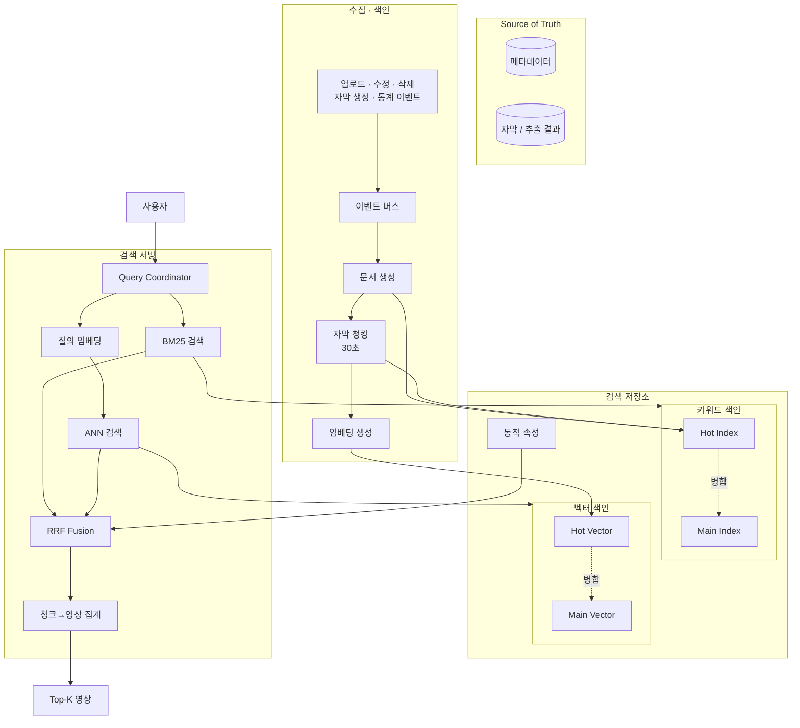

# Week7 과제: 동영상 플랫폼 검색 시스템 설계 (수집 → 색인 → 하이브리드 검색)

- 유튜브에는 분당 수백 시간 분량의 영상이 업로드되고, 매초 수만 건의 검색 질의가 들어온다. 수십억 영상 중 관련 영상을 수백 ms 안에 찾아 반환한다.
- 유튜브에 업로드되는 영상의 메타데이터와 자막을 수집·색인하고, 키워드 검색(exact match)과 시맨틱 검색을 결합한 하이브리드 검색으로 사용자 질의에 응답하는 검색 시스템을 제공한다. 
- 이번 과제에서는 특히 음악(공연·커버·플리) 관련 영상을 수집·색인하여, 분위기·악기·언어를 넘나드는 하이브리드 검색으로 제공하는 **글로벌 음악 레퍼런스 검색 시스템**을 설계해보았다.
- 타겟은 유튜브의 음악 도메인 영상 전체 — MV, 라이브, 밴드·악기별 커버, 연주·강의 영상, 플레이리스트 영상 등으로, 수억 건 규모이다. 전 세계 크리에이터가 매분 새로운 커버를 올리고, 한 곡에 대한 공연 영상은 보컬 성별·언어·악기 편성·악보 여부가 제각각이다. 사용자가 원하는 영상을 수백 ms 안에 반환해야 한다.


## 1. 문제 이해 및 설계 범위 확정

### 시나리오

**서로 다른 두 종류의 질의를 모두 처리해야 한다**

- 정확히 일치해야 하는 질의: 아티스트·곡명·악기명 ("체리필터", "Oasis", "예뻤어 기타 커버")
- 내용을 묘사하는 질의: "청량한 여름 록", "감성적인 남자 보컬", "드럼이 화려한 메탈"
— 텍스트로 뽑히는 것: 제목, 설명, 태그, 댓글, 음악 정보, 게시자 채널 등
- 영상은 본문이 없는 매체. 곡의 분위기, 썸네일 설명, 영상에 등장하는 인물 및 성별, 악기(instrument), 분위기(mood), 난이도(일부 영상만 표기) - 이미 존재하는 추출 컴포넌트로 가정.

**색인은 계속 갱신되어야 한다**

- 업로드된 영상은 수 분 내 검색에 노출되어야 함
- 조회수·좋아요는 색인된 뒤에도 계속 변함
- 삭제·비공개 영상은 결과에서 빠르게 사라져야 함
- 즉 색인은 한 번 만들고 끝이 아니라 계속 갱신되는 살아있는 자료구조여야 함

**이 과제의 초점**

- 검색 인프라: 안정적 수집·색인 / 낮은 지연의 후보 검색(retrieval) / 색인 최신 상태 유지
- **유튜브 영상 중에서도 음악에 특히 집중한 이유**: '곡의 분위기'가 시맨틱 검색 대상이라고 생각.
- 설계의 깊이는 수집·색인·샤딩·융합·실시간 색인·서빙 같은 인프라에 둔다. 곡 클러스터링·악기 추출 등은 추출 단계의 입력으로만 가정하고 깊게 다루지 않는다.

### 예상 질의 분류

| 유형 | 예시 | 주 경로 |
| --- | --- | --- |
| 아티스트/곡명 | 체리필터, Oasis, 잔나비 | 키워드(BM25) |
| 장르 | 메탈, JPOP, 국내 인디 | 혼합 |
| 분위기 | 청량한 여름 록, 몽환적인, 벅차오르는 | 시맨틱 |
| 악기/보컬 | 기타 솔로 좋은 곡, 감성적인 남자 보컬 | 시맨틱 |
| 복합·연습 | 초보 밴드용, 떼창, 축제 | 시맨틱 |

- 분위기 키워드: 사용자는 곡명·아티스트명 exact 검색뿐 아니라 "청량한 여름 록", "감성적인 남성 보컬", "축제에서 하기 좋은 곡"과 같은 의미가 담긴 질의도 빈번하게 수행한다. 
- 교차 언어(cross-lingual): 사용자 질의 언어와 영상 메타데이터 언어가 달라도 검색되어야 한다. (ex. 오아시스, Oasis / "플리" → "playlist", "Best Song Collection")
- 따라서 BM25만으로는 분위기·악기·보컬 특성·교차 언어 질의를 충분히 처리하기 어렵고, 반대로 시맨틱 검색만으로는 곡명·아티스트명 검색의 정확도를 보장하기 어렵다. 본 시스템은 두 방식을 결합한 하이브리드 검색 구조를 채택한다.

---

## 설계 범위

| 포함 (In Scope) | 제외 (Out scope) |
| --- | --- |
| 영상에서 검색용 데이터를 무엇으로 뽑을지 설계 (자막, 음성, 프레임 캡션 등 자유) | 추출 모델(STT, 캡셔닝 등) 자체의 구현·학습 |
| 영상 메타데이터/추출 데이터 수집 파이프라인 | 영상 업로드/트랜스코딩 파이프라인 자체 |
| 색인 단위 설계 (영상 단위 vs 청크 단위) | 임베딩 모델 학습 자체 |
| 키워드 매칭용 색인 구축 및 샤딩 | 정밀 재랭킹 모델 (LTR, cross-encoder) |
| 임베딩 생성 및 의미 검색용 색인 | 검색 품질 평가 (nDCG, 평가셋 구축) |
| 두 검색 경로 결과의 융합 (하이브리드 검색) | 개인화 검색 / 추천 시스템 |
| 업로드 즉시 검색 노출 (실시간 색인) | 검색어 자동완성, 오타 교정 |
| 조회수 등 동적 속성 갱신 반영 | 어뷰징/저작권/제한 콘텐츠 필터링 정책 |
| 삭제/비공개 전환 색인 반영 | 광고 시스템 |
| 쿼리 서빙 (분산 조회, 결과 병합) |  |
| 장애 복구 및 색인 재구축 |  |

> 영상에서 어떤 데이터를 추출해 색인할지는 전적으로 설계 재량이다. 추출 모델(STT, 프레임 캡셔닝, 챕터 요약 등)은 이미 존재한다고 가정하고 가져다 쓰면 되며, ML 모델을 만들라는 뜻이 아니다. 다만 무엇을 뽑느냐에 따라 색인 규모, 도착 지연, 비용이 달라지므로 그 선택의 결과는 설계에서 책임져야 한다.
> 

---

## 시스템 구성 전제

- 영상 업로드/트랜스코딩 파이프라인은 이미 존재하며, 업로드 완료·메타데이터 변경·삭제 이벤트가 Kafka로 발행된다고 가정한다.
- 영상에서 텍스트를 추출하는 시스템(STT 자막, 프레임 캡셔닝 등)은 이미 존재한다고 가정한다. 어떤 데이터를 추출해 색인에 쓸지는 설계 재량이며, 추출 결과는 업로드 후 수 분~수십 분 지연되어 이벤트로 도착한다.
- 원본 메타데이터/자막의 source of truth는 별도 DB와 Object Storage에 있고, 검색 색인은 파생 데이터라고 가정한다.
- 역색인 엔진은 직접 설계하거나 Lucene 계열(Elasticsearch, OpenSearch)을 사용할 수 있다.
- 벡터 색인은 HNSW, IVF 등 ANN 알고리즘 기반 엔진(Faiss, Vespa, Milvus, Lucene KNN 등)을 사용할 수 있다.
- 임베딩 모델은 자체 서빙(GPU)하며, 처리량 한계와 호출 비용이 존재한다고 가정한다.
- 조회수·좋아요 등 통계 값은 별도 집계 시스템이 산출하며, 검색 시스템은 이를 구독해 반영한다고 가정한다.
- 본 시스템은 후보 검색(retrieval)과 단순 fusion까지를 다루며, 그 이후의 정밀 랭킹은 다루지 않는다.

---

## 기능 요구사항 및 고려할 점

요구사항은 한 줄씩만 적고, 각 요구사항에서 무엇이 문제가 되는지를 함께 정리한다. 설계는 이 문제들에 답하는 과정이다.

### [수집] 영상 업로드·변경·삭제·자막 생성 이벤트를 수신해 색인할 수 있어야 한다

- 문제: 한 영상의 데이터가 한 번에 오지 않는다. 메타데이터는 업로드 즉시, 자막은 STT를 거쳐 수십 분 뒤에 도착한다. 자막을 기다렸다 색인하면 노출 SLA가 깨지고, 따로 색인하면 같은 영상을 두 번 갱신해야 한다.

### [색인] 키워드 매칭용 색인과 의미 검색용 색인을 함께 유지해야 한다

- 문제: 색인이 두 개다. 텍스트 색인 등록은 ms 단위인데 임베딩 생성은 GPU 처리량에 묶여 있어, 두 색인의 상태가 항상 어긋나 있는 게 기본값이 된다. 이 불일치를 허용할 것인가, 막을 것인가.
- 문제: 문서 단위가 자명하지 않다. 10분 분량 자막을 벡터 하나로 뭉치면 여러 주제가 평균되어 내용 묘사 질의에 잡히지 않는다. 그렇다고 잘게 쪼개면 색인 규모가 20배(1,000억 건)로 뛴다. 검색의 문서 단위를 무엇으로 잡을 것인가 — 두 색인에서 같은 단위를 써야 하는가?

### [융합] 키워드 매칭 후보와 의미 기반 후보를 하나의 결과로 융합해야 한다

- 문제: 두 경로의 점수는 스케일이 달라 그냥 더할 수 없다. 융합 방식에 따라 한쪽 경로가 다른 쪽을 압도한다.
- 문제: 의미 검색 경로는 태생적으로 느리다. 수십억 벡터의 정확한 최근접 탐색은 불가능해서 근사 탐색을 쓰는데, 탐색 범위를 넓히면 지연이 늘고, 여기에 질의 임베딩 생성(GPU 호출) 지연까지 얹힌다. 의미 검색 경로가 전체 지연 예산의 병목이 되는 구조다.

### [신선도] 업로드 후 수 분 내 검색 노출, 삭제 후 1분 내 결과 제외가 되어야 한다

- 문제: 검색이 빠른 색인일수록 갱신에는 불리하다. 색인은 검색 속도를 위해 압축하고 정리해서 꽉 눌러 담은 구조라, 중간에 한 건 끼워 넣는 것보다 통째로 다시 쓰는 게 자연스러운 자료구조다. "방금 올라온 영상을 바로 노출하라"는 요구와 "5억 건을 빠르게 검색하라"는 요구가 정면으로 충돌한다.
- 문제: 이런 색인에서 삭제는 보통 그 자리에서 지우지 않고 "삭제됨" 표시만 해뒀다가 나중에 한꺼번에 정리한다. 정리 전까지 비공개 영상이 검색에 남아 있을 수 있는데, 이 시간을 어떻게 1분 안으로 줄이는가.

### [동적 속성] 조회수·좋아요 변경이 재색인 없이 검색에 반영되어야 한다

- 문제: 텍스트는 거의 안 변하는데 통계 값은 초당 수십만 건씩 변한다. 변할 때마다 문서를 다시 색인하면 색인 시스템이 통계 갱신만 하다 끝난다. 그렇다고 안 반영하면 검색 결과의 조회수가 며칠 전 값이다. 어떻게 할 것인가.
- 추가 문제: 결과에 표시만 할 때는 다 고른 뒤에 값을 붙이면 됐다. 그런데 순위에 반영하려면 후보를 고르는 그 시점에 값이 필요하다

### [서빙] 상위 K개 영상 목록(매칭 구간 타임스탬프 포함)을 p95 300ms 내 반환해야 한다

- 문제: 색인이 수십 개 조각(샤드)에 나뉘어 있어, 한 질의가 두 경로 × 수십 샤드로 흩어져 조회된 뒤 다시 모인다. 가장 느린 샤드 하나가 전체 응답 시간을 결정한다.
- 문제: 청크 단위로 검색하면 같은 영상의 청크 여러 개가 후보로 돌아온다. 사용자에게 보여줄 것은 영상 목록인데, 이 간극을 어디서 어떻게 메울 것인가.

---

## 비기능 요구사항

| 항목 | 목표 |
| --- | --- |
| 검색 응답 지연 | p95 300ms 이내 (end-to-end) |
| 후보 검색(retrieval) 지연 | 키워드/의미 경로 각각 p95 50ms 이내 |
| 업로드 → 검색 노출 지연 | 메타데이터 기준 5분 이내 |
| 삭제/비공개 → 결과 제외 지연 | 1분 이내 |
| 동적 속성(조회수) 반영 지연 | 수 분 이내 (정확한 실시간성 불요) |
| 색인 가용성 | 색인 갱신/재구축 중 무중단 서빙 |
| 확장성 | 영상 수 증가에 따라 색인 샤드 수평 확장 가능 |
| 데이터 정합성 | 색인은 파생 데이터, source of truth 기준 전체 재구축 가능 |
| 임베딩 처리량 | 신규 유입 영상의 임베딩 생성이 유입 속도를 따라갈 것 |

---

## 대략적 규모 추정

| 항목 | 수치 | 비고 |
| --- | --- | --- |
| 색인 대상 영상 수 | 약 5억 건 | 전체 유튜브 ~50억의 약 10%를 음악 도메인으로 가정 |
| 신규 업로드 | 일 40만 건 (분당 ~280건) | 전체 업로드의 ~10% |
| 평균 영상 길이 | 약 4분 (곡 길이) | 일반 영상(~10분)보다 짧음 |
| 메타데이터 크기 (제목+설명+태그) | 영상당 평균 2KB | 음악 정보 포함 |
| 자막/가사 크기 | 영상당 평균 3KB | 짧고, 연주·instrumental 커버는 거의 없음 |
| 전체 자막 텍스트 | 약 1.5TB | |
| 자막 청크 수 | 영상당 ~8개 → 전체 약 40억 청크 | 4분 ÷ 30초 |
| 영상 단위 임베딩 | 5억 × 768차원 float32(3KB) ≈ 1.5TB | |
| 청크 단위 임베딩 (전부) | 40억 × 3KB ≈ 12TB | 일반 케이스(300TB)보다 훨씬 작음 → 전부 임베딩 현실적 |
| 신규 임베딩 생성 처리량 | 일 40만 영상 → 초당 약 5건 (청크 단위면 ×8 ≈ 40건) | |
| 검색 QPS | 평균 10,000 / 피크 50,000 | 음악 검색 서비스 가정 |
| 질의당 후보 수 | 경로별 top 1,000 (키워드 / 의미) | |
| 동적 속성 갱신 | 조회수 변경 이벤트 초당 수만 건 | |

# 2. 개략적 설계안 제시 및 동의 구하기

- 역색인과 벡터 색인을 분리 운영, 임베딩 생성 지연에 따른 일시적 불일치를 허용
- 검색은 청크 단위로 수행, 결과는 영상 단위로 집계해 반환
- 조회수·좋아요 등 동적 속성은 텍스트 색인과 분리 저장, 검색 시 결합

---

## 핵심 흐름 (필수)

**1) 쓰기 흐름 (수집·색인)**
업로드·자막 생성·통계·삭제 이벤트가 Kafka로 발행되고 색인 파이프라인이 이를 소비한다. 동일 영상의 이벤트 순서를 보장하기 위해 videoId 기준으로 파티셔닝한다. 업로드 직후에는 제목·설명·태그 등 기본 메타데이터만으로 문서를 생성해 BM25 색인에 먼저 반영하여 검색 노출 SLA를 맞춘다. 이후 자막과 음악 특성(악기·분위기·보컬 정보 등)이 도착하면 역색인 문서를 보강하고, 자막을 약 30초 단위로 청킹하여 임베딩을 생성한 뒤 벡터 색인에 반영한다. 따라서 하나의 영상은 여러 단계에 걸쳐 점진적으로 색인이 완성된다.

**2) 읽기 흐름 (검색)**
질의가 들어오면 Query Coordinator가 BM25 기반 키워드 검색과 벡터 기반 의미 검색을 병렬 수행한다. 각 경로는 샤드별로 후보를 조회한 뒤 상위 결과를 수집한다. 두 후보 집합은 RRF로 융합하고, 청크 단위 결과를 영상 단위로 집계하면서 대표 청크의 타임스탬프를 함께 기록한다. 이후 동적 속성을 반영해 최종 Top-K 영상을 반환한다. 인기 질의는 결과 캐시로 처리한다.

**3) 갱신 흐름 (동적 속성·삭제)**
조회수·좋아요는 별도 동적 속성 저장소에 관리하며 색인을 재작성하지 않는다. 검색 시 최종 후보 병합 단계에서 랭킹 신호로 활용한다. 삭제·비공개 이벤트는 즉시 tombstone으로 기록해 검색 결과에서 제외하고, 실제 색인 정리는 이후 세그먼트 병합 과정에서 수행한다.


- 

## 개략적 아키텍처 다이어그램 (필수)





---


# 3. 상세 설계


## 설계 대상 컴포넌트 사이의 우선순위 정하기 / 아키텍처 다이어그램


| 역할              | 일반 컴포넌트               | YouTube 추정                      | GCP로 만든다면                 |
| --------------- | --------------------- | ------------------------------- | ------------------------- |
| 메타데이터 SoT       | 메타데이터 DB              | Vitess + Spanner                | Cloud Spanner             |
| 원본 자막·추출 데이터    | Object Storage        | Google Cloud Storage (Colossus) | Cloud Storage             |
| 이벤트 버스          | Kafka                 | 내부 이벤트 시스템 (Pub/Sub 유사)         | GCP 관리형 Kafka         |
| 스트림 처리·색인 파이프라인 | Consumer / Upsert     | Borg 기반 스트림 처리                  | Dataflow (Kafka Consumer) |
| 임베딩 생성          | GPU Embedding Service | TPU 기반 임베딩 서비스                  | Vertex AI Embeddings      |
| 키워드 색인          | BM25 역색인              | Google Search Index (비공개)       | OpenSearch on GKE         |
| 시맨틱 색인          | ANN (HNSW / ScaNN)    | ScaNN                           | Vertex AI Vector Search   |
| 동적속성 저장소        | Key-Value Store       | Bigtable                        | Cloud Bigtable            |
| 결과 캐시           | Distributed Cache     | 내부 캐시                           | Memorystore (Redis)       |
| 검색 API          | Query Coordinator     | YouTube Search Frontend         | GKE                       |
| 로드밸런서           | Global LB             | Maglev                          | Cloud Load Balancing      |
| 운영자 콘솔          | Admin Tool            | 내부 운영도구                         | Cloud Run / GKE Admin UI  |


---

## 3-1. 수집 파이프라인 설계

(1) 영상 업로드·변경·삭제 이벤트와 늦게 도착하는 자막을 어떻게 안정적으로 수집할 것인가?

→ 기다리지 않고 **"증분식 색인(incremental indexing)"**! `videoId`로 단계별로 문서를 수렴시킨다.

(2) 업로드 이벤트와 자막 생성 완료 이벤트는 도착 시점이 다른데, 하나의 영상 문서로 어떻게 합칠 것인가?

→ `videoId` 기반 2단계 점진 색인
- 업로드 직후: 제목·설명·태그 등 메타데이터만으로 영상 문서 생성 → BM25 색인 즉시 반영 (노출 SLA 충족)
- 자막 도착 후: 자막을 청킹·임베딩해 같은 `videoId` 문서에 보강 → 벡터 색인 반영
- 문서 PK = `videoId#chunkId` (영상 문서는 chunkId=0) → 재시도·중복 이벤트가 와도 덮어쓰기(멱등)
- 하나의 영상은 여러 단계에 걸쳐 색인이 수렴하는 구조

(3) Kafka 토픽/파티션 키와 순서 보장

→ 파티션 키 = `videoId`, 토픽은 3분할
- `lifecycle`(업로드·수정·삭제) / `caption`(자막·음악특성) / `stats`(조회수·좋아요)로 분리
- 모든 토픽의 파티션 키 = `videoId` → 동일 영상 이벤트는 같은 파티션에서 순차, 다른 영상은 병렬
- 각 이벤트에 `version`(또는 eventTime) 부여 → 색인은 더 높은 version만 반영, 낮은 version은 무시(stale write 방지)
- 삭제는 tombstone(version=N)으로 기록 → 이후 도착한 낮은 version 자막이 재색인되는 **좀비 문서** 방지
- 주의: 토픽이 분리돼 토픽 간 순서는 보장되지 않음. `version` 가드로 낮은 버전 무시.

(4) 색인 파이프라인이 밀리는 동안 업로드 노출 SLA는 어떻게 지킬 것인가?

→ 메타데이터 경로와 자막·임베딩 경로 분리
- 노출 SLA는 가볍고 빠른 메타데이터 색인으로 충족시킨다 (자막은 STT로 수십 분 지연 → SLA 밖)
- GPU가 필요한 임베딩 생성은 비동기 처리 → 임베딩 병목이 노출을 막지 않음
- Consumer 오토스케일링으로 처리량 확장, 파티션 수를 충분히 확보해 병렬도 상한 확보
- 처리 실패(poison) 메시지는 DLQ로 격리 → 한 메시지가 파티션을 막는 일 방지


---

## 3-2. 색인 단위 설계: 영상 vs 자막 청크

(1) 검색의 문서 단위를 무엇으로 할 것인가?

→ **청크**
- 라이브·플레이리스트 영상은 한 `videoId` 안에 여러 곡이 챕터(타임스탬프)로 들어 있다.

```
영상 V123 ("잔나비 단독 콘서트 LIVE", 약 70분 · 챕터 12개)
 ├─ 영상 문서  key=V123     { 제목, 설명, 태그, 아티스트, mood 태그 }
 ├─ 청크 #1   key=V123#c1   { 0:00    · 주저하는 연인들을 위해 }
 ├─ 청크 #2   key=V123#c2   { 4:30    · 뜨거운 여름밤은 가고 }
 ├─ 청크 #3   key=V123#c3   { 9:10    · 꿈나라 별나라 }
 ├─ ...
 └─ 청크 #12  key=V123#c12  { 1:02:10 · 앵콜 - What’s up }
```

(2) 영상 전체를 하나의 문서로 색인하는 것과 자막을 청크 단위로 색인하는 것의 장단점은?

→ **하이브리드**: 제목·설명·태그·아티스트 = 영상 단위, 곡 구간 = 청크 단위

| | 영상 단위 | 청크 단위 |
|---|---|---|
| 규모 | 5억 | 40억 (평균 8배, 음악은 영상이 짧아 일반 20배보다 작음) |
| 의미 검색 | 평균화로 약함 | 정밀 (곡별) |
| 집계 | 불필요 | 필요 |
| 구간 점프 | 불가 | 가능 |

- 위 콘서트를 영상 단위로 임베딩하면 12곡이 한 벡터로 평균돼 무의미해진다. "청량한 여름 록"으로 검색했을 때 2번째 곡 구간만 정확히 잡으려면 청크 단위가 필수.

(3) 자막 청크는 어떤 기준으로 자를 것인가? (고정 길이, 문장, 화제 전환 / overlap)

→ 곡·챕터 경계 우선 → 없으면 30초 윈도우 폴백 (+ 문장 경계, overlap 10~15%)
- 라이브·플리 영상은 설명/댓글의 타임스탬프(챕터)가 이미 곡 경계. 이걸 그대로 청크 경계로 쓴다.
- 음악 보정: 자막(가사)이 짧거나 없다(연주 커버). 청크 임베딩 입력에 곡명(챕터 제목) + mood/장르/악기 태그를 함께 넣어 보강. mood는 오디오 피처에서 추출(가정 컴포넌트).

(4) 청크 단위로 검색하면 같은 영상의 청크 여러 개가 후보에 들어오는데, 영상 단위 결과로 어떻게 집계할 것인가?

→ max pooling (best chunk)
- `videoId`로 묶어 최고 청크 점수를 영상 점수로 (평균은 긴 영상이 불리)
- 순서: 경로별 청크 top-K → videoId 집계 → RRF 융합

(5) 제목/설명과 자막 청크의 매칭 가중치를 다르게 둘 것인가? 그 구조는 색인 설계에 어떤 영향을 주는가?

→ 곡명·아티스트·제목 > tags > 가사 순 차등 (예: ^5 / ^2 / ^1)
- 제목=영상 문서, 곡 구간=청크 문서라 단위가 달라 색인 단계에서 못 건다. 가중은 영상 집계 시점에 결합 (제목점수×5 + 최고청크점수×1).

(6) "영상 안의 그 장면으로 점프" 기능을 지원하려면 색인에 무엇이 추가로 필요한가?

→ 청크에 start/end 타임스탬프 저장 → 매칭 청크의 시작 시각 반환 ("그 곡으로 점프")
- 챕터가 있는 영상은 타임스탬프가 이미 있어 추가 작업이 거의 없다.
- snippet(곡명·구간 라벨)도 저장하면 결과 미리보기

```
[썸네일] 잔나비 단독 콘서트 LIVE
         4:30 · 뜨거운 여름밤은 가고 (2번째 곡) ← snippet/구간
```

---

## 3-3. 역색인과 벡터 색인의 구축 및 샤딩

(1) 5억 영상(40억 청크)을 두 종류의 색인으로 어떻게 저장하고 분산할 것인가?

hot과 main

(2) 색인 샤딩 기준은 무엇으로 할 것인가?

→ videoId를 해시해 샤딩한다.
- videoId 해시로 샤드를 정하면 영상이 모든 샤드에 고르게 흩어져, 특정 샤드에 트래픽이 몰리는 핫스팟을 막는다.
- 한 영상의 모든 청크가 같은 샤드에 모이므로, 나중에 청크를 영상 단위로 집계할 때 샤드를 넘나들지 않아도 된다.
- 업로드 시각으로 나누면 최근 영상 샤드에, 인기도로 나누면 인기 영상 샤드에 부하가 집중돼 핫스팟이 생기므로 쓰지 않는다.
- 역색인과 벡터 색인을 같은 videoId 해시 기준으로 나눠, 같은 영상이 양쪽에서 대응되는 샤드에 위치하게 한다.

(3)) posting list(단어→영상 목록)는 어떻게 압축하고 어떤 순서로 저장할 것인가?

→ docId를 오름차순으로 정렬하고, 인접 docId의 차이(delta)만 압축해 저장한다.
- posting list는 "이 단어가 등장한 영상 ID 목록"이다. ID를 정렬하면 인접한 ID 간 차이가 작아진다.
- 이 작은 차이값만 가변길이 인코딩(VByte, PForDelta)으로 저장하면 용량이 크게 줄어든다.
- 정렬돼 있으면 여러 단어 목록의 교집합(AND 검색)을 빠르게 병합할 수 있고, skip list로 불필요한 구간을 건너뛴다.
- 상위 결과만 필요하므로 Block-Max WAND로 점수가 높을 가능성이 없는 문서를 미리 건너뛰어 조기 종료한다.

(4) 벡터 색인은 HNSW와 IVF 중 무엇을 선택할 것인가? 메모리 상주 요구량은?

→ 최근 영상은 HNSW, 대규모 본 색인은 IVF에 양자화를 더해 쓴다. (매니지드 ScaNN이면 엔진이 자동 처리)
- HNSW는 그래프 기반이라 정확도와 속도가 좋고 새 벡터를 끼워 넣기 쉽지만, 그래프와 벡터를 전부 메모리에 올려야 해 대규모에선 비싸다.
- IVF는 벡터를 군집으로 나눠 탐색 범위를 좁히는 방식으로 메모리 효율이 좋지만, 정확도가 탐색 범위(nprobe) 설정에 좌우된다.
- 메모리 산정: 40억 청크 × 768차원 float32 = 원본 약 12TB. 이를 HNSW로 전부 풀정밀 상주시키는 것은 비현실적이다.
- 따라서 본 색인은 PQ/SQ 양자화로 벡터를 1/10 이하로 압축해 메모리를 줄이고, 자주 갱신되는 소량의 hot 색인만 HNSW 풀정밀로 둔다.

(5) 모든 청크를 임베딩하면 약 12TB인데, 전부 할 것인가? 안 한다면 무엇을 기준으로 거를 것인가?

→ 음악 도메인은 약 12TB라 전부 임베딩하는 것이 현실적이다.
- 일반 영상은 1,000억 청크 300TB라 전부 임베딩이 부담이지만, 음악은 영상이 짧아 40억 청크 12TB 수준으로 떨어진다.
- 비용을 더 줄여야 한다면 조회수 상위·신규 영상을 우선 임베딩하고, 롱테일 영상은 청크를 생략해 영상 단위 임베딩만 만든다.
- 가사가 없는 연주 커버는 청크 텍스트가 비어 임베딩 가치가 낮으므로, 청크 대신 영상 단위 임베딩과 태그만으로 처리한다.

(6) 역색인과 벡터 색인의 등록 시점 차이를 허용할 것인가? 검색 결과 영향은?

→ 허용한다. 역색인엔 있는데 벡터엔 아직 없는 상태가 정상이다.
- 역색인 등록은 밀리초 단위지만 임베딩 생성은 GPU 처리량에 묶여 수 초~수십 초 걸린다. 그래서 두 색인의 상태는 항상 어긋나 있는 것이 기본이다.
- 그 결과 갓 올라온 영상은 곡명·아티스트 같은 키워드 검색엔 바로 잡히지만, 분위기 묘사 질의엔 임베딩이 완성될 때까지 잠시 잡히지 않는다.
- 불일치를 막으려면 임베딩이 끝날 때까지 노출을 미뤄야 하는데 그러면 5분 노출 SLA가 깨진다. 융합 단계는 한쪽 경로만 있어도 동작하므로 불일치를 허용하는 편이 안전하다.

---

## 3-4. 하이브리드 검색과 Score Fusion

키워드 경로와 시맨틱 경로의 결과를 어떻게 하나로 합칠 것인가?

(1) BM25 점수와 벡터 유사도 점수는 스케일이 전혀 다른데 어떻게 융합할 것인가?

→ RRF로 융합한다. 점수 대신 순위만 사용해 스케일 차이를 우회한다.
- BM25 점수는 상한이 없고 cosine 유사도는 -1~1 범위라, 두 점수를 그대로 더하면 값이 큰 쪽이 결과를 지배한다.
- RRF는 각 경로에서 몇 등인지(rank)만 본다. 등수를 `1/(k+rank)`(k는 보통 60)로 환산해 더하므로 원래 점수의 스케일이 무의미해진다.
- min-max나 z-score 정규화도 가능하지만 데이터 분포에 민감해 튜닝이 까다롭다. RRF는 분포와 무관해 더 안정적이라 실무 표준이다.

(2) 두 경로를 항상 병렬 실행할 것인가, 질의 유형에 따라 라우팅하거나 가중치를 바꿀 것인가?

→ 항상 두 경로를 병렬 실행하고, 질의 유형에 따라 가중치만 조정한다.
- 두 경로를 늘 함께 돌리면 한쪽이 죽어도 검색이 멈추지 않는다.
- 질의를 분류해 곡명·아티스트 같은 정확형이면 키워드 가중을, 자연어 묘사형이면 시맨틱 가중을 높인다. 이를 weighted RRF(`w/(k+rank)`)로 반영한다.
- 분류 결과로 한 경로만 실행하는 라우팅은 위험하다. 분류가 틀리면 정답이 있는 경로를 통째로 버리기 때문이다.

(3) "아이유 밤편지" 같은 exact 질의에서 시맨틱 후보가 정답을 밀어내는 문제를 어떻게 막을 것인가?

→ 정확 매치에 큰 가중을 줘서 키워드 경로가 주도하게 한다.
- "아이유 밤편지"는 곡명·아티스트 필드와 정확히 일치한다. 이 정확 매치(구문 일치)에 강한 부스트를 준다.
- 질의가 정확형으로 분류되면 융합 단계에서 키워드 경로의 가중을 크게 둔다.
- 정확 매치 문서는 융합 후 동점 처리에서 우선순위를 둬 상위에 고정한다. 그래야 의미가 비슷한 다른 발라드가 정답을 밀어내지 못한다.

(4) "잠 안 올 때 듣는 잔잔한 노래"처럼 키워드 경로가 빈약한 질의에서 시맨틱 비중을 어떻게 높일 것인가?

→ 자연어 묘사형으로 분류해 시맨틱 가중을 높인다.
- "잠 안 올 때 듣는 잔잔한 노래"는 곡명·태그에 거의 매치되지 않아 BM25 후보가 빈약하다.
- 이런 질의는 시맨틱 경로 가중을 높여, 키워드 후보가 적어도 의미 기반 후보가 결과를 채우게 한다.
- 추출된 mood 태그가 있으면 키워드 경로도 "잔잔한"을 일부 매치해 보완한다. 언어가 다른 질의도 키워드로는 안 잡히므로 다국어 임베딩이 주도한다.

(5) 한쪽 경로가 장애일 때 검색은 어떻게 동작해야 하는가?

→ 살아있는 경로만으로 응답한다 (graceful degradation).
- 두 경로가 독립적으로 돌기 때문에 벡터 색인이나 임베딩 GPU가 죽어도 키워드 경로 결과로 검색이 동작한다.
- 키워드만 살아있으면 곡명·아티스트 검색은 정상이고 묘사 질의 품질만 떨어진다. 반대면 묘사 질의는 되고 정확 검색이 약해진다.
- 한 경로가 느려 지연이 길어지면 그 경로를 잘라내고 부분 결과로 응답해 p95 300ms를 지킨다.


---
## 3-5. 업로드 즉시 노출: 실시간 색인 구조

방금 올라온 영상을 수 분 안에 검색 가능하게 만들면서, 5억 건 본 색인의 효율도 유지하려면?

(1) 실시간 색인 tier와 본 색인 tier를 분리할 것인가?

→ 분리한다. 작고 빠른 hot tier에 즉시 색인하고, 크고 최적화된 본 tier는 그대로 둔다.
- 본 색인은 검색 속도를 위해 압축·정렬해 꽉 눌러 담은 구조라, 중간에 한 건을 끼워 넣는 비용이 크다. 새 영상을 여기에 바로 넣으면 쓰기 비용이 폭발한다.
- 그래서 최근 영상만 담는 작고 쓰기 빠른 hot tier를 따로 두고, 거기에 즉시 색인해 수 분 내 노출을 달성한다.
- 시간이 지나면 hot tier의 영상을 본 색인으로 옮겨, 본 색인은 검색 효율을 유지한다.

(2) 두 tier를 어떻게 함께 조회·병합하는가? 이동 시점과 중복 노출 방지는?

→ 질의를 두 tier에 동시에 보내고 결과를 합치되, videoId로 중복을 제거한다.
- 질의는 hot tier와 본 tier에 동시에 흩어져(scatter) 각각의 후보를 가져온 뒤 합친다. 기존 샤드 병합 구조에 tier 하나가 더 붙는 셈이다.
- 영상이 hot → 본으로 이동(merge)하는 동안 두 tier에 잠깐 동시에 존재할 수 있으므로, videoId 기준으로 중복 제거해 한 번만 노출한다.
- 본 색인에 먼저 반영한 뒤 hot에서 제거하는 순서로, 이동 중 검색에서 누락되는 구멍을 막는다.

(3) segment를 추가하고 백그라운드에서 merge하는 구조에서, merge는 검색 지연에 어떤 영향을 주는가?

→ merge는 백그라운드 작업이지만 디스크·CPU를 크게 써서 검색 지연(특히 tail)을 끌어올린다.
- 색인은 작은 조각(segment)을 계속 추가하고 백그라운드에서 큰 조각으로 합친다. 조각이 많으면 검색이 여러 조각을 다 훑어야 해 느려지므로 merge가 필요하다.
- 그런데 merge 자체가 대량의 읽기·쓰기와 CPU를 써서, 동시에 처리 중인 질의의 지연을 흔든다.
- 완화: merge를 트래픽이 적은 시간대로 몰거나 속도를 제한(throttle)하고, 조각 수와 merge 빈도를 균형 맞춰 "검색이 훑는 조각 수"와 "merge 부하"를 동시에 관리한다.

(4) 임베딩 생성이 수십 초 걸리는 동안, 영상을 키워드 검색에만 먼저 노출할 것인가?

→ 그렇다. 텍스트로 키워드 검색에 먼저 노출하고, 임베딩이 완성되는 대로 시맨틱 검색에 합류시킨다.
- 텍스트 색인은 즉시 가능하지만 임베딩 생성은 GPU 처리량에 묶여 수십 초 걸린다.
- 그래서 곡명·아티스트 같은 키워드 검색은 업로드 직후부터 되고, 분위기 묘사 검색은 임베딩이 끝난 뒤 잡힌다.
- 사용자에겐 "갓 올린 영상이 검색은 되는데 묘사 검색엔 잠깐 안 뜨는" 정도의 자연스러운 degrade로 보인다.

---

## 3-6. 동적 속성 갱신과 삭제 처리

색인된 뒤에도 계속 변하는 값(조회수, 좋아요)과 사라지는 영상을 어떻게 다룰 것인가?

(1) 텍스트 색인과 동적 속성 저장소를 분리할 것인가?

→ 분리한다. 거의 안 변하는 텍스트와 초당 수십만 건 변하는 통계를 같은 색인에 둘 수 없다.
- 조회수가 바뀔 때마다 문서를 재색인하면 색인 시스템이 통계 갱신만 하다 끝난다. 재색인은 무거운 작업이기 때문이다.
- 그래서 텍스트·임베딩은 검색 색인에 두고, 조회수·좋아요는 빠르게 갱신 가능한 별도 저장소(예: Cloud Bigtable)에 둔다.
- 동적 속성은 videoId로 조회 가능하게 저장해, 검색 시점에 갖다 붙인다.

(2) 검색 시점에 동적 속성은 어느 단계에서 결합되는가?

→ 용도에 따라 다르다. 표시만 하면 맨 끝, 순위에 쓰면 후보 선정 시점.
- 결과에 조회수를 표시만 한다면, 최종 Top-K를 다 고른 뒤 저장소에서 값을 조인해 붙이면 된다.
- 조회수를 랭킹 신호로 쓰려면(인기곡 우대), 후보를 고르고 점수 매기는 그 시점에 값이 필요하다. 따라서 융합·집계 단계에서 결합한다.
- 필터로 쓸 경우(예: 비공개·통계 이상치 제외)는 retrieval 시점에 적용한다.

(3) 삭제는 나중에 정리되는 구조인데 1분 SLA를 어떻게 지키는가?

→ tombstone을 쿼리 시점 필터로 즉시 적용한다. 색인의 물리적 정리는 나중 merge에서 해도 된다.
- 빠른 색인은 삭제를 그 자리에서 지우지 않고 "삭제됨" 표시(tombstone)만 해두고 나중에 한꺼번에 정리한다.
- 정리 전까지 문서가 색인에 남아 있어도, 검색할 때 tombstone 표시된 문서를 결과에서 즉시 걸러내면 사용자에겐 1분 내 사라진 것처럼 보인다.
- 즉 "물리적 삭제"는 느려도 되고 "논리적 제외"만 빠르면 된다. tombstone 집합을 작고 빠르게 조회 가능하게 유지하는 것이 핵심이다.

(4) 동적 속성 갱신 이벤트가 초당 수십만 건인데 어떻게 반영하는가?

→ 매 건 반영하지 않고, 짧은 주기로 모아서(coalescing) 반영한다.
- 갱신 이벤트를 스트림으로 받아 수 초~수 분 윈도우 동안 videoId별로 모은 뒤 마지막 값만 저장소에 쓴다(write coalescing).
- NFR이 "동적 속성 반영은 수 분 이내, 정확한 실시간성 불요"이므로 매 건 반영할 필요가 없고, 이 여유가 부하를 크게 줄인다.
- 별도 stats 토픽·별도 컨슈머로 처리해, 통계 폭증이 본 색인 파이프라인을 막지 않게 한다.

---

## 3-7. 쿼리 서빙 구조

질의 한 건이 들어왔을 때 수백 ms 안에 어떻게 응답할 것인가?

(1) 질의 처리 경로에서 지연 예산을 어떻게 배분하는가?

→ p95 300ms를 단계별로 쪼개 배분하고, 두 retrieval 경로는 병렬이라 합이 아닌 max로 잡는다.
- 예시 배분: 질의 임베딩 약 30~50ms, 키워드/시맨틱 retrieval 각 p95 50ms(병렬이므로 둘 중 느린 쪽), 융합·집계 수십 ms, 나머지는 네트워크와 여유분.
- 각 단계에 타임아웃을 걸어, 한 단계가 예산을 초과하면 잘라내고 부분 결과로 진행한다.

(2) 질의 임베딩 생성이 추가하는 지연은 얼마이고 어떻게 줄이는가?

→ 질의 임베딩은 GPU 호출이라 수십 ms가 든다. 캐시와 배치로 줄인다.
- 인기 질의의 임베딩을 캐시해두면 같은 질의는 GPU 호출 없이 재사용한다.
- 동시에 들어온 질의들을 micro-batch로 묶어 GPU에서 한 번에 처리하면 처리량이 오른다(약간의 대기는 추가됨).
- 키워드 경로는 임베딩이 필요 없으므로, 임베딩을 기다리는 동안 키워드 retrieval을 병렬로 진행한다.

(3) 가장 느린 샤드가 전체 지연을 결정하는(tail latency) 구조를 어떻게 완화하는가?

→ hedged request와 부분 응답으로 느린 샤드의 꼬리를 자른다.
- 한 질의가 두 경로 × 수십 샤드로 흩어졌다 모이므로, 한 샤드만 느려도 전체가 느려진다.
- hedged(backup) request: 응답이 늦는 샤드에 같은 요청을 복제본에도 보내 먼저 오는 응답을 쓴다.
- 부분 응답: 정해진 시간 안에 응답한 샤드 결과만으로 마감하고 느린 샤드는 버린다. 약간의 recall 손실로 지연을 지킨다.
- 샤드를 과하게 늘리지 않는다. fan-out이 클수록 느린 샤드를 만날 확률이 높아진다.

(4) 인기 질의는 결과 캐시로 받을 수 있는가?

→ 받을 수 있다. 컴백·이슈 직후 같은 질의가 폭증하므로 캐시 효과가 크다.
- 동일 질의의 최종 Top-K를 캐시(Memorystore)에 저장하면, 폭증 트래픽을 색인까지 보내지 않고 캐시에서 처리한다.
- 단 조회수·신선도 때문에 TTL을 짧게(수 초~수십 초) 둔다. 너무 길면 새 영상이나 바뀐 순위가 반영되지 않는다.
- 캐시에 남은 삭제 영상은 짧은 TTL과 함께, 캐시 결과에도 tombstone 필터를 적용해 막는다.

(5) 각 샤드에서 top-K를 가져와 병합할 때 K는 어떻게 정하는가? 너무 작으면 무엇이 깨지는가?

→ 각 샤드에서 최종 필요 개수보다 넉넉히 가져와야 한다. 너무 작으면 상위 결과가 누락된다.
- 최종 N개가 필요해도 샤드마다 정확히 N개만 가져오면, 상위 문서가 한 샤드에 몰려 있을 때 그 샤드의 N+1번째(실제 전체 상위)가 버려진다.
- 그래서 샤드별로 N의 몇 배(예: 경로별 top-1,000)를 가져와 모은 뒤, 전체에서 다시 top-N을 뽑는다.
- K가 너무 작으면 recall이 깨져 정답이 누락되고, 너무 크면 네트워크·병합 비용이 커진다. 둘의 균형으로 정한다.

---

## 3-8. 저장 비용, 신선도, 검색 범위 Trade-off

동영상 검색 인프라에서 가장 중요한 trade-off를 어떻게 판단할 것인가?

→ 핵심 trade-off는 "검색 품질(recall) vs 저장·지연 비용"이며, 판단 원칙은 자원을 균등 배분하지 않고 수요(인기 영상·인기 질의)에 집중 배분하는 것이다.
- 음악 소비는 인기곡에 편중된다. 따라서 인기 영상에는 청크 단위 색인·풀정밀(full-precision) 임베딩·넓은 탐색 범위를 할당하고, 롱테일에는 영상 단위 색인·양자화·축소된 탐색 범위를 적용해 저비용으로 처리한다.
- retrieval의 목표는 정답을 후보군에 포함시키는 recall이지 완전한 정렬이 아니다. 정밀 정렬은 본 과제 범위 밖의 재랭킹이 담당하므로, recall을 훼손하지 않는 범위에서 정밀도를 낮춰 비용과 지연을 절감한다.
- 모든 튜닝 파라미터(임베딩 적용 범위, 양자화 강도, 탐색 범위)는 SLA(p95 300ms·노출 5분)와 예산 상한 내에서 조정한다.

(1) 40억 청크 전체 임베딩(~12TB + GPU 비용) vs 일부만 임베딩했을 때의 커버리지 손실 — 어디서 자를 것인가?

→ 시맨틱 검색에 실제로 노출되는 영상(검색 트래픽 상위)을 기준으로 적용 범위를 결정한다.
- 음악 도메인은 약 12TB로 전체 임베딩도 가능하나, 비용 절감을 위해 조회수 상위·신규 영상을 청크 단위로 우선 임베딩한다.
- 롱테일·무자막 영상은 청크 임베딩을 생략하고 영상 단위 임베딩만 유지한다. 묘사 질의 커버리지는 대부분 인기 영상에서 발생하므로 손실이 미미하다.
- 검색 수요가 없는 영상에는 청크 임베딩 비용을 투입하지 않는 것이 적용 경계의 기준이다.

(2) 벡터를 양자화(float32 → int8, PQ)하면 검색 결과에 어떤 영향을 주는가?

→ 저장량·메모리·지연을 크게 절감하지만 recall이 소폭 저하되며, 재정렬(rerank)로 손실을 회복한다.
- float32 → int8(SQ)은 1/4, PQ(Product Quantization)는 1/10~1/30까지 압축해 메모리·디스크 사용량과 거리 계산 비용을 낮춘다.
- 대가는 근사 오차에 따른 recall 저하다. 유사 벡터들이 동일 코드로 양자화되며 미세한 차이에 대한 식별력이 떨어진다.
- 보정: 양자화 색인으로 후보를 충분히 추출한 뒤, 해당 후보에 한해 고정밀 벡터로 거리를 재계산하여 정렬하면 손실을 대부분 회복한다.

(3) 근사 탐색의 탐색 범위(HNSW의 ef, IVF의 nprobe)는 어디서 멈출 것인가?

→ recall-지연 곡선이 포화되는 지점, 즉 목표 recall을 충족하는 최소값에서 탐색 범위를 고정한다.
- ef(HNSW)·nprobe(IVF)는 탐색 범위를 결정하는 파라미터다. 값을 키우면 누락 후보는 감소하지만 지연이 증가한다.
- 이 곡선은 초기에는 가파르게 상승하다 특정 지점 이후 포화된다. 그 포화 지점(knee), 즉 목표 recall(예: 0.95)을 충족하는 최소 ef·nprobe로 설정한다.
- 상한은 retrieval p95 50ms다. 이 예산 내에서 최대값을 선택하고, 부하 증가 시 동적으로 축소한다.

(4) 조회수가 희박한 롱테일 영상(전체의 대부분)을 어떻게 처리할 것인가?

→ 최소 자원으로 처리한다. 청크·풀정밀 임베딩을 제외하고 키워드 색인과 영상 단위 임베딩(또는 태그)만 유지한다.
- 전체 영상의 대부분은 조회수가 희박하고 검색 노출 빈도도 낮다. 이들에 정밀 자원을 투입하는 것은 비효율적이다.
- 곡명·아티스트는 키워드로 정확 검색되므로, 롱테일은 키워드 색인 + 영상 단위 임베딩·태그만으로 충분하며 청크 임베딩은 생략한다.
- 이후 조회수 상승으로 수요가 발생하면 청크 임베딩 대상으로 승격(promote)한다. 비용을 수요에 따라 사후 배분하는 방식이다.

---

# 4. 설계 장점

- **증분 색인으로 노출 SLA와 자막 지연을 분리**: `videoId#chunkId` 멱등 upsert. 메타데이터 먼저, 자막·임베딩 나중. STT 수십 분 지연이 5분 노출 SLA를 깨지 않음.
- **두 색인 비동기 운영 + RRF**: 임베딩이 밀려도 노출은 막히지 않고, 한쪽이 죽어도 검색이 동작.
- **청크 색인 + 영상 집계**: 라이브·플리에서 곡별 매칭. 챕터 타임스탬프가 그대로 청크 경계 → 구간 점프 거의 공짜.
- **videoId 해시 샤딩**: 핫스팟 회피 + 두 색인을 같은 기준으로 나눠 청크→영상 집계가 샤드 내에서 끝남.
- **동적 속성 분리(Bigtable)**: 초당 수만 건 통계 갱신이 텍스트 색인을 흔들지 않고, fusion 단계에서 랭킹 신호로 결합.

---

# 5. 설계 단점

- **두 색인 불일치의 사용자 가시성**: 갓 올린 영상이 곡명엔 잡히고 묘사 질의엔 안 잡힘. 임베딩 큐 상태에 따라 검색 결과가 비결정적으로 보임.
- **임베딩 GPU가 색인·서빙 양쪽 병목**: 색인 큐 적체 + 질의 임베딩 RTT(long-tail 질의는 캐시 안 됨).
- **추출 컴포넌트가 시맨틱 경로 상한을 결정**: mood/instrument 품질이 곧 검색 품질. 모델 교체 시 40억 청크 backfill.
- **Max pooling이 다곡 매치 신호를 버림**: 12곡 매치 콘서트와 1곡 매치 영상이 동점 → 체감 품질 손해.
- **Scatter-gather tail latency**: 2경로 × 수십 샤드 fan-out 자체가 p95 변동성. hedging은 완화지 해결이 아님.
- **IVF+PQ recall 손실의 silent 누적**: 메모리 1/10 대가로 근사도↓. 평가셋이 out of scope라 손실이 드러나지 않음.

---

#### 레퍼런스

- Apache Lucene의 증분식 색인 기법 https://waterfogsw.tistory.com/66
- [IR] RRF(Reciprocal Rank Fusion) 설명과 파이썬 코드 https://abluesnake.tistory.com/180